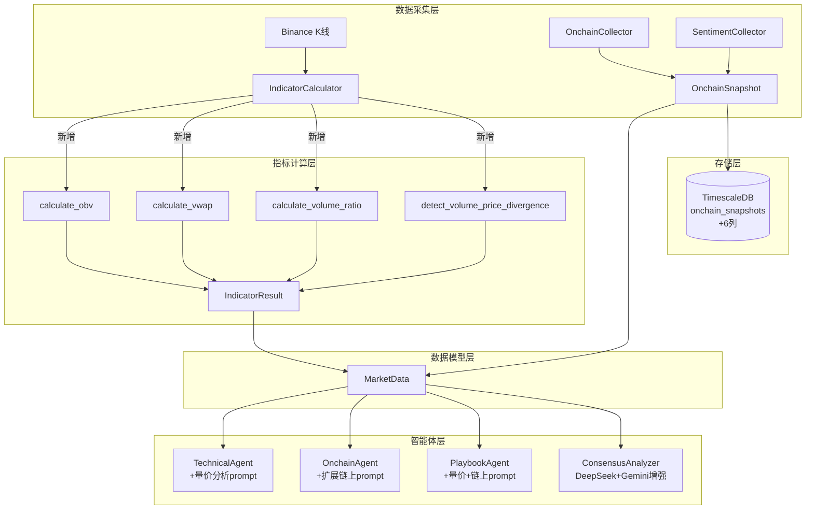

# Design Document: accuracy-enhancement

## Overview

本设计文档描述如何在现有庄家视角多智能体分析系统中增加量价分析维度和扩展链上数据指标，以提升分析准确率和信号命中率。

当前系统的技术指标仅覆盖价格维度（EMA/RSI/MACD/布林带/ATR），缺少成交量分析；链上数据仅有 4 个字段（exchange_netflow, whale_change_24h, fear_greed_index, mvrv），维度不足。本次增强分为三个层面：

1. **量价分析层**：在 `IndicatorCalculator` 中新增 OBV、VWAP、量比、量价背离检测四个计算方法，并将结果注入 `IndicatorResult` 模型
2. **链上数据层**：扩展 `OnchainSnapshot` 模型和 `OnchainCollector` 采集器，新增活跃地址数、新增地址数、交易所余额、大额转账、矿工持仓变化 6 个字段；扩展 `SentimentCollector` 支持多源交叉验证
3. **智能体 Prompt 层**：增强 TechnicalAgent、OnchainAgent、PlaybookAgent 和 ConsensusAnalyzer 的 prompt，将新增数据注入分析链路

设计原则：
- 所有新增字段默认 `None`，保持向后兼容
- 量价指标计算纯 Python + numpy，无外部 API 调用
- 链上采集遵循 30s 超时 + 降级模式，单源失败不影响其他
- 数据库迁移使用 `ADD COLUMN IF NOT EXISTS`，安全升级

## Architecture



数据流向：K线数据 → IndicatorCalculator 计算量价指标 → IndicatorResult → MarketData → 各智能体 prompt 注入。链上数据 → OnchainCollector 扩展采集 → OnchainSnapshot → MarketData → 各智能体 prompt 注入。

## Components and Interfaces

### 1. IndicatorCalculator 新增方法

文件：`backend/app/data/indicators.py`

在现有 `IndicatorCalculator` 类中新增 4 个静态方法：

```python
@staticmethod
def calculate_obv(klines: list[KlineData]) -> list[float]:
    """计算 OBV 序列。
    规则：收盘价 > 前收盘价 → 累加成交量；< → 累减；= → 不变。
    第一个值为该根 K 线的成交量。空列表输入返回空列表。
    """

@staticmethod
def calculate_vwap(klines: list[KlineData]) -> list[float]:
    """计算 VWAP 序列。
    公式：累积(典型价格 × 成交量) / 累积(成交量)
    典型价格 = (high + low + close) / 3
    累积成交量为零时返回 NaN。
    """

@staticmethod
def calculate_volume_ratio(klines: list[KlineData], period: int = 20) -> list[float]:
    """计算量比序列。
    公式：当前成交量 / 过去 N 根平均成交量
    前 N 个值为 NaN。平均成交量为零时返回 NaN。
    """

@staticmethod
def detect_volume_price_divergence(
    klines: list[KlineData], window: int = 20
) -> str:
    """检测最新一根 K 线的量价背离。
    顶背离：价格创窗口新高但 OBV 未创新高 → "bearish_divergence"
    底背离：价格创窗口新低但 OBV 未创新低 → "bullish_divergence"
    无背离 → "none"
    """
```

`calculate_all` 方法扩展：在现有计算流程末尾调用上述 4 个方法，将最新值填入 `IndicatorResult` 的新增字段。

### 2. OnchainCollector 新增采集方法

文件：`backend/app/data/onchain.py`

在现有 `OnchainCollector` 类中新增采集方法：

```python
async def fetch_active_addresses(self, symbol: str) -> int | None:
    """采集活跃地址数。30s 超时，失败返回 None。"""

async def fetch_new_addresses(self, symbol: str) -> int | None:
    """采集新增地址数。30s 超时，失败返回 None。"""

async def fetch_exchange_balance(self, symbol: str) -> float | None:
    """采集交易所余额绝对值。30s 超时，失败返回 None。"""

async def fetch_large_transactions(self, symbol: str) -> tuple[int | None, float | None]:
    """采集大额转账笔数和总金额。30s 超时，失败返回 (None, None)。"""

async def fetch_miner_reserve_change(self, symbol: str) -> float | None:
    """采集矿工持仓变化百分比。30s 超时，失败返回 None。"""
```

`collect_snapshot` 方法扩展：在现有 `asyncio.gather` 中并行加入新增采集任务，将结果填入 `OnchainSnapshot` 的新增字段。

### 3. SentimentCollector 多源交叉验证

文件：`backend/app/data/sentiment.py`

重构为类，支持多数据源：

```python
class SentimentCollector:
    async def fetch_fear_greed_alternative(self, timeout: float = 30.0) -> int | None:
        """数据源1：Alternative.me 恐慌贪婪指数（现有逻辑）"""

    async def fetch_fear_greed_coinglass(self, timeout: float = 30.0) -> int | None:
        """数据源2：CoinGlass 恐慌贪婪指数"""

    async def collect_sentiment(self) -> int | None:
        """并行采集多源情绪数据，计算加权平均值。
        - 两源均有效：加权平均（Alternative 权重 0.6，CoinGlass 权重 0.4）
        - 仅一源有效：使用该源值，日志记录缺失源
        - 全部失败：返回 None，记录错误日志
        """
```

### 4. 智能体 Prompt 增强

#### TechnicalAgent（`backend/app/agents/technical.py`）

- `_SYSTEM_PROMPT` 增加量价关系分析指导段落
- `_build_user_prompt` 增加量价指标注入：OBV、VWAP、量比、量价背离
- 当 `volume_price_divergence != "none"` 时，在 prompt 中标注 `⚠️ 量价背离信号`

#### OnchainAgent（`backend/app/agents/onchain.py`）

- `_SYSTEM_PROMPT` 增加扩展链上指标解读指导（活跃地址、大额转账、矿工持仓与庄家阶段关联规则）
- `_build_user_prompt` 增加扩展字段注入
- 当 `large_tx_count` 可用时，标注 `⚠️ 大额转账活跃`

#### PlaybookAgent（`backend/app/agents/playbook.py`）

- `_build_user_prompt` 在技术指标段增加量价指标摘要
- `_build_user_prompt` 在链上数据段增加扩展字段

#### ConsensusAnalyzer（`backend/app/consensus/analyzers.py`）

- `_build_deepseek_user_prompt`：链上数据部分注入扩展字段（活跃地址、大额转账、矿工持仓等）
- `_build_gemini_user_prompt`：模式匹配部分注入量价指标（OBV、VWAP、量比、背离信号）

### 5. 数据库迁移

文件：`backend/migrations/v7_accuracy_enhancement.sql`

```sql
ALTER TABLE onchain_snapshots ADD COLUMN IF NOT EXISTS active_addresses INTEGER;
ALTER TABLE onchain_snapshots ADD COLUMN IF NOT EXISTS new_addresses INTEGER;
ALTER TABLE onchain_snapshots ADD COLUMN IF NOT EXISTS exchange_balance DOUBLE PRECISION;
ALTER TABLE onchain_snapshots ADD COLUMN IF NOT EXISTS large_tx_count INTEGER;
ALTER TABLE onchain_snapshots ADD COLUMN IF NOT EXISTS large_tx_volume DOUBLE PRECISION;
ALTER TABLE onchain_snapshots ADD COLUMN IF NOT EXISTS miner_reserve_change DOUBLE PRECISION;
```

## Data Models

### IndicatorResult 扩展

```python
class IndicatorResult(BaseModel):
    # ... 现有字段保持不变 ...
    symbol: str
    interval: str
    time: datetime
    ema7: Optional[float] = None
    ema25: Optional[float] = None
    ema99: Optional[float] = None
    rsi: Optional[float] = None
    macd: Optional[float] = None
    macd_signal: Optional[float] = None
    macd_histogram: Optional[float] = None
    bb_upper: Optional[float] = None
    bb_middle: Optional[float] = None
    bb_lower: Optional[float] = None
    support_levels: list[float] = []
    resistance_levels: list[float] = []
    atr: float | None = None

    # 新增量价分析字段
    obv: Optional[float] = None
    vwap: Optional[float] = None
    volume_ratio: Optional[float] = None
    volume_price_divergence: Optional[str] = None  # "bullish_divergence" | "bearish_divergence" | "none"
```

### OnchainSnapshot 扩展

```python
class OnchainSnapshot(BaseModel):
    # ... 现有字段保持不变 ...
    time: datetime
    symbol: str
    exchange_netflow: Optional[float] = None
    whale_change_24h: Optional[float] = None
    fear_greed_index: Optional[int] = None
    mvrv: Optional[float] = None

    # 新增链上数据字段
    active_addresses: Optional[int] = None
    new_addresses: Optional[int] = None
    exchange_balance: Optional[float] = None
    large_tx_count: Optional[int] = None
    large_tx_volume: Optional[float] = None
    miner_reserve_change: Optional[float] = None
```

### 数据库表映射

| Python 字段 | DB 列名 | DB 类型 | 说明 |
|---|---|---|---|
| active_addresses | active_addresses | INTEGER | 活跃地址数 |
| new_addresses | new_addresses | INTEGER | 新增地址数 |
| exchange_balance | exchange_balance | DOUBLE PRECISION | 交易所余额 |
| large_tx_count | large_tx_count | INTEGER | 大额转账笔数 |
| large_tx_volume | large_tx_volume | DOUBLE PRECISION | 大额转账总金额 |
| miner_reserve_change | miner_reserve_change | DOUBLE PRECISION | 矿工持仓变化% |


## Correctness Properties

*A property is a characteristic or behavior that should hold true across all valid executions of a system—essentially, a formal statement about what the system should do. Properties serve as the bridge between human-readable specifications and machine-verifiable correctness guarantees.*

### Property 1: OBV 累积规则正确性

*For any* 非空 K 线序列，OBV 序列的每个元素应满足：OBV[0] = volume[0]；对于 i > 0，若 close[i] > close[i-1] 则 OBV[i] = OBV[i-1] + volume[i]，若 close[i] < close[i-1] 则 OBV[i] = OBV[i-1] - volume[i]，若 close[i] == close[i-1] 则 OBV[i] = OBV[i-1]。

**Validates: Requirements 1.1, 1.2**

### Property 2: OBV 输出长度不变量

*For any* K 线列表（包括空列表），calculate_obv 返回的列表长度应与输入 K 线列表长度相等。

**Validates: Requirements 1.2, 1.3**

### Property 3: VWAP 公式正确性

*For any* 非空 K 线序列且所有成交量均为正数，VWAP 序列的每个元素应等于 sum(typical_price[0..i] * volume[0..i]) / sum(volume[0..i])，其中 typical_price = (high + low + close) / 3。

**Validates: Requirements 2.1, 2.2**

### Property 4: 量比公式正确性与 NaN 前缀

*For any* K 线序列和回看周期 N，量比序列的前 N 个值应为 NaN，且对于 i >= N，volume_ratio[i] = volume[i] / mean(volume[i-N..i-1])（当平均成交量非零时）。

**Validates: Requirements 3.1, 3.2**

### Property 5: 量价背离检测正确性

*For any* K 线序列和回看窗口 W，若最新收盘价为窗口内最高但 OBV 非窗口内最高，则结果为 "bearish_divergence"；若最新收盘价为窗口内最低但 OBV 非窗口内最低，则结果为 "bullish_divergence"；否则为 "none"。返回值必须是 {"bullish_divergence", "bearish_divergence", "none"} 之一。

**Validates: Requirements 4.1, 4.2, 4.3**

### Property 6: calculate_all 量价指标集成

*For any* 非空 K 线列表，calculate_all 返回的 IndicatorResult 中，obv 应等于 calculate_obv 的最后一个有效值，vwap 应等于 calculate_vwap 的最后一个有效值，volume_ratio 应等于 calculate_volume_ratio 的最后一个有效值，volume_price_divergence 应等于 detect_volume_price_divergence 的返回值。

**Validates: Requirements 1.4, 2.4, 3.4, 4.4**

### Property 7: IndicatorResult 序列化 round-trip

*For any* 有效的 IndicatorResult 对象（包含新增量价字段），执行 `IndicatorResult(**obj.model_dump())` 应产生与原对象等价的 IndicatorResult。

**Validates: Requirements 5.3**

### Property 8: OnchainSnapshot 序列化 round-trip

*For any* 有效的 OnchainSnapshot 对象（包含新增链上字段），执行 `OnchainSnapshot(**obj.model_dump())` 应产生与原对象等价的 OnchainSnapshot。

**Validates: Requirements 6.3**

### Property 9: 链上采集器单源故障隔离

*For any* 链上数据源子集发生故障，OnchainCollector.collect_snapshot 应对故障源对应字段返回 None，而其余正常数据源的字段应包含有效值。

**Validates: Requirements 7.3**

### Property 10: 情绪数据加权平均

*For any* 两个有效的情绪指数值 v1 和 v2（0-100 范围），SentimentCollector.collect_sentiment 的结果应等于 round(0.6 * v1 + 0.4 * v2)。当仅一个源有效时，结果应等于该源的值。

**Validates: Requirements 8.2, 8.4**

### Property 11: TechnicalAgent 量价 Prompt 注入

*For any* MarketData 其 IndicatorResult 包含非 None 的量价字段，TechnicalAgent 生成的用户 prompt 应包含对应的 OBV、VWAP、量比值。当 volume_price_divergence 不为 "none" 时，prompt 应包含背离警告标注。

**Validates: Requirements 9.1, 9.3**

### Property 12: OnchainAgent 扩展数据 Prompt 注入

*For any* MarketData 其 OnchainSnapshot 包含非 None 的扩展字段，OnchainAgent 生成的用户 prompt 应包含对应的活跃地址数、新增地址数、交易所余额、大额转账、矿工持仓变化值。当 large_tx_count 可用时，prompt 应包含大额转账标注。

**Validates: Requirements 10.1, 10.3**

### Property 13: PlaybookAgent 新增数据 Prompt 注入

*For any* MarketData 同时包含量价指标和扩展链上数据，PlaybookAgent 生成的用户 prompt 应同时包含量价指标摘要和扩展链上数据。

**Validates: Requirements 11.1**

### Property 14: ConsensusAnalyzer 专责数据注入

*For any* MarketData 包含量价指标和扩展链上数据，DeepSeek 分析器的 prompt 应包含扩展链上字段，Gemini 分析器的 prompt 应包含量价指标数据。

**Validates: Requirements 11.2, 11.3, 11.4**

## Error Handling

### 量价指标计算

| 场景 | 处理方式 |
|---|---|
| 空 K 线列表 | calculate_obv/calculate_vwap/calculate_volume_ratio 返回空列表；detect_volume_price_divergence 返回 "none" |
| K 线数量不足（< window） | detect_volume_price_divergence 返回 "none"；volume_ratio 前 N 个值为 NaN |
| 累积成交量为零 | VWAP 对应位置返回 NaN |
| 平均成交量为零 | volume_ratio 对应位置返回 NaN |
| calculate_all 中某个量价计算异常 | 捕获异常，对应字段设为 None，不影响其他指标计算，记录 warning 日志 |

### 链上数据采集

| 场景 | 处理方式 |
|---|---|
| 单个数据源超时（>30s） | 该字段返回 None，记录 warning 日志 |
| 单个数据源返回非预期格式 | 该字段返回 None，记录 error 日志 |
| 所有数据源失败 | 返回全 None 的 OnchainSnapshot，记录 error 日志 |
| API Key 未配置 | 跳过该数据源，记录 warning 日志 |
| asyncio.gather 中某任务抛异常 | `return_exceptions=True` 捕获，转为 None |

### 情绪数据采集

| 场景 | 处理方式 |
|---|---|
| 两源均成功 | 加权平均 |
| 仅一源成功 | 使用该源值，日志记录缺失源 |
| 两源均失败 | 返回 None，记录 error 日志 |
| 返回值超出 0-100 范围 | 视为无效，等同于该源失败 |

### Prompt 注入

| 场景 | 处理方式 |
|---|---|
| 新增字段为 None | 不注入该字段到 prompt，或标注"数据缺失" |
| IndicatorResult 整体为 None | 跳过量价分析段落（与现有行为一致） |
| OnchainSnapshot 整体为 None | 跳过扩展链上段落（与现有行为一致） |

## Testing Strategy

### 属性测试（Property-Based Testing）

使用 **Hypothesis** 库进行属性测试，每个属性测试至少运行 100 次迭代。

测试文件：`backend/tests/test_accuracy_properties.py`

每个测试用 `@given` 装饰器生成随机输入，并用注释标注对应的设计属性：

```python
# Feature: accuracy-enhancement, Property 1: OBV 累积规则正确性
@given(klines=st.lists(kline_strategy(), min_size=1, max_size=200))
@settings(max_examples=100)
def test_obv_accumulation_rule(klines): ...

# Feature: accuracy-enhancement, Property 2: OBV 输出长度不变量
@given(klines=st.lists(kline_strategy(), min_size=0, max_size=200))
@settings(max_examples=100)
def test_obv_length_invariant(klines): ...

# Feature: accuracy-enhancement, Property 3: VWAP 公式正确性
@given(klines=st.lists(positive_volume_kline_strategy(), min_size=1, max_size=200))
@settings(max_examples=100)
def test_vwap_formula_correctness(klines): ...

# Feature: accuracy-enhancement, Property 4: 量比公式正确性与 NaN 前缀
@given(klines=st.lists(kline_strategy(), min_size=1, max_size=200), period=st.integers(min_value=2, max_value=50))
@settings(max_examples=100)
def test_volume_ratio_formula_and_nan_prefix(klines, period): ...

# Feature: accuracy-enhancement, Property 5: 量价背离检测正确性
@given(klines=st.lists(kline_strategy(), min_size=21, max_size=200), window=st.integers(min_value=5, max_value=50))
@settings(max_examples=100)
def test_divergence_detection_correctness(klines, window): ...

# Feature: accuracy-enhancement, Property 6: calculate_all 量价指标集成
@given(klines=st.lists(kline_strategy(), min_size=1, max_size=200))
@settings(max_examples=100)
def test_calculate_all_volume_integration(klines): ...

# Feature: accuracy-enhancement, Property 7: IndicatorResult 序列化 round-trip
@given(indicator=indicator_result_strategy())
@settings(max_examples=100)
def test_indicator_result_roundtrip(indicator): ...

# Feature: accuracy-enhancement, Property 8: OnchainSnapshot 序列化 round-trip
@given(snapshot=onchain_snapshot_strategy())
@settings(max_examples=100)
def test_onchain_snapshot_roundtrip(snapshot): ...

# Feature: accuracy-enhancement, Property 9: 链上采集器单源故障隔离
@given(failing_sources=st.sets(st.sampled_from(["active_addresses", "new_addresses", "exchange_balance", "large_tx", "miner_reserve"])))
@settings(max_examples=100)
def test_collector_fault_isolation(failing_sources): ...

# Feature: accuracy-enhancement, Property 10: 情绪数据加权平均
@given(v1=st.integers(min_value=0, max_value=100), v2=st.integers(min_value=0, max_value=100))
@settings(max_examples=100)
def test_sentiment_weighted_average(v1, v2): ...

# Feature: accuracy-enhancement, Property 11: TechnicalAgent 量价 Prompt 注入
@given(market_data=market_data_with_volume_indicators_strategy())
@settings(max_examples=100)
def test_technical_agent_volume_prompt(market_data): ...

# Feature: accuracy-enhancement, Property 12: OnchainAgent 扩展数据 Prompt 注入
@given(market_data=market_data_with_extended_onchain_strategy())
@settings(max_examples=100)
def test_onchain_agent_extended_prompt(market_data): ...

# Feature: accuracy-enhancement, Property 13: PlaybookAgent 新增数据 Prompt 注入
@given(market_data=market_data_with_all_new_data_strategy())
@settings(max_examples=100)
def test_playbook_agent_new_data_prompt(market_data): ...

# Feature: accuracy-enhancement, Property 14: ConsensusAnalyzer 专责数据注入
@given(market_data=market_data_with_all_new_data_strategy())
@settings(max_examples=100)
def test_consensus_analyzer_data_injection(market_data): ...
```

### 单元测试

测试文件：`backend/tests/test_accuracy_unit.py`

覆盖以下场景：

- **边界情况**：空 K 线列表、单根 K 线、累积成交量为零、平均成交量为零
- **模型默认值**：IndicatorResult 和 OnchainSnapshot 新增字段默认 None
- **情绪采集降级**：全部数据源失败返回 None
- **Prompt 静态内容**：TechnicalAgent 系统 prompt 包含量价分析指导、OnchainAgent 系统 prompt 包含扩展链上指标解读指导
- **数据库迁移**：迁移脚本使用 `ADD COLUMN IF NOT EXISTS` 语法

### 测试生成器（Hypothesis Strategies）

为属性测试定义自定义生成器：

- `kline_strategy()`：生成随机 KlineData，价格在合理范围（1-100000），成交量 >= 0
- `positive_volume_kline_strategy()`：生成成交量 > 0 的 KlineData
- `indicator_result_strategy()`：生成包含新增字段的随机 IndicatorResult
- `onchain_snapshot_strategy()`：生成包含新增字段的随机 OnchainSnapshot
- `market_data_with_volume_indicators_strategy()`：生成包含量价指标的 MarketData
- `market_data_with_extended_onchain_strategy()`：生成包含扩展链上数据的 MarketData
- `market_data_with_all_new_data_strategy()`：生成同时包含量价和链上扩展数据的 MarketData
