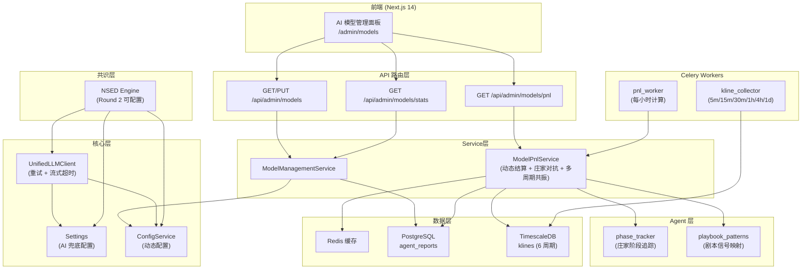

# 设计文档：AI 模型层优化

## 概述

本设计对 AI 模型调用层（`UnifiedLLMClient`）和 NSED 共识引擎进行全面优化，涵盖八个方面：

1. **Settings 兜底配置** — 在 `app/core/config.py` 的 `Settings` 类中增加 AI 相关字段，确保 ConfigService 不可用时 LLM 客户端仍能通过环境变量初始化
2. **客户端初始化重试** — `_ensure_client()` 失败后不再永久不可用，支持自动重试和冷却机制
3. **流式超时保护** — `stream_model()` 对整个流式读取过程施加总超时控制
4. **Round 2 可配置化** — NSED 共识引擎的 Round 2 交叉审查可通过动态配置开关控制
5. **模型列表可配置化** — 模型映射从 ConfigService 动态加载，支持热重载
6. **AI 模型管理面板** — 前端 `/admin/models` 卡片式管理界面 + 后端 CRUD/统计 API
7. **增强模拟盈亏** — 基于历史预测信号计算各模型虚拟账户盈亏和胜率，结合庄家阶段动态结算、剧本对抗仓位调整和多周期共振盈亏调整
8. **补充 K 线采集** — 新增 5m 和 30m 周期 K 线采集，支持多周期共振分析所需的全部 6 个时间周期

所有改动遵循现有分层架构（API 路由层 → Service 层 → Agent 层 → 数据层），AI 调用统一经过 `UnifiedLLMClient`，配置优先从 ConfigService 读取、回退到 Settings 环境变量。

## 架构

### 整体架构图



### 改动范围

| 模块 | 文件 | 改动类型 |
|------|------|----------|
| Settings | `backend/app/core/config.py` | 修改：增加 AI 相关字段 |
| LLM 客户端 | `backend/app/core/llm_client.py` | 修改：重试机制、流式超时、模型列表可配置（`MODELS` 重命名为 `DEFAULT_MODELS`）、启用状态检查、新增 `get_models()` 方法 |
| NSED 引擎 | `backend/app/consensus/engine.py` | 修改：Round 2 可配置开关，`import MODELS` 改为 `import DEFAULT_MODELS`，`_get_dynamic_weights()` 使用 `llm_client.get_models()` |
| 动态权重 | `backend/app/consensus/weights.py` | 修改：`import MODELS` 改为 `import DEFAULT_MODELS`，所有引用 `MODELS` 的地方替换为 `DEFAULT_MODELS` |
| ORM 模型 | `backend/app/models/db.py` | 修改：ORM `ConsensusReport` 增加 `round2_executed` 布尔列（默认 True） |
| 模型管理服务 | `backend/app/services/model_service.py` | 新增：含 `_load_model_scenarios()` 方法从 ConfigService 读取使用场景，回退到 `DEFAULT_MODEL_SCENARIOS` |
| 模拟盈亏服务 | `backend/app/services/model_pnl_service.py` | 新增（重大更新：动态结算 + 庄家对抗 + 多周期共振） |
| 模型管理 API | `backend/app/api/admin_models.py` | 新增 |
| 应用入口 | `backend/main.py` | 修改：注册 `admin_models_router` |
| 定时任务 | `backend/workers/pnl_worker.py` | 新增 |
| Celery 配置 | `backend/workers/celery_app.py` | 修改：`include` 列表增加 `workers.pnl_worker`，`beat_schedule` 增加每小时 PnL 计算任务，K 线采集周期从 `["15m", "1h", "4h", "1d"]` 扩展为 `["5m", "15m", "30m", "1h", "4h", "1d"]` |
| 数据库迁移 | `backend/migrations/v_ai_model_opt.sql` | 新增：`ALTER TABLE consensus_reports ADD COLUMN round2_executed BOOLEAN NOT NULL DEFAULT TRUE` |
| 前端导航 | `frontend/components/layout/TopNav.tsx` | 修改：管理菜单增加 "AI 模型" 入口（`{ label: "AI 模型", href: "/admin/models" }`） |
| 前端 API 封装 | `frontend/lib/api/models.ts` | 新增 |
| 前端页面 | `frontend/app/(main)/admin/models/page.tsx` | 新增 |
| 前端组件 | `frontend/components/admin/ModelCard.tsx` | 新增 |


## 组件与接口

### 1. Settings 类扩展（需求 1）

在 `app/core/config.py` 的 `Settings` 类中增加以下字段：

```python
class Settings(BaseSettings):
    # ... 现有字段 ...

    # AI 模型兜底配置
    dmx_api_key: str = ""
    dmx_base_url: str = "https://www.dmxapi.cn/v1"
    default_model_timeout: float = 30.0
    consensus_round2_enabled: bool = True
```

这些字段从环境变量读取，作为 ConfigService 不可用时的兜底值。

### 2. UnifiedLLMClient 增强（需求 2、3、5）

#### 2.1 初始化重试与冷却机制（需求 2）

```python
class UnifiedLLMClient:
    def __init__(self) -> None:
        self._client: AsyncOpenAI | None = None
        self._init_fail_count: int = 0          # 连续失败计数
        self._cooldown_until: float = 0.0       # 冷却截止时间戳
        self._models: dict[str, str] = dict(DEFAULT_MODELS)
        self._model_enabled: dict[str, bool] = {}  # 模型启用状态

    async def _ensure_client(self) -> AsyncOpenAI | None:
        """延迟初始化，支持重试和冷却。
        
        - _client 为 None 时每次调用都尝试重新初始化
        - 连续失败 3 次后进入 60 秒冷却期，直接返回 None
        - 冷却期结束后重新允许初始化尝试
        
        注意：现有代码的 _ensure_client() 中 ConfigService 调用没有 try/except，
        如果 ConfigService 不可用会直接抛出异常导致客户端永远无法初始化。
        必须增加 try/except 包裹 ConfigService 调用，失败时回退到 Settings：
        """
        if self._client is not None:
            return self._client
        # 冷却期检查 ...
        try:
            api_key = await get_config_value("dmx_api_key")
            base_url = await get_config_value("dmx_base_url", "https://www.dmxapi.cn/v1")
        except Exception:
            logger.warning("ConfigService unavailable, falling back to Settings")
            api_key = settings.dmx_api_key
            base_url = settings.dmx_base_url
        if not api_key:
            logger.error("No API key available from ConfigService or Settings")
            self._init_fail_count += 1
            return None
        self._client = AsyncOpenAI(api_key=api_key, base_url=base_url)
        return self._client

    def reset(self) -> None:
        """强制重置客户端，下次调用时重新初始化。"""
        self._client = None
        self._init_fail_count = 0
        self._cooldown_until = 0.0
```

初始化优先级：ConfigService `dmx_api_key` → Settings `dmx_api_key` → 记录错误日志，后续返回 Fallback。

#### 2.2 流式调用全程超时（需求 3）

当前 `stream_model()` 的 `asyncio.wait_for` 只覆盖初始连接，不覆盖逐 chunk 读取。改为对整个流式过程施加总超时：

```python
async def stream_model(self, ..., timeout_s: float = 30.0) -> AsyncGenerator[str, None]:
    """流式调用，对整个读取过程施加 timeout_s 总超时。"""
    start = time.monotonic()
    # ... 初始连接 ...
    async for chunk in response:
        if time.monotonic() - start > timeout_s:
            logger.warning("LLM stream total timeout", extra={
                "model_key": model_key, "elapsed_s": ..., "timeout_s": timeout_s
            })
            yield "\n[错误] 模型响应超时，请稍后重试"
            return
        # ... yield chunk ...
```

#### 2.3 模型列表可配置化（需求 5）

> **注意：`MODELS` 重命名为 `DEFAULT_MODELS`**
> 现有代码中 `weights.py` 和 `engine.py` 的 `_get_dynamic_weights()` 通过 `from app.core.llm_client import MODELS` 引用模块级模型常量。设计将模型列表从模块级 `MODELS` 改为实例属性 `self._models`，因此需要：
> - 保留模块级常量但重命名为 `DEFAULT_MODELS`（避免与实例属性混淆）
> - `weights.py` 和 `engine.py` 中的 `from app.core.llm_client import MODELS` 改为 `from app.core.llm_client import DEFAULT_MODELS`
> - 在 `UnifiedLLMClient` 上增加公开方法 `get_models() -> dict[str, str]`，返回当前 `self._models`
> - `engine.py` 的 `_get_dynamic_weights()` 应优先使用 `llm_client.get_models()` 获取当前模型列表，以确保动态加载的模型也能获得权重

```python
DEFAULT_MODELS: dict[str, str] = {
    "deepseek": "deepseek-chat",
    "gpt4o": "gpt-4o",
    "claude": "claude-3-5-sonnet-20241022",
    "gemini": "gemini-1.5-pro",
}

class UnifiedLLMClient:
    async def _load_models(self) -> None:
        """从 ConfigService 加载模型列表，失败则使用默认列表。"""
        try:
            raw = await get_config_value("llm_models", "")
            if raw:
                loaded = json.loads(raw)
                self._models = loaded
                logger.info("Models loaded from config", extra={"count": len(loaded)})
                return
        except Exception as exc:
            logger.warning("Failed to load models from config", extra={"error": str(exc)})
        self._models = dict(DEFAULT_MODELS)

    async def reload_models(self) -> None:
        """公开方法：从 ConfigService 重新加载模型列表。"""
        await self._load_models()

    def get_models(self) -> dict[str, str]:
        """公开方法：返回当前模型映射字典（供 weights.py / engine.py 使用）。"""
        return dict(self._models)
```

`call_model` 和 `stream_model` 中使用 `self._models.get(model_key)` 替代原来的 `MODELS.get(model_key)`，并检查 `self._model_enabled` 状态。

### 3. NSED 引擎 Round 2 可配置化（需求 4）

修改 `run_nsed()` 函数，在 Round 2 之前检查配置开关：

```python
async def run_nsed(market_data: MarketData) -> ConsensusReport:
    # ... Round 1 ...
    
    # Round 2 — 可配置开关
    round2_enabled = await _is_round2_enabled()
    if round2_enabled:
        r2_votes = await _round2_cross_review(r1_votes, market_data)
        logger.info("Round 2 complete", ...)
    else:
        r2_votes = r1_votes
        logger.info("Round 2 skipped (disabled by config)")
    
    # Round 3 ...
    report = _round3_aggregate(r2_votes, weights, market_data.symbol)
    report.round2_executed = round2_enabled  # 新增字段
    return report
```

`_is_round2_enabled()` 优先从 ConfigService 读取 `consensus_round2_enabled`，失败则回退到 `settings.consensus_round2_enabled`。

`ConsensusReport` Pydantic 模型（`engine.py`）增加 `round2_executed: bool = True` 字段。

> **注意：ORM 模型同步更新**
> `backend/app/models/db.py` 中的 ORM `ConsensusReport`（对应 `consensus_reports` 表）与 `engine.py` 中的 Pydantic `ConsensusReport` 存在同名但不同用途的情况。ORM 模型也需要增加 `round2_executed` 布尔列（默认 True），以便将该信息持久化到数据库。需要配合数据库迁移脚本添加该列：
> ```sql
> ALTER TABLE consensus_reports ADD COLUMN round2_executed BOOLEAN NOT NULL DEFAULT TRUE;
> ```

### 4. 模型管理服务（需求 6）

新建 `backend/app/services/model_service.py`：

```python
class ModelInfo(BaseModel):
    model_key: str
    model_name: str
    usage_scenarios: list[str]
    enabled: bool

class ModelStats(BaseModel):
    model_key: str
    call_count: int
    success_rate: float        # 0-1
    avg_latency_ms: float
    total_tokens: int

class ModelUpdateRequest(BaseModel):
    model_name: str | None = None
    enabled: bool | None = None
    usage_scenarios: list[str] | None = None  # 自定义使用场景标签

class ModelManagementService:
    """模型管理服务 — 读取/更新模型配置，查询调用统计。"""

    def __init__(self, session: AsyncSession) -> None:
        self._session = session

    async def _load_model_scenarios(self) -> dict[str, list[str]]:
        """从 ConfigService 加载模型使用场景配置。
        
        优先从 ConfigService 读取 `llm_model_scenarios`（JSON 格式），
        失败或为空时回退到 DEFAULT_MODEL_SCENARIOS 默认值。
        """

    async def get_all_models(self) -> list[ModelInfo]:
        """返回所有模型列表，包含 key、名称、使用场景、启用状态。
        
        使用场景通过 _load_model_scenarios() 获取（ConfigService 优先，默认值兜底）。
        """

    async def get_model_stats(self) -> list[ModelStats]:
        """查询最近 24 小时各模型调用统计。
        
        从 agent_reports 表按 agent_id 分组统计：
        - call_count: COUNT(*)
        - success_rate: 非 fallback 的比例
        - avg_latency_ms: 从日志或 raw_data 中提取（如无则返回 0）
        - total_tokens: SUM(raw_data->>'tokens')
        """

    async def update_model(self, model_key: str, data: ModelUpdateRequest, admin_user_id: str) -> ModelInfo:
        """更新模型配置（model_name、enabled 和/或 usage_scenarios）。
        
        - 更新 ConfigService 中的 llm_models JSON（需要 admin_user_id 用于审计日志）
        - 若 usage_scenarios 不为 None，同步更新 ConfigService 中的 llm_model_scenarios JSON
        - 调用 llm_client.reload_models() 使变更生效
        
        注意：ConfigService.update_config() 要求 admin_user_id 参数用于审计日志记录，
        因此本方法签名必须包含 admin_user_id 并透传给 ConfigService。
        """
```

使用场景映射（默认值作为 ConfigService 不可用时的兜底，与 `analyzers.py` 中各模型实际职责一致）：

```python
DEFAULT_MODEL_SCENARIOS: dict[str, list[str]] = {
    "deepseek": ["链上数据解读"],
    "gpt4o": ["宏观叙事分析"],
    "claude": ["风险识别", "逻辑一致性"],
    "gemini": ["模式匹配", "历史相似"],
}
```

使用场景支持通过 ConfigService 动态配置（键名 `llm_model_scenarios`，值为 JSON 格式），管理员可在 `/admin/models` 面板中自定义各模型的使用场景标签：

```python
class ModelManagementService:
    async def _load_model_scenarios(self) -> dict[str, list[str]]:
        """从 ConfigService 加载模型使用场景，失败则使用默认值。"""
        try:
            raw = await get_config_value("llm_model_scenarios", "")
            if raw:
                loaded = json.loads(raw)
                return loaded
        except Exception as exc:
            logger.warning("Failed to load model scenarios from config", extra={"error": str(exc)})
        return dict(DEFAULT_MODEL_SCENARIOS)
```

### 5. 模拟盈亏服务（需求 7）

新建 `backend/app/services/model_pnl_service.py`：

```python
from app.agents.phase_tracker import MarketPhase, get_current_phase
from app.agents.playbook_patterns import PLAYBOOK_SIGNAL_MAP

class ModelPnl(BaseModel):
    model_key: str
    virtual_balance: float      # 当前虚拟账户余额
    win_rate: float             # 胜率 0-1
    total_trades: int           # 总交易次数
    profit_loss_ratio: float    # 盈亏比（平均盈利 / 平均亏损）
    settlement_hours: int       # 本次结算周期小时数
    playbook_multiplier: float  # 庄家对抗仓位倍数
    resonance_multiplier: float # 多周期共振盈亏倍数

# 庄家阶段 → 结算周期（小时）映射
PHASE_SETTLEMENT_HOURS: dict[MarketPhase | None, int] = {
    MarketPhase.ACCUMULATION: 72,   # 吸筹：长周期
    MarketPhase.TESTING: 24,        # 试盘：标准周期
    MarketPhase.MARKUP: 12,         # 拉盘：短周期
    MarketPhase.DISTRIBUTION: 6,    # 派发：极短周期
    None: 24,                       # 未知阶段：回退 24h
}

# 多周期共振检查的时间周期列表
RESONANCE_TIMEFRAMES: list[str] = ["5m", "15m", "30m", "1h", "4h", "1d"]

class ModelPnlService:
    """增强模拟盈亏计算服务 — 结合庄家阶段、剧本对抗和多周期共振。"""

    INITIAL_BALANCE: float = 10000.0
    POSITION_RATIO: float = 0.10       # 每次开仓占余额 10%
    CACHE_TTL: int = 3600              # Redis 缓存 1 小时

    def __init__(self, session: AsyncSession) -> None:
        self._session = session

    async def get_all_pnl(self) -> list[ModelPnl]:
        """获取所有模型的模拟盈亏，优先从 Redis 缓存读取。"""

    async def calculate_pnl(self, model_key: str) -> ModelPnl:
        """计算单个模型的增强模拟盈亏。
        
        算法：
        1. 从 agent_reports 查询该模型所有 bullish/bearish 信号
        2. 对每个信号：
           a. 获取动态结算周期：调用 phase_tracker.get_current_phase(symbol)
              → 查 PHASE_SETTLEMENT_HOURS 映射，None 回退 24h
           b. 获取庄家对抗倍数：查 agent_reports 最新 playbook agent 的
              raw_data->>'matched_playbook'，通过 PLAYBOOK_SIGNAL_MAP 获取
              剧本信号方向，与模型信号对比：
              - 方向一致 → position_multiplier = 1.5
              - 方向相反 → position_multiplier = 0.5
              - 无匹配剧本 → position_multiplier = 1.0
           c. 从 klines 获取信号时刻价格和动态结算周期后价格
           d. 计算基础投入 = 当前余额 × 10% × position_multiplier
           e. 模拟交易：
              - bullish: 盈亏 = 投入 × (平仓价 - 开仓价) / 开仓价
              - bearish: 盈亏 = 投入 × (开仓价 - 平仓价) / 开仓价
              - neutral: 跳过
           f. 获取多周期共振倍数：查 klines 6 个周期最新 K 线
              - ≥5 个方向一致 → resonance_multiplier = 1.3
              - 3-4 个一致 → resonance_multiplier = 1.0
              - <3 个一致 → resonance_multiplier = 0.7
           g. 最终盈亏 = raw_pnl × resonance_multiplier
        3. 统计胜率和盈亏比
        """

    async def _get_settlement_hours(self, symbol: str) -> int:
        """获取动态结算周期。
        
        调用 phase_tracker.get_current_phase(symbol)，
        通过 PHASE_SETTLEMENT_HOURS 映射获取结算小时数。
        phase_tracker 返回 None 时回退到 24h。
        """
        phase = await get_current_phase(symbol)
        return PHASE_SETTLEMENT_HOURS.get(phase, 24)

    async def _get_playbook_multiplier(
        self, model_signal: str, symbol: str
    ) -> float:
        """获取庄家推演对抗仓位倍数。
        
        1. 查询 agent_reports 最新 playbook agent 报告
        2. 从 raw_data->>'matched_playbook' 获取匹配的剧本名
        3. 通过 PLAYBOOK_SIGNAL_MAP 获取剧本信号方向
        4. 对比模型信号与剧本信号：
           - 一致 → 1.5（顺庄加仓）
           - 相反 → 0.5（逆庄减仓）
           - 无匹配 → 1.0
        """
        sql = text("""
            SELECT raw_data->>'matched_playbook' AS matched_playbook
            FROM agent_reports
            WHERE agent_id = 'playbook' AND symbol = :symbol
            ORDER BY created_at DESC
            LIMIT 1
        """)
        try:
            result = await self._session.execute(sql, {"symbol": symbol})
            row = result.mappings().first()
            if row and row["matched_playbook"]:
                playbook_name = row["matched_playbook"]
                playbook_signal = PLAYBOOK_SIGNAL_MAP.get(playbook_name)
                if playbook_signal and model_signal != "neutral":
                    if model_signal == playbook_signal:
                        return 1.5  # 顺庄
                    else:
                        return 0.5  # 逆庄
        except Exception as exc:
            logger.warning("Failed to get playbook multiplier", extra={"error": str(exc)})
        return 1.0  # 无匹配或异常

    async def _get_resonance_multiplier(self, symbol: str) -> float:
        """获取多周期共振盈亏倍数。
        
        查询 6 个时间周期（5m、15m、30m、1h、4h、1d）最新 K 线，
        统计价格变动方向一致性：
        - close > open → 上涨
        - close < open → 下跌
        - close = open → 中性（不计入）
        
        ≥5 个方向一致 → 1.3（强共振）
        3-4 个一致 → 1.0（正常）
        <3 个一致 → 0.7（分散）
        """
        sql = text("""
            SELECT DISTINCT ON (interval) interval, open, close
            FROM klines
            WHERE symbol = :symbol
              AND interval = ANY(:intervals)
            ORDER BY interval, time DESC
        """)
        try:
            result = await self._session.execute(sql, {
                "symbol": symbol,
                "intervals": RESONANCE_TIMEFRAMES,
            })
            rows = result.mappings().all()

            up_count = 0
            down_count = 0
            for row in rows:
                if row["close"] > row["open"]:
                    up_count += 1
                elif row["close"] < row["open"]:
                    down_count += 1
                # close == open → 中性，不计入

            max_agreement = max(up_count, down_count)
            if max_agreement >= 5:
                return 1.3
            elif max_agreement >= 3:
                return 1.0
            else:
                return 0.7
        except Exception as exc:
            logger.warning("Failed to get resonance multiplier", extra={"error": str(exc)})
            return 1.0  # 异常时不调整

    async def _get_cached_pnl(self, model_key: str) -> ModelPnl | None:
        """从 Redis 读取缓存的 PnL 数据。键名: model_pnl:{model_key}"""

    async def _cache_pnl(self, model_key: str, pnl: ModelPnl) -> None:
        """写入 Redis 缓存，TTL=3600s。"""
```

#### 模拟盈亏计算 SQL（动态结算周期）

复用 `weights.py` 中的 `price_checks` CTE 模式，但使用动态结算周期替代固定 24h：

```sql
WITH predictions AS (
    SELECT agent_id, signal, confidence, created_at AS pred_time, symbol
    FROM agent_reports
    WHERE agent_id = :agent_id
      AND signal IN ('bullish', 'bearish')
    ORDER BY created_at ASC
),
price_checks AS (
    SELECT
        p.signal, p.pred_time,
        (SELECT k.close FROM klines k
         WHERE k.symbol = p.symbol AND k.interval = '1h'
           AND k.time <= p.pred_time
         ORDER BY k.time DESC LIMIT 1) AS price_at_pred,
        (SELECT k.close FROM klines k
         WHERE k.symbol = p.symbol AND k.interval = '1h'
           AND k.time > p.pred_time
           AND k.time <= p.pred_time + make_interval(hours => :settle_hours)
         ORDER BY k.time DESC LIMIT 1) AS price_after
    FROM predictions p
)
SELECT signal, price_at_pred, price_after
FROM price_checks
WHERE price_at_pred IS NOT NULL
  AND price_after IS NOT NULL
  AND price_at_pred > 0
ORDER BY pred_time ASC
```

> **注意**：使用 PostgreSQL `make_interval(hours => :settle_hours)` 函数替代硬编码 `INTERVAL '24 hours'`，`:settle_hours` 由 `_get_settlement_hours()` 动态提供。

应用层按顺序遍历结果，对每笔交易：
1. 计算 `position = balance * POSITION_RATIO * playbook_multiplier`
2. 计算 `raw_pnl`（做多/做空公式）
3. 计算 `final_pnl = raw_pnl * resonance_multiplier`
4. 更新 `balance += final_pnl`

### 6. API 路由（需求 6、7）

新建 `backend/app/api/admin_models.py`：

```python
router = APIRouter(prefix="/api/admin/models", tags=["admin-models"])

@router.get("", response_model=list[ModelInfo])
async def list_models(
    admin: UserInfo = Depends(require_admin),
    session: AsyncSession = Depends(get_db),
) -> list[ModelInfo]:
    """获取所有模型列表。"""

@router.get("/stats", response_model=list[ModelStats])
async def get_stats(
    admin: UserInfo = Depends(require_admin),
    session: AsyncSession = Depends(get_db),
) -> list[ModelStats]:
    """获取最近 24 小时各模型调用统计。"""

@router.get("/pnl", response_model=list[ModelPnl])
async def get_pnl(
    admin: UserInfo = Depends(require_admin),
    session: AsyncSession = Depends(get_db),
) -> list[ModelPnl]:
    """获取各模型模拟盈亏数据。"""

@router.put("/{model_key}", response_model=ModelInfo)
async def update_model(
    model_key: str,
    data: ModelUpdateRequest,
    admin: UserInfo = Depends(require_admin),
    session: AsyncSession = Depends(get_db),
) -> ModelInfo:
    """更新模型配置（model_name / enabled / usage_scenarios）。
    
    将 admin.id 传递给 ModelManagementService，
    以便 ConfigService.update_config() 记录审计日志。
    """
    svc = ModelManagementService(session)
    return await svc.update_model(model_key, data, admin_user_id=str(admin.id))
```

所有接口通过 `Depends(require_admin)` 校验管理员权限，无权限返回 HTTP 403。

### 7. 定时任务（需求 7）

新建 `backend/workers/pnl_worker.py`：

```python
@celery_app.task(name="calculate_model_pnl")
def calculate_model_pnl_task():
    """每小时计算一次所有模型的模拟盈亏，结果缓存到 Redis。"""
```

在 Celery beat 配置中添加每小时执行一次的调度。

### 8. 前端组件（需求 6、7）

#### 8.1 API 封装 `frontend/lib/api/models.ts`

```typescript
interface ModelInfo {
  model_key: string;
  model_name: string;
  usage_scenarios: string[];
  enabled: boolean;
}

interface ModelStats {
  model_key: string;
  call_count: number;
  success_rate: number;
  avg_latency_ms: number;
  total_tokens: number;
}

interface ModelPnl {
  model_key: string;
  virtual_balance: number;
  win_rate: number;
  total_trades: number;
  profit_loss_ratio: number;
  settlement_hours: number;
  playbook_multiplier: number;
  resonance_multiplier: number;
}

interface ModelUpdatePayload {
  model_name?: string;
  enabled?: boolean;
  usage_scenarios?: string[];
}

export async function fetchModels(): Promise<ModelInfo[]>
export async function fetchModelStats(): Promise<ModelStats[]>
export async function fetchModelPnl(): Promise<ModelPnl[]>
export async function updateModel(modelKey: string, data: ModelUpdatePayload): Promise<ModelInfo>
```

#### 8.2 模型卡片组件 `frontend/components/admin/ModelCard.tsx`

每张卡片展示：
- 模型 key + 实际模型名（可编辑）
- 使用场景标签（Tag 列表，支持编辑：可添加新标签、删除已有标签，编辑后调用 `PUT /api/admin/models/{model_key}` 提交 `usage_scenarios` 变更）
- 启用/禁用开关（Switch）
- 调用统计摘要（调用次数、成功率、平均耗时、token 消耗）
- 模拟账户余额（醒目大字体，绿色/红色根据是否高于 $10,000）
- 胜率百分比 + 总交易次数（如 `62% (48 trades)`）
- 当前结算周期（如 `结算: 72h (吸筹)`）、仓位倍数（如 `仓位: ×1.5 (顺庄)`）、共振倍数（如 `共振: ×1.3 (强共振)`）

使用场景标签编辑交互：
- 每个标签右侧显示 `×` 删除按钮
- 标签列表末尾显示 `+` 按钮，点击后出现输入框，输入后按 Enter 添加新标签
- 编辑完成后自动调用 `updateModel(modelKey, { usage_scenarios: [...] })` 保存

#### 8.3 页面 `frontend/app/(main)/admin/models/page.tsx`

- 顶部：DMXAPI 网关信息提示条（说明所有模型共用一个 API key）
- 主体：4 列卡片网格布局（响应式，移动端 1 列）
- 数据加载：并行请求 3 个 API（models、stats、pnl），合并后渲染


## 数据模型

### 1. Settings 扩展字段

| 字段 | 类型 | 默认值 | 环境变量 | 说明 |
|------|------|--------|----------|------|
| `dmx_api_key` | `str` | `""` | `DMX_API_KEY` | DMXAPI 网关 API Key |
| `dmx_base_url` | `str` | `"https://www.dmxapi.cn/v1"` | `DMX_BASE_URL` | DMXAPI 网关地址 |
| `default_model_timeout` | `float` | `30.0` | `DEFAULT_MODEL_TIMEOUT` | LLM 调用默认超时秒数 |
| `consensus_round2_enabled` | `bool` | `True` | `CONSENSUS_ROUND2_ENABLED` | NSED Round 2 开关 |

### 2. UnifiedLLMClient 内部状态

| 属性 | 类型 | 说明 |
|------|------|------|
| `_client` | `AsyncOpenAI \| None` | 当前客户端实例 |
| `_init_fail_count` | `int` | 连续初始化失败次数 |
| `_cooldown_until` | `float` | 冷却截止时间戳（`time.monotonic()`） |
| `_models` | `dict[str, str]` | 当前模型映射 `{model_key: model_name}` |
| `_model_enabled` | `dict[str, bool]` | 模型启用状态 |

### 3. ConsensusReport 扩展

在现有 `ConsensusReport` Pydantic 模型（`engine.py`）中增加：

```python
class ConsensusReport(BaseModel):
    # ... 现有字段 ...
    round2_executed: bool = True  # 本次共识是否执行了 Round 2
```

同时在 ORM 模型（`backend/app/models/db.py`）的 `ConsensusReport` 类中增加对应列：

```python
class ConsensusReport(Base):
    __tablename__ = "consensus_reports"
    # ... 现有列 ...
    round2_executed: Mapped[bool] = mapped_column(
        Boolean, server_default=text("true")
    )
```

需配合数据库迁移脚本 `backend/migrations/v_ai_model_opt.sql`。

### 4. 模型管理 Pydantic 模型

```python
class ModelInfo(BaseModel):
    model_key: str              # 如 "deepseek"
    model_name: str             # 如 "deepseek-chat"
    usage_scenarios: list[str]  # 如 ["链上数据解读"]
    enabled: bool               # 启用状态

class ModelStats(BaseModel):
    model_key: str
    call_count: int             # 最近 24h 调用次数
    success_rate: float         # 成功率 0-1
    avg_latency_ms: float       # 平均耗时毫秒
    total_tokens: int           # 总 token 消耗

class ModelUpdateRequest(BaseModel):
    model_name: str | None = None
    enabled: bool | None = None
    usage_scenarios: list[str] | None = None  # 自定义使用场景标签
```

### 5. 模拟盈亏 Pydantic 模型

```python
class ModelPnl(BaseModel):
    model_key: str
    virtual_balance: float      # 当前虚拟账户余额
    win_rate: float             # 胜率 0-1
    total_trades: int           # 总交易次数
    profit_loss_ratio: float    # 盈亏比（平均盈利 / 平均亏损）
    settlement_hours: int       # 本次结算周期小时数（由庄家阶段决定）
    playbook_multiplier: float  # 庄家对抗仓位倍数（1.5/0.5/1.0）
    resonance_multiplier: float # 多周期共振盈亏倍数（1.3/1.0/0.7）
```

### 6. ConfigService 新增配置键

| 键名 | 值类型 | 说明 |
|------|--------|------|
| `llm_models` | JSON 字符串 | 模型映射，如 `{"deepseek":"deepseek-chat",...}` |
| `llm_model_enabled` | JSON 字符串 | 模型启用状态，如 `{"deepseek":true,"gpt4o":true,...}` |
| `llm_model_scenarios` | JSON 字符串 | 模型使用场景映射，如 `{"deepseek":["链上数据解读"],"gpt4o":["宏观叙事分析"],...}`。管理员可通过 `/admin/models` 面板自定义，未配置时回退到 `DEFAULT_MODEL_SCENARIOS` |
| `consensus_round2_enabled` | 字符串 `"true"/"false"` | Round 2 开关 |

### 7. Redis 缓存键

| 键名模式 | TTL | 说明 |
|----------|-----|------|
| `model_pnl:{model_key}` | 3600s | 单个模型的模拟盈亏数据（JSON） |

### 8. 现有表复用

本设计不新增数据库表，完全复用现有表：

- **`agent_reports`** — 查询各模型历史预测信号（`agent_id`, `signal`, `confidence`, `created_at`, `symbol`）；查询 playbook agent 的 `raw_data->>'matched_playbook'` 用于庄家对抗
- **`klines`** — 查询信号时刻和动态结算周期后的实际价格（`symbol`, `interval='1h'`, `time`, `close`）；查询 6 个时间周期（5m/15m/30m/1h/4h/1d）最新 K 线用于多周期共振
- **`system_configs`** — 存储模型列表、启用状态、Round 2 开关等动态配置


## 正确性属性（Correctness Properties）

*属性（Property）是指在系统所有合法执行中都应成立的特征或行为——本质上是对系统应做之事的形式化陈述。属性是人类可读规格说明与机器可验证正确性保证之间的桥梁。*

### Property 1: Settings AI 默认值完整性

*对于任意* 未设置 AI 相关环境变量的 Settings 实例，`dmx_api_key` 应为空字符串，`dmx_base_url` 应为 `"https://www.dmxapi.cn/v1"`，`default_model_timeout` 应为 `30.0`，`consensus_round2_enabled` 应为 `True`。

**Validates: Requirements 1.1, 1.2, 1.3**

### Property 2: LLM 客户端配置优先级

*对于任意* ConfigService 返回的 `dmx_api_key` 和 `dmx_base_url` 值，UnifiedLLMClient 初始化时应使用 ConfigService 的值；当 ConfigService 抛出异常时，应回退到 Settings 中的对应值。

**Validates: Requirements 1.4, 1.5**

### Property 3: 客户端初始化重试

*对于任意* `_client` 为 None 的 UnifiedLLMClient 实例，每次 `call_model` 或 `stream_model` 调用都应尝试重新初始化客户端，而非永久返回失败。

**Validates: Requirements 2.1, 2.3**

### Property 4: 初始化冷却机制

*对于任意* 连续初始化失败超过 3 次的 UnifiedLLMClient，在随后 60 秒内的所有调用应直接返回 Fallback_Response 而不尝试初始化；60 秒后应重新允许初始化尝试。

**Validates: Requirements 2.4**

### Property 5: reset() 状态清除

*对于任意* 状态的 UnifiedLLMClient，调用 `reset()` 后 `_client` 应为 None，`_init_fail_count` 应为 0，`_cooldown_until` 应为 0.0，使得下次调用时重新初始化。

**Validates: Requirements 2.5**

### Property 6: 流式调用总超时

*对于任意* `timeout_s` 值和超过该时长的流式响应，`stream_model()` 应在总耗时超过 `timeout_s` 时终止读取，最后 yield 的内容应包含 `"[错误] 模型响应超时，请稍后重试"`。

**Validates: Requirements 3.1, 3.2, 3.3**

### Property 7: Round 2 配置开关

*对于任意* `consensus_round2_enabled` 配置值，当值为 False 时 NSED 引擎应跳过 Round 2 交叉审查，将 Round 1 投票直接传入 Round 3；当值为 True 时应正常执行 Round 2。共识报告的 `round2_executed` 字段应与实际执行情况一致。

**Validates: Requirements 4.1, 4.3, 4.5**

### Property 8: Round 2 配置回退

*对于任意* Settings 中的 `consensus_round2_enabled` 值，当 ConfigService 读取该配置失败时，NSED 引擎应使用 Settings 中的值作为 Round 2 开关。

**Validates: Requirements 4.2**

### Property 9: 模型列表动态加载与回退

*对于任意* ConfigService 中存储的合法 JSON 模型映射，`_load_models()` 应将其加载为内部模型列表；当 ConfigService 不可用或值为空时，应回退到默认模型列表 `{"deepseek":"deepseek-chat","gpt4o":"gpt-4o","claude":"claude-3-5-sonnet-20241022","gemini":"gemini-1.5-pro"}`。

**Validates: Requirements 5.1, 5.2**

### Property 10: 无效或禁用模型返回 Fallback

*对于任意* 不在当前模型列表中的 `model_key`，或 `enabled` 为 False 的模型，`call_model` 和 `stream_model` 应返回 Fallback_Response（signal 为 `"neutral"`，`is_fallback` 为 True）。

**Validates: Requirements 5.5, 6.4**

### Property 11: 模型配置更新同步

*对于任意* 通过 PUT 接口提交的 `model_name` 变更，ConfigService 中的 `llm_models` 配置应同步更新，使 UnifiedLLMClient 在 `reload_models()` 后使用新的模型名。

**Validates: Requirements 6.5**

### Property 12: 管理员权限校验

*对于任意* 非管理员用户对 `/api/admin/models`、`/api/admin/models/stats`、`/api/admin/models/pnl`、`/api/admin/models/{model_key}` 的请求，后端应返回 HTTP 403。

**Validates: Requirements 6.10, 7.10**

### Property 13: 增强模拟盈亏计算正确性

*对于任意* 预测信号序列（bullish/bearish/neutral）、对应的开仓价和平仓价、庄家对抗仓位倍数（playbook_multiplier）和多周期共振倍数（resonance_multiplier），模拟盈亏计算应满足：
- bullish 信号：raw_pnl = 当前余额 × 10% × playbook_multiplier × (平仓价 - 开仓价) / 开仓价，final_pnl = raw_pnl × resonance_multiplier
- bearish 信号：raw_pnl = 当前余额 × 10% × playbook_multiplier × (开仓价 - 平仓价) / 开仓价，final_pnl = raw_pnl × resonance_multiplier
- neutral 信号：跳过，不影响余额和交易计数
- 每次交易的基础投入金额为交易时刻虚拟余额的 10%，再乘以 playbook_multiplier
- 胜率 = 盈利交易数 / 总交易数

**Validates: Requirements 7.3, 7.4, 7.5, 7.7**

### Property 14: PnL 缓存优先读取

*对于任意* Redis 中已缓存的模型 PnL 数据（键 `model_pnl:{model_key}`），`get_all_pnl()` 应直接返回缓存数据而不重新计算；当缓存未命中时应实时计算并写入缓存。

**Validates: Requirements 7.23, 7.24**

### Property 15: 动态结算周期正确性

*对于任意* 庄家阶段值（accumulation/testing/markup/distribution/None），`_get_settlement_hours()` 返回的结算小时数应满足：accumulation → 72，testing → 24，markup → 12，distribution → 6，None → 24。

**Validates: Requirements 7.8, 7.9, 7.10, 7.11, 7.12, 7.13**

### Property 16: 庄家推演对抗倍数正确性

*对于任意* 模型信号方向（bullish/bearish）和剧本信号方向（bullish/bearish），`_get_playbook_multiplier()` 返回的仓位倍数应满足：方向一致 → 1.5，方向相反 → 0.5，无匹配剧本或模型信号为 neutral → 1.0。

**Validates: Requirements 7.14, 7.15, 7.16, 7.17**

### Property 17: 多周期共振倍数正确性

*对于任意* 6 个时间周期的 K 线数据（每根 K 线有 open 和 close），`_get_resonance_multiplier()` 返回的盈亏倍数应满足：≥5 个周期方向一致 → 1.3，3-4 个一致 → 1.0，<3 个一致 → 0.7。其中 close > open 为上涨，close < open 为下跌，close = open 为中性不计入方向统计。

**Validates: Requirements 7.18, 7.19, 7.20, 7.21, 7.22**

### Property 18: K 线采集周期完整性

*对于任意* Celery Beat 配置中的 K 线采集任务，其采集周期列表应包含全部 6 个时间周期：`["5m", "15m", "30m", "1h", "4h", "1d"]`。

**Validates: Requirements 8.1**


## 错误处理

### 1. UnifiedLLMClient 初始化失败

| 场景 | 处理方式 |
|------|----------|
| ConfigService 不可用 | 回退到 Settings 环境变量，记录 warning 日志 |
| Settings `dmx_api_key` 也为空 | 记录 error 日志，`_client` 保持 None，后续调用返回 Fallback_Response |
| AsyncOpenAI 构造异常 | `_init_fail_count` +1，记录 error 日志，返回 Fallback_Response |
| 连续失败 ≥3 次 | 进入 60 秒冷却期，期间直接返回 Fallback_Response，不尝试初始化 |

### 2. 流式调用异常

| 场景 | 处理方式 |
|------|----------|
| 初始连接超时 | yield `"[错误] 模型响应超时，请稍后重试"`，记录 warning 日志 |
| 逐 chunk 读取总超时 | 终止读取，yield 超时错误提示，记录 warning（含模型名、已耗时、超时阈值） |
| 流式读取异常 | yield `"[错误] 模型调用失败: {exc}"`，记录 error 日志 |

### 3. 模型列表加载失败

| 场景 | 处理方式 |
|------|----------|
| ConfigService `llm_models` 不存在 | 使用默认模型列表，记录 info 日志 |
| `llm_models` JSON 解析失败 | 使用默认模型列表，记录 warning 日志 |
| `reload_models()` 失败 | 保留当前模型列表不变，记录 error 日志 |

### 4. NSED Round 2 配置读取失败

| 场景 | 处理方式 |
|------|----------|
| ConfigService 读取 `consensus_round2_enabled` 失败 | 回退到 `settings.consensus_round2_enabled`，记录 warning 日志 |
| Settings 值也异常 | 默认启用 Round 2（`True`） |

### 5. 模拟盈亏计算异常

| 场景 | 处理方式 |
|------|----------|
| `agent_reports` 查询失败 | 返回初始状态（余额 10000.0，0 交易），记录 error 日志 |
| `klines` 中缺少对应时间点价格 | 跳过该笔交易，不计入统计 |
| 开仓价为 0 或 NULL | 跳过该笔交易 |
| Redis 缓存读写失败 | 读取失败时实时计算；写入失败时仍返回计算结果，记录 warning |
| `phase_tracker.get_current_phase()` 失败或返回 None | 回退使用 24h 作为默认结算周期，记录 warning 日志 |
| playbook agent 报告不存在或 `matched_playbook` 为空 | 仓位倍数设为 1.0（不调整），记录 debug 日志 |
| `PLAYBOOK_SIGNAL_MAP` 中无匹配剧本名 | 仓位倍数设为 1.0（不调整） |
| 多周期共振查询失败（klines 缺少某些周期数据） | 共振倍数设为 1.0（不调整），记录 warning 日志 |
| 6 个周期中部分周期无数据 | 仅基于有数据的周期计算方向一致性 |

### 6. 模型管理 API 异常

| 场景 | 处理方式 |
|------|----------|
| 非管理员访问 | 返回 HTTP 403，由 `require_admin` 依赖统一处理 |
| 更新不存在的 `model_key` | 返回 HTTP 404 |
| ConfigService 更新失败 | 返回 HTTP 500，记录 error 日志，不影响现有配置 |

## 测试策略

### 测试框架选择

- **单元测试**: `pytest` + `pytest-asyncio`（异步测试支持）
- **属性测试**: `hypothesis`（Python 属性测试库，每个属性测试最少 100 次迭代）
- **Mock**: `unittest.mock.AsyncMock`（mock 异步外部调用）

### 属性测试（Property-Based Testing）

每个属性测试必须：
- 使用 `hypothesis` 库的 `@given` 装饰器
- 配置 `@settings(max_examples=100)` 确保最少 100 次迭代
- 以注释标注对应的设计属性编号和名称

#### 属性测试清单

| 属性 | 测试文件 | 说明 |
|------|----------|------|
| Property 1: Settings AI 默认值 | `test_settings_ai.py` | 生成随机环境变量组合，验证 AI 字段默认值 |
| Property 2: LLM 配置优先级 | `test_llm_client_init.py` | 生成随机 api_key/base_url，验证 ConfigService 优先、Settings 回退 |
| Property 3: 客户端初始化重试 | `test_llm_client_init.py` | 生成随机失败/成功序列，验证每次 _client=None 时都尝试初始化 |
| Property 4: 初始化冷却机制 | `test_llm_client_init.py` | 生成随机失败次数和时间间隔，验证 3 次失败后 60 秒冷却 |
| Property 5: reset() 状态清除 | `test_llm_client_init.py` | 生成随机客户端状态，验证 reset() 后状态归零 |
| Property 6: 流式总超时 | `test_llm_stream.py` | 生成随机 timeout_s 和 chunk 延迟，验证超时终止行为 |
| Property 7: Round 2 配置开关 | `test_nsed_round2.py` | 生成随机 Round 1 投票和配置值，验证 Round 2 跳过/执行逻辑 |
| Property 8: Round 2 配置回退 | `test_nsed_round2.py` | 生成随机 Settings 值，模拟 ConfigService 失败，验证回退 |
| Property 9: 模型列表动态加载 | `test_llm_models.py` | 生成随机模型映射 JSON，验证加载和回退逻辑 |
| Property 10: 无效/禁用模型 Fallback | `test_llm_models.py` | 生成随机 model_key，验证不在列表或禁用时返回 Fallback |
| Property 11: 模型配置更新同步 | `test_model_service.py` | 生成随机 model_name 更新，验证 ConfigService 同步 |
| Property 12: 管理员权限校验 | `test_admin_models_api.py` | 生成随机非管理员请求，验证所有端点返回 403 |
| Property 13: 增强模拟盈亏计算 | `test_model_pnl.py` | 生成随机信号序列、价格数据、playbook_multiplier 和 resonance_multiplier，验证余额、胜率、盈亏比计算正确性 |
| Property 14: PnL 缓存优先 | `test_model_pnl.py` | 生成随机缓存数据，验证缓存命中时不重新计算 |
| Property 15: 动态结算周期 | `test_model_pnl.py` | 生成随机庄家阶段值（含 None），验证 PHASE_SETTLEMENT_HOURS 映射正确性 |
| Property 16: 庄家对抗倍数 | `test_model_pnl.py` | 生成随机模型信号和剧本信号组合，验证仓位倍数（1.5/0.5/1.0）正确性 |
| Property 17: 多周期共振倍数 | `test_model_pnl.py` | 生成随机 6 周期 K 线数据（open/close），验证方向统计和共振倍数（1.3/1.0/0.7）正确性 |
| Property 18: K 线采集周期完整性 | `test_celery_config.py` | 验证 beat_schedule 中 kline 采集任务包含全部 6 个周期 |

标注格式示例：
```python
# Feature: ai-model-optimization, Property 13: 增强模拟盈亏计算正确性
@given(
    signals=st.lists(st.sampled_from(["bullish", "bearish", "neutral"]), min_size=1, max_size=50),
    prices=st.lists(st.tuples(st.floats(min_value=100, max_value=100000), st.floats(min_value=100, max_value=100000)), min_size=1),
    playbook_multipliers=st.lists(st.sampled_from([0.5, 1.0, 1.5]), min_size=1),
    resonance_multipliers=st.lists(st.sampled_from([0.7, 1.0, 1.3]), min_size=1),
)
@settings(max_examples=100)
def test_enhanced_pnl_calculation_correctness(signals, prices, playbook_multipliers, resonance_multipliers):
    ...
```

```python
# Feature: ai-model-optimization, Property 15: 动态结算周期正确性
@given(
    phase=st.sampled_from([MarketPhase.ACCUMULATION, MarketPhase.TESTING, MarketPhase.MARKUP, MarketPhase.DISTRIBUTION, None]),
)
@settings(max_examples=100)
def test_dynamic_settlement_hours(phase):
    expected = {MarketPhase.ACCUMULATION: 72, MarketPhase.TESTING: 24, MarketPhase.MARKUP: 12, MarketPhase.DISTRIBUTION: 6, None: 24}
    assert PHASE_SETTLEMENT_HOURS.get(phase, 24) == expected[phase]
```

```python
# Feature: ai-model-optimization, Property 17: 多周期共振倍数正确性
@given(
    candles=st.lists(
        st.tuples(st.floats(min_value=100, max_value=100000), st.floats(min_value=100, max_value=100000)),
        min_size=6, max_size=6,
    ),
)
@settings(max_examples=100)
def test_resonance_multiplier_correctness(candles):
    # candles = [(open, close), ...] for 6 timeframes
    up = sum(1 for o, c in candles if c > o)
    down = sum(1 for o, c in candles if c < o)
    max_agree = max(up, down)
    if max_agree >= 5:
        expected = 1.3
    elif max_agree >= 3:
        expected = 1.0
    else:
        expected = 0.7
    ...
```

### 单元测试

| 测试文件 | 覆盖范围 |
|----------|----------|
| `test_settings_ai.py` | Settings 新增字段存在性、类型、默认值 |
| `test_llm_client_init.py` | 初始化成功/失败、冷却期边界（第 3 次失败、60 秒边界）、reset() |
| `test_llm_stream.py` | 流式正常完成、连接超时、chunk 读取超时、异常处理 |
| `test_nsed_round2.py` | Round 2 启用/禁用、配置回退、报告字段 `round2_executed` |
| `test_llm_models.py` | 模型列表加载、JSON 解析失败、reload_models()、未知 model_key |
| `test_model_service.py` | 模型列表查询、统计查询、更新操作、ConfigService 同步 |
| `test_model_pnl.py` | 增强 PnL 计算（bullish/bearish/neutral + 动态结算 + 庄家对抗 + 多周期共振）、缓存命中/未命中、空数据处理、phase_tracker 不可用降级、playbook 无匹配降级、klines 缺少周期数据降级 |
| `test_admin_models_api.py` | 所有 API 端点的权限校验、正常响应格式（含新增 settlement_hours/playbook_multiplier/resonance_multiplier 字段）、错误响应 |
| `test_celery_config.py` | beat_schedule 中 kline 采集任务包含 6 个周期、PnL 计算任务每小时执行 |

### 测试原则

- 所有外部 API 调用（DMXAPI、Redis、PostgreSQL）在单元测试中使用 `AsyncMock` mock
- 属性测试和单元测试互补：属性测试覆盖通用规则，单元测试覆盖具体边界和集成点
- 每个属性测试对应设计文档中的一个 Property，以注释标注 `Feature: ai-model-optimization, Property N: {title}`
- mock ConfigService 时需覆盖两种场景：正常返回和抛出异常

