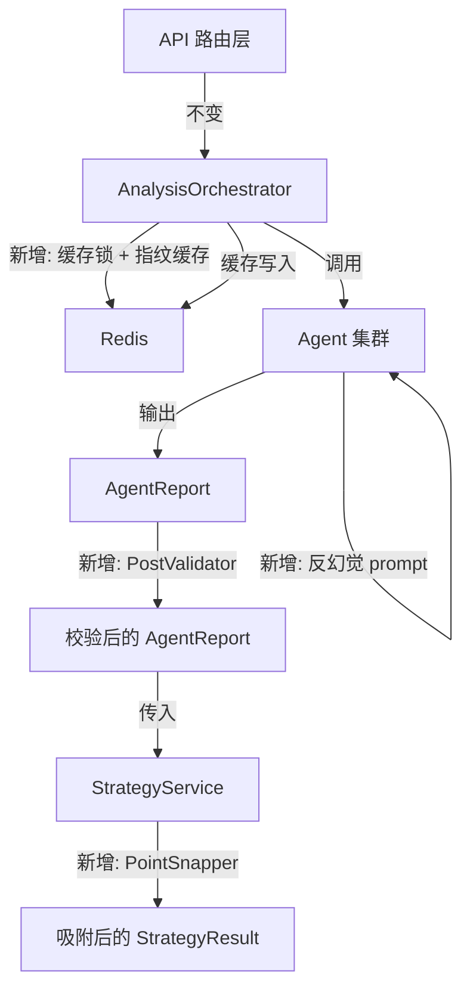
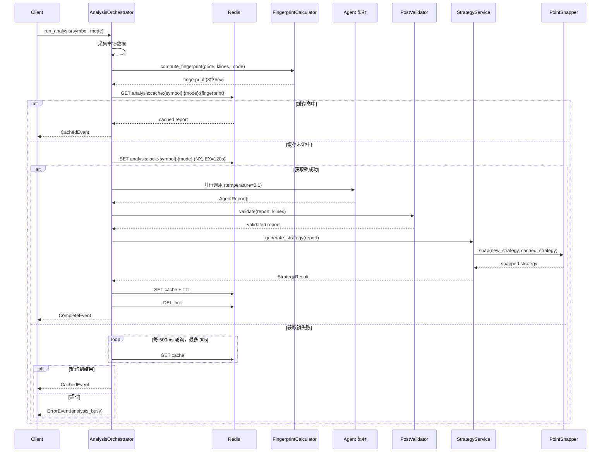

# 设计文档：分析结果一致性保障与反幻觉约束

## 概述

本设计解决多智能体分析系统中的结果一致性与可信度问题。核心改动涉及 6 个层面：

1. **LLM 调用层**：降低 temperature 默认值并增加范围校验，减少输出随机性
2. **智能体层**：在 4 个 Agent 的 system prompt 中注入反幻觉硬约束规则
3. **后验校验层**：新增 `PostValidator` 模块，对 TechnicalAgent 输出的支撑阻力位进行 K 线数据交叉验证
4. **策略层**：新增 `PointSnapper` 模块，对 StrategyService 输出的点位进行吸附逻辑处理
5. **编排层**：在 `AnalysisOrchestrator` 中引入 Redis 分布式锁防止缓存击穿，并增强缓存一致性
6. **缓存层**：引入数据指纹机制，使缓存 key 包含市场数据摘要，数据实质变化时自动触发缓存未命中

整体设计遵循项目分层架构约束：改动集中在 Service 层和 Agent 层，不涉及 API 路由层和数据层的业务逻辑变更。

## 架构

### 改动范围



### 数据流（以 intraday 模式为例）



## 组件与接口

### 1. UnifiedLLMClient 改动

**文件**: `backend/app/core/llm_client.py`

修改 `call_model` 方法：
- 默认 `temperature` 从 `0.3` 改为 `0.1`
- 新增范围校验：`temperature` 超出 `[0.0, 1.0]` 时裁剪至边界值并记录 warning 日志

```python
async def call_model(
    self,
    model_key: str,
    system_prompt: str,
    user_prompt: str,
    temperature: float = 0.1,  # 从 0.3 降至 0.1
    timeout_s: float = 30.0,
) -> dict[str, Any]:
    # 范围校验
    if temperature < 0.0 or temperature > 1.0:
        clamped = max(0.0, min(1.0, temperature))
        logger.warning(
            "temperature 超出范围，已裁剪",
            extra={"original": temperature, "clamped": clamped},
        )
        temperature = clamped
    # ... 其余逻辑不变
```

### 2. 反幻觉 Prompt 注入

**文件**: `backend/app/agents/technical.py`, `onchain.py`, `playbook.py`, `risk.py`

在每个 Agent 的 `_SYSTEM_PROMPT` 末尾追加反幻觉硬约束段落。各 Agent 的约束内容不同，但格式统一：

**TechnicalAgent 追加内容**:
```
【硬约束 - 反幻觉规则】
1. 禁止编造输入数据中不存在的支撑位或阻力位数值，所有输出价格点位必须可追溯到输入的 K 线或指标数据
2. 当输入数据中某项指标标注为"数据缺失"时，对应分析字段必须标注为"数据不足，无法判断"
3. evidence 或 reasoning 中必须明确引用输入数据中的具体数值作为依据
```

**OnchainAgent 追加内容**:
```
【硬约束 - 反幻觉规则】
1. 禁止编造链上指标数值，所有输出数据必须来自输入
2. 当输入数据标注为"数据缺失"时，对应分析字段必须标注为"数据不足，无法判断"，禁止给出推测值
3. evidence 列表中每条证据必须引用输入中的具体数值
```

**PlaybookAgent 追加内容**:
```
【硬约束 - 反幻觉规则】
1. 剧本匹配概率必须基于输入数据中实际存在的特征计算，禁止凭空赋予概率
2. 禁止引用输入中未提供的市场事件或数据
3. 当关键数据缺失时，必须在 reasoning 中明确说明数据不足对判断的影响
```

**RiskAgent 追加内容**:
```
【硬约束 - 反幻觉规则】
1. 风险评估必须基于实际触发的告警和输入的链上数据，禁止编造未在输入中出现的风险事件
2. 当输入数据标注为"数据缺失"时，对应风险维度必须标注为"数据不足，无法评估"
3. risk_factors 中每条风险因素必须引用输入中的具体数值
```

### 3. PostValidator（后验校验器）

**新文件**: `backend/app/services/post_validator.py`

```python
class PostValidator:
    """支撑阻力位后验校验器。"""

    RANGE_TOLERANCE: float = 0.20  # 20% 容差

    def validate_levels(
        self,
        report: AgentReport,
        klines: list[KlineData],
        n_klines: int = 30,
    ) -> AgentReport:
        """校验 support_levels 和 resistance_levels，丢弃超出范围的点位。"""
        ...
```

**接口说明**:
- 输入：`AgentReport`（含 `raw_data.support_levels` 和 `raw_data.resistance_levels`）+ 最近 K 线数据
- 输出：修改后的 `AgentReport`，`raw_data` 中新增 `validation_applied: true` 和 `discarded_levels` 列表
- 校验逻辑：取最近 30 根 K 线的 `[min(low), max(high)]` 作为合理范围，扩展 20% 后过滤
- 回退逻辑：全部支撑位被丢弃时用 `min(low)` 回退；全部阻力位被丢弃时用 `max(high)` 回退

### 4. PointSnapper（点位吸附器）

**新文件**: `backend/app/services/point_snapper.py`

```python
class PointSnapper:
    """策略点位吸附器 — 减少 LLM 微小随机性导致的点位漂移。"""

    SNAP_THRESHOLD: float = 0.005  # 0.5%

    async def snap(
        self,
        new_strategy: StrategyResult,
        symbol: str,
    ) -> StrategyResult:
        """将新策略点位与缓存策略比较，偏差小于阈值时沿用缓存值。"""
        ...
```

**接口说明**:
- 从 Redis 读取 `strategy:latest:{symbol}` 获取上一次策略
- 逐字段比较 `entry_low`, `entry_high`, `stop_loss`, `targets`
- 偏差 < 0.5% 时沿用缓存值
- `direction` 不同时跳过吸附，直接使用新值
- 在 `StrategyResult` 中新增 `snapped_fields: list[str]` 记录被吸附的字段

### 5. 缓存锁机制

**文件**: `backend/app/services/analysis_orchestrator.py`

在 `run_analysis` 方法中，缓存未命中后新增锁逻辑：

```python
lock_key = f"analysis:lock:{symbol}:{mode.value}"
lock_acquired = await redis.set(lock_key, "1", nx=True, ex=120)

if lock_acquired:
    try:
        report = await self._dispatch_mode(symbol, mode)
        await set_with_ttl(cache_key, report.model_dump(mode="json"), ttl)
    finally:
        await redis.delete(lock_key)
else:
    # 轮询等待，500ms 间隔，最多 90s
    for _ in range(180):
        await asyncio.sleep(0.5)
        cached = await get_json(cache_key)
        if cached is not None:
            report = AnalysisReport.model_validate(cached)
            report.cached = True
            yield _sse(CachedEvent(report=report))
            return
    yield _sse(ErrorEvent(code="analysis_busy", message="分析正在进行中，请稍后重试"))
    return
```

### 6. FingerprintCalculator（数据指纹计算器）

**新文件**: `backend/app/services/fingerprint.py`

```python
import hashlib
from app.models.analysis import AnalysisMode
from app.models.market_data import KlineData

# 模式精度配置
MODE_PRECISION: dict[AnalysisMode, float] = {
    AnalysisMode.SCALPING: 0.001,   # 0.1%
    AnalysisMode.INTRADAY: 0.005,   # 0.5%
    AnalysisMode.TREND: 0.01,       # 1%
}

# 模式 K 线数量配置
MODE_KLINE_COUNT: dict[AnalysisMode, int] = {
    AnalysisMode.SCALPING: 6,
    AnalysisMode.INTRADAY: 4,
    AnalysisMode.TREND: 3,
}

def round_price_by_precision(price: float, precision: float) -> float:
    """按精度取整价格。"""
    if price <= 0 or precision <= 0:
        return 0.0
    step = price * precision
    return round(price / step) * step

def compute_fingerprint(
    price: float,
    klines: list[KlineData],
    mode: AnalysisMode,
) -> str:
    """计算数据指纹，返回 8 位十六进制字符串。"""
    precision = MODE_PRECISION[mode]
    n = MODE_KLINE_COUNT[mode]

    rounded_price = round_price_by_precision(price, precision)
    recent_closes = [str(k.close) for k in klines[-n:]] if klines else []

    raw_str = f"{rounded_price}|{'|'.join(recent_closes)}"
    return hashlib.md5(raw_str.encode()).hexdigest()[:8]
```

**缓存 key 变更**:
- 旧格式: `analysis:cache:{symbol}:{mode}`
- 新格式: `analysis:cache:{symbol}:{mode}:{fingerprint}`

TTL 保留作为兜底过期机制。

## 数据模型

### 新增/修改的模型

**StrategyResult 扩展**（`backend/app/services/strategy.py`）:
```python
class StrategyResult(BaseModel):
    symbol: str
    direction: str
    entry_low: float
    entry_high: float
    stop_loss: float
    targets: list[float] = Field(default_factory=list)
    confidence: float = Field(ge=0.0, le=1.0)
    valid_until: datetime
    reasoning: str
    snapped_fields: list[str] = Field(default_factory=list)  # 新增
```

**AgentReport.raw_data 扩展字段**（无模型变更，通过 dict 扩展）:
- `validation_applied: bool` — 是否经过后验校验
- `discarded_levels: list[dict]` — 被丢弃的点位列表，每项含 `type`（support/resistance）、`value`、`reason`

**FingerprintConfig 常量**（`backend/app/services/fingerprint.py`）:
- `MODE_PRECISION: dict[AnalysisMode, float]` — 各模式价格精度
- `MODE_KLINE_COUNT: dict[AnalysisMode, int]` — 各模式 K 线数量


## 正确性属性（Correctness Properties）

*正确性属性是系统在所有合法执行路径上都应保持为真的特征或行为——本质上是对系统应做什么的形式化陈述。属性是连接人类可读规格说明与机器可验证正确性保证的桥梁。*

### Property 1: Temperature 裁剪幂等性

*对于任意* 浮点数 `t` 作为 temperature 参数传入 `call_model`，实际使用的 temperature 值应等于 `max(0.0, min(1.0, t))`。特别地，当 `0.0 <= t <= 1.0` 时，值不变；当 `t < 0.0` 时，值为 `0.0`；当 `t > 1.0` 时，值为 `1.0`。

**Validates: Requirements 1.2, 1.3**

### Property 2: 后验校验保留点位均在合理范围内

*对于任意* 非空 K 线列表和任意支撑位/阻力位列表，经过 `PostValidator.validate_levels` 校验后，返回的 `support_levels` 和 `resistance_levels` 中的每个点位都应在 `[min_low * (1 - 0.20), max_high * (1 + 0.20)]` 范围内（其中 `min_low` 和 `max_high` 分别为最近 30 根 K 线的最低价和最高价）。当所有原始点位被丢弃时，回退值（最低价或最高价）也应在此范围内。同时 `raw_data` 中应包含 `validation_applied: true` 和 `discarded_levels` 列表。

**Validates: Requirements 3.1, 3.2, 3.3, 3.4, 3.5**

### Property 3: 点位吸附阈值一致性

*对于任意* 两个同方向的 `StrategyResult`（新策略和缓存策略），对于 `entry_low`、`entry_high`、`stop_loss`、`targets` 中的每个数值字段：若新值与缓存值的相对偏差 `|new - cached| / cached < 0.005`，则吸附后的值应等于缓存值；若偏差 >= 0.005，则吸附后的值应等于新值。且 `snapped_fields` 列表应准确记录所有被吸附的字段名。

**Validates: Requirements 4.2, 4.3, 4.4, 4.5, 4.7**

### Property 4: 方向变化跳过吸附

*对于任意* 两个 `StrategyResult`，若新策略的 `direction` 与缓存策略的 `direction` 不同，则吸附后的策略应与新策略完全相同（所有数值字段不变），且 `snapped_fields` 为空列表。

**Validates: Requirements 4.6**

### Property 5: 指纹确定性

*对于任意* 价格 `p`、K 线列表 `klines` 和分析模式 `mode`，`compute_fingerprint(p, klines, mode)` 的返回值应是确定的——相同输入始终产生相同的 8 位十六进制字符串。

**Validates: Requirements 7.2, 7.5**

### Property 6: 指纹对价格变动的敏感性

*对于任意* 价格 `p`、K 线列表 `klines` 和分析模式 `mode`，若价格变动量 `delta` 使得 `round_price_by_precision(p, precision) != round_price_by_precision(p + delta, precision)`（即取整后的价格不同），则 `compute_fingerprint(p, klines, mode) != compute_fingerprint(p + delta, klines, mode)`。

**Validates: Requirements 7.3**

### Property 7: 指纹对 K 线变化的敏感性

*对于任意* 价格 `p`、两个不同的 K 线收盘价序列 `klines_a` 和 `klines_b`（最近 N 根的收盘价至少有一个不同）和分析模式 `mode`，`compute_fingerprint(p, klines_a, mode) != compute_fingerprint(p, klines_b, mode)`。

**Validates: Requirements 7.3**

## 错误处理

### 各层错误处理策略

| 层级 | 错误场景 | 处理方式 |
|------|----------|----------|
| LLM 调用层 | temperature 超出范围 | 裁剪至边界值 + warning 日志 |
| 后验校验层 | K 线数据为空 | 跳过校验，返回原始 report，`validation_applied: false` |
| 后验校验层 | 所有点位被丢弃 | 使用 K 线最低价/最高价作为回退值 |
| 点位吸附层 | Redis 读取缓存策略失败 | 跳过吸附，使用新策略，记录 warning 日志 |
| 点位吸附层 | 缓存策略不存在 | 跳过吸附，使用新策略（首次分析场景） |
| 缓存锁层 | 获取锁失败 | 轮询等待缓存结果，最多 90 秒 |
| 缓存锁层 | 轮询超时 | 返回 `ErrorEvent(code="analysis_busy")` |
| 缓存锁层 | 持锁进程崩溃 | 锁自动过期（120 秒），下一个请求可获取锁 |
| 指纹计算层 | 价格为 0 或负数 | `round_price_by_precision` 返回 0.0，指纹仍可计算 |
| 指纹计算层 | K 线列表为空 | 指纹仅基于价格计算，仍然有效 |

### 降级策略

- **PostValidator 降级**：校验过程异常时，返回原始 AgentReport 不做修改，记录 error 日志
- **PointSnapper 降级**：吸附过程异常时，返回原始 StrategyResult 不做修改，记录 error 日志
- **FingerprintCalculator 降级**：指纹计算异常时，回退到不含指纹的旧缓存 key 格式，记录 warning 日志

## 测试策略

### 测试框架选择

- **单元测试**: `pytest` + `pytest-asyncio`
- **属性测试**: `hypothesis`（Python 属性测试库，支持丰富的数据生成策略）
- **Mock**: `unittest.mock` + `pytest-mock`（mock Redis 和 LLM 调用）

### 属性测试配置

- 每个属性测试最少运行 **100 次迭代**（`@settings(max_examples=100)`）
- 每个属性测试必须用注释标注对应的设计属性编号
- 标注格式: `# Feature: analysis-consistency, Property {N}: {property_text}`

### 单元测试覆盖

| 测试文件 | 覆盖范围 |
|----------|----------|
| `test_llm_temperature.py` | temperature 默认值检查、边界值裁剪 |
| `test_anti_hallucination.py` | 4 个 Agent 的 system prompt 包含反幻觉规则 |
| `test_post_validator.py` | 后验校验逻辑、回退逻辑、discarded_levels 记录 |
| `test_point_snapper.py` | 点位吸附逻辑、方向变化跳过、snapped_fields 记录 |
| `test_cache_lock.py` | 锁获取/释放、轮询等待、超时处理（mock Redis） |
| `test_fingerprint.py` | 指纹计算确定性、敏感性、格式校验 |
| `test_cache_consistency.py` | 缓存 key 格式、TTL 设置、缓存命中标记 |

### 属性测试覆盖

| 属性编号 | 测试文件 | 数据生成策略 |
|----------|----------|-------------|
| Property 1 | `test_llm_temperature.py` | `st.floats(min_value=-100, max_value=100)` 生成任意 temperature |
| Property 2 | `test_post_validator.py` | `st.lists(st.floats(min_value=1, max_value=200000))` 生成 K 线价格和点位 |
| Property 3 | `test_point_snapper.py` | 生成两个同方向的 StrategyResult，数值字段在合理范围内随机 |
| Property 4 | `test_point_snapper.py` | 生成两个不同方向的 StrategyResult |
| Property 5 | `test_fingerprint.py` | `st.floats(min_value=0.01, max_value=200000)` + 随机 K 线列表 + 随机模式 |
| Property 6 | `test_fingerprint.py` | 生成价格对 `(p, p+delta)`，确保取整后不同 |
| Property 7 | `test_fingerprint.py` | 生成两个收盘价序列不同的 K 线列表 |

### 集成测试

- **缓存锁并发测试**: 使用 `asyncio.gather` 模拟多个并发请求，验证只有一个请求执行 LLM 调用
- **端到端缓存一致性测试**: 验证同一 symbol+mode 在缓存有效期内返回相同结果
- **指纹缓存失效测试**: 验证价格变动超过阈值后缓存未命中，触发新分析
