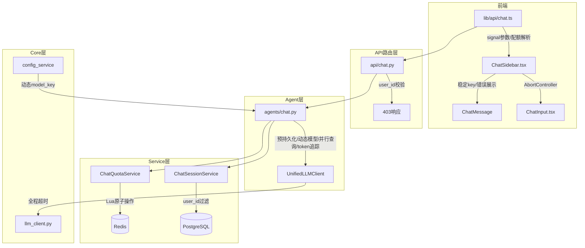
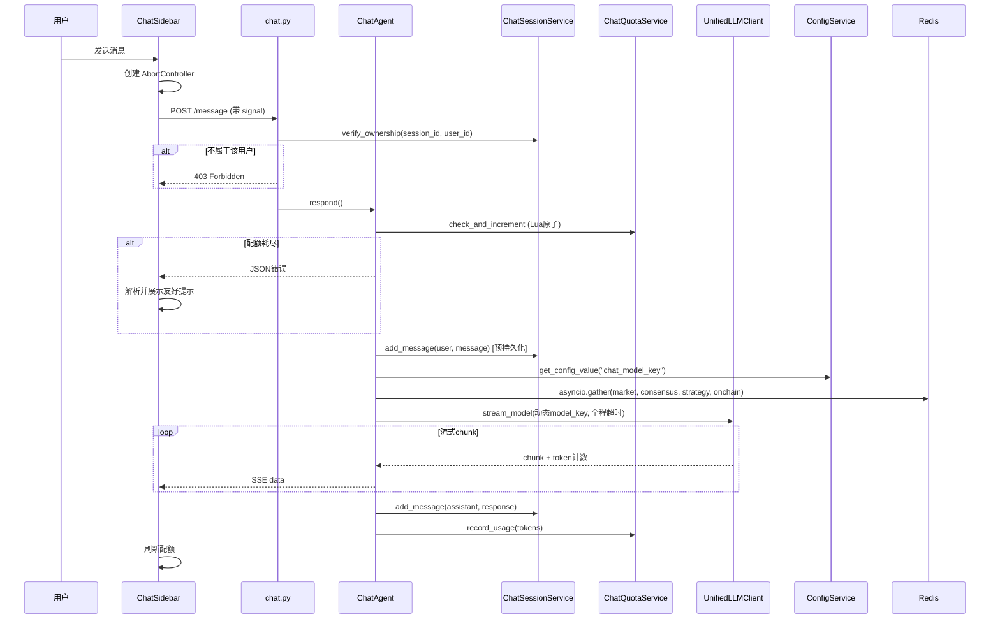

# 设计文档：AI 对话功能优化

## 概述

本设计文档覆盖 AI 对话功能的 12 项优化，分为三个维度：

1. **安全性修复**（需求 1）：会话归属权校验，防止越权访问
2. **后端健壮性**（需求 2-8）：消息预持久化、动态模型配置、并行查询、token 追踪、超时控制、原子限流
3. **前端体验**（需求 9-12）：配额错误展示、请求取消、稳定 key、错误可见化

所有改动遵循现有分层架构（API 路由层 → Service 层 → Agent 层 → 数据层），不引入新的外部依赖。

## 架构

### 改动范围



### 数据流变更

**发送消息流程（优化后）：**



## 组件与接口

### 1. ChatSessionService 变更

**新增方法：`verify_ownership`**

```python
async def verify_ownership(self, session_id: UUID, user_id: UUID) -> bool:
    """验证会话是否属于指定用户。返回 True/False。"""
```

**修改方法：`get_history`**

```python
async def get_history(
    self, session_id: UUID, *, user_id: UUID, limit: int = 20
) -> list[dict]:
    """增加 user_id 参数，SQL 同时过滤 session_id 和 user_id。"""
```

SQL 变更：
```sql
-- 原始
WHERE session_id = :session_id
-- 优化后
WHERE session_id = :session_id AND session_id IN (
    SELECT id FROM chat_sessions WHERE user_id = :user_id
)
```

### 2. ChatQuotaService 变更

**修改方法：`check_and_increment` — Lua 原子操作**

```python
_LUA_CHECK_AND_INCR = """
local key = KEYS[1]
local limit = tonumber(ARGV[1])
local ttl = tonumber(ARGV[2])
local current = redis.call('INCR', key)
if current == 1 then
    redis.call('EXPIRE', key, ttl)
end
if current > limit then
    redis.call('DECR', key)
    return {0, 0}
end
return {1, limit - current}
"""
```

将 INCR + EXPIRE 合并为单次 Lua 脚本执行，消除竞态条件。

### 3. ChatAgent 变更

**预持久化**：在 `respond()` 中，限流检查通过后、LLM 调用前，先 `add_message(user, message)`。流式完成后只保存 assistant 回复。

**动态模型配置**：
```python
from app.services.config_service import get_config_value

model_key = await get_config_value("chat_model_key", "gpt4o")
```

**并行上下文查询**：
```python
async def _gather_context(self, symbol: str | None, intent: str) -> dict:
    if symbol is None:
        return {}
    tasks = {
        "market": get_json(f"market:latest:{symbol}"),
        "consensus": get_json(f"consensus:latest:{symbol}"),
        "strategy": get_json(f"strategy:latest:{symbol}"),
        "onchain": get_json(f"onchain:latest:{symbol}"),
    }
    # 根据 intent 过滤需要的 keys
    needed = self._keys_for_intent(intent)
    results = await asyncio.gather(
        *[tasks[k] for k in needed],
        return_exceptions=True,
    )
    return {
        k: v for k, v in zip(needed, results)
        if v is not None and not isinstance(v, Exception)
    }
```

**Token 用量追踪**：在流式迭代中累计 completion_tokens，完成后调用 `quota_svc.record_usage()`。

### 4. UnifiedLLMClient.stream_model 变更

**全程超时控制**：

```python
async def stream_model(
    self,
    model_key: str,
    messages: list[dict[str, str]],
    temperature: float = 0.3,
    timeout_s: float = 30.0,
    chunk_timeout_s: float = 10.0,  # 新增：单chunk超时
) -> AsyncGenerator[str, None]:
```

当前实现只对初始连接有超时（`asyncio.wait_for` 包裹 `create` 调用），但流式迭代阶段无超时保护。优化后：

- 使用 `asyncio.wait_for` 包裹整个流式迭代（`timeout_s` 控制总耗时）
- 对每个 `async for chunk` 使用 `asyncio.wait_for` 包裹 `__anext__`（`chunk_timeout_s` 控制单次读取）

### 5. API 路由层变更 (chat.py)

**send_message 端点**：调用 `ChatAgent.respond` 前，先调用 `session_svc.verify_ownership()`，失败返回 403。

**get_messages 端点**：传递 `user_id` 给 `get_history()`。

### 6. 前端 lib/api/chat.ts 变更

**sendMessage 增加 AbortSignal**：

```typescript
export async function* sendMessage(
  request: ChatMessageRequest,
  signal?: AbortSignal,  // 新增
): AsyncGenerator<string, void, undefined> {
  const res = await fetch(url, {
    ...options,
    signal,  // 传递给 fetch
  });
  // ...
}
```

**配额耗尽 JSON 检测**：在 SSE 数据解析中，检测 `{"error": ...}` 格式并抛出结构化错误。

### 7. ChatSidebar.tsx 变更

- **AbortController 集成**：`handleSend` 中创建 `AbortController`，存入 `abortRef`，传递 signal 给 `sendMessage`
- **取消按钮**：streaming 状态下 ChatInput 显示取消按钮
- **稳定 key**：消息 key 改为 `${msg.createdAt}-${msg.role}-${index}` 或基于消息 ID
- **错误可见化**：`initSession` 和 `loadHistory` 失败时显示错误 UI + 重试按钮
- **配额耗尽展示**：检测到配额错误时显示友好中文提示，自动刷新配额并禁用输入

### 8. ChatInput.tsx 变更

- **取消按钮**：新增 `streaming` 和 `onCancel` props，streaming 时显示停止按钮替代发送按钮

## 数据模型

### 现有表结构（无需变更）

```sql
-- chat_sessions 表
CREATE TABLE chat_sessions (
    id UUID PRIMARY KEY DEFAULT gen_random_uuid(),
    user_id UUID NOT NULL REFERENCES users(id),
    created_at TIMESTAMPTZ DEFAULT NOW(),
    updated_at TIMESTAMPTZ DEFAULT NOW()
);

-- chat_messages 表
CREATE TABLE chat_messages (
    id UUID PRIMARY KEY DEFAULT gen_random_uuid(),
    session_id UUID NOT NULL REFERENCES chat_sessions(id),
    role VARCHAR(20) NOT NULL,  -- 'user' | 'assistant'
    content TEXT NOT NULL,
    token_count INTEGER,
    model_key VARCHAR(50),
    latency_ms INTEGER,
    created_at TIMESTAMPTZ DEFAULT NOW()
);
```

### 动态配置键

| 配置键 | 默认值 | 说明 |
|--------|--------|------|
| `chat_model_key` | `gpt4o` | 对话使用的 LLM 模型键 |
| `chat_stream_timeout_s` | `120` | 流式响应总超时（秒） |
| `chat_chunk_timeout_s` | `15` | 单 chunk 读取超时（秒） |

这些配置通过已有的 `config_service.get_config_value()` 读取，无需新建表。

### Redis 数据结构

**限流计数器（优化后）**：
- Key: `chat_quota:{user_id}:{date}`
- Type: String (integer)
- TTL: 到次日 UTC 00:00 的秒数
- 操作: Lua 脚本原子执行 INCR + EXPIRE

**用量统计（不变）**：
- Key: `chat_usage:{user_id}:{date}`
- Type: Hash
- Fields: `total_calls`, `total_latency_ms`, `total_prompt_tokens`, `total_completion_tokens`, `total_tokens`, `last_model`

### 前端状态模型

```typescript
interface LocalMessage {
  id: string;           // 新增：稳定唯一标识符
  role: "user" | "assistant";
  content: string;
  createdAt: string;
}

interface ChatError {
  type: "init" | "history" | "send" | "quota";
  message: string;
  retryCount: number;
}
```

## 正确性属性

*属性（Property）是在系统所有合法执行路径中都应成立的特征或行为——本质上是对系统行为的形式化陈述。属性是人类可读规格说明与机器可验证正确性保证之间的桥梁。*

### Property 1: 会话归属隔离

*For any* user_id 和 session_id 组合，当 session_id 不属于该 user_id 时，`get_history(session_id, user_id=user_id)` 应返回空列表，且 API 层应返回 HTTP 403。

**Validates: Requirements 1.1, 1.2**

### Property 2: 用户消息持久化不变量

*For any* 合法的用户消息和会话，调用 `respond()` 后（无论 LLM 是否成功），用户消息在数据库中应恰好出现一次，且在 LLM 调用之前已存在。

**Validates: Requirements 2.1, 2.3**

### Property 3: 动态模型配置传递

*For any* 动态配置中的 `chat_model_key` 值，`ChatAgent.respond()` 应将该值传递给 `UnifiedLLMClient.stream_model()` 的 `model_key` 参数。

**Validates: Requirements 3.1**

### Property 4: 取消后部分内容保留

*For any* 正在进行的流式响应，当 AbortController.abort() 被调用时，已接收的 chunk 内容应被保留在消息列表中，且 streaming 状态应变为 false。

**Validates: Requirements 4.3**

### Property 5: 上下文查询部分失败容错

*For any* Redis 数据源子集失败的情况，`_gather_context()` 返回的字典应包含所有成功查询的数据源，且不包含失败的数据源。

**Validates: Requirements 5.2**

### Property 6: Token 用量记录完整性

*For any* 成功完成的流式响应，`ChatQuotaService.record_usage()` 应被调用，且记录的 completion_tokens 应等于流式过程中所有 chunk 的 token 累计值。

**Validates: Requirements 6.1**

### Property 7: 流式总超时终止

*For any* 流式响应，当总耗时超过 `timeout_s` 配置值时，`stream_model()` 应终止迭代并 yield 包含超时错误信息的字符串。

**Validates: Requirements 7.1**

### Property 8: 单 Chunk 超时终止

*For any* 流式响应中的单个 chunk 读取，当等待时间超过 `chunk_timeout_s` 时，`stream_model()` 应终止迭代并 yield 超时错误提示。

**Validates: Requirements 7.3**

### Property 9: 限流计数器原子性

*For any* 首次执行 `check_and_increment()` 的用户，操作完成后 Redis key 应同时具有正确的计数值（1）和有效的 TTL（> 0 秒）。

**Validates: Requirements 8.1**

### Property 10: 配额耗尽 JSON 解析

*For any* 包含 `{"error": ..., "remaining": 0}` 结构的 SSE 数据，`sendMessage` 应将其识别为配额耗尽错误并抛出结构化异常，而非作为普通文本 yield。

**Validates: Requirements 9.1**

### Property 11: 消息 Key 稳定性与唯一性

*For any* 消息列表和任意新增消息，所有消息的 React key 应互不相同，且已有消息的 key 在新增操作后保持不变。

**Validates: Requirements 11.1, 11.2**

### Property 12: 错误日志完整性

*For any* ChatSidebar 捕获的错误（包括 initSession、loadHistory、sendMessage 失败），该错误应被记录到浏览器 console，包含错误类型和上下文信息。

**Validates: Requirements 12.3**

## 错误处理

### 后端错误处理策略

| 场景 | 处理方式 | 降级行为 |
|------|----------|----------|
| 会话归属校验失败 | API 层返回 HTTP 403 + JSON `{"detail": "无权访问该会话"}` | 不降级，直接拒绝 |
| 用户消息预持久化失败 | SSE yield `{"error": "消息保存失败，请重试"}` + 终止流程 | 不降级，不调用 LLM |
| 动态配置读取失败 | 记录 WARNING 日志，回退使用 `"gpt4o"` | 使用默认模型继续 |
| Redis 上下文查询部分失败 | 跳过失败数据源，记录 ERROR 日志 | 使用可用数据源继续 |
| Redis 上下文查询全部失败 | 返回空上下文 `{}`，记录 ERROR 日志 | 无上下文继续对话 |
| LLM 流式总超时 | yield `"\n[错误] 模型响应超时，请稍后重试"` | 保留已接收内容 |
| LLM 单 chunk 超时 | yield `"\n[错误] 模型响应中断，请稍后重试"` | 保留已接收内容 |
| Token 用量记录失败 | 记录 ERROR 日志，不影响用户响应 | 静默跳过记录 |
| Redis 限流 Lua 脚本失败 | 记录 ERROR 日志，拒绝本次请求 | 安全降级：拒绝而非放行 |
| 限流计数器超限 | yield JSON `{"error": "今日查询次数已用完", "remaining": 0}` | 不调用 LLM |

### 前端错误处理策略

| 场景 | 处理方式 | 用户体验 |
|------|----------|----------|
| initSession 失败 | 显示错误提示 + 重试按钮，`console.error` 记录 | 用户可手动重试 |
| loadHistory 失败 | 显示"加载失败"提示 + 重试按钮 | 用户可手动重试 |
| 连续失败 ≥ 3 次 | 显示"服务暂时不可用"，延长重试间隔（指数退避） | 避免频繁重试 |
| 配额耗尽 JSON | 解析 JSON，显示友好中文提示，禁用输入框，刷新配额 | 明确告知剩余次数 |
| AbortError（用户取消） | 保留已接收内容，结束 streaming 状态 | 无错误提示 |
| 网络错误 / 其他异常 | 在 assistant 消息位置显示错误提示 | 用户知道出了问题 |
| fetch 403 响应 | 显示"会话访问被拒绝"提示 | 引导用户新建会话 |

### 错误分类与重试策略

```typescript
// 前端错误类型
type ChatErrorType = "init" | "history" | "send" | "quota" | "abort" | "network";

// 重试策略
const RETRY_CONFIG = {
  maxRetries: 3,
  baseDelay: 1000,      // 1秒
  maxDelay: 10000,       // 10秒
  backoffMultiplier: 2,  // 指数退避
};
```

## 测试策略

### 测试框架

- **后端**: pytest + pytest-asyncio + hypothesis（属性测试）
- **前端**: vitest + @testing-library/react + fast-check（属性测试）

### 属性测试（Property-Based Testing）

每个正确性属性对应一个属性测试，最少运行 100 次迭代。每个测试用注释标注对应的设计属性。

**后端属性测试**（hypothesis）：

| 属性 | 测试文件 | 生成器 |
|------|----------|--------|
| Property 1: 会话归属隔离 | `test_chat_session.py` | 随机 UUID 对（user_id, session_id） |
| Property 2: 用户消息持久化不变量 | `test_chat_agent.py` | 随机消息字符串 + mock DB |
| Property 3: 动态模型配置传递 | `test_chat_agent.py` | 随机 model_key 字符串 |
| Property 5: 上下文查询部分失败容错 | `test_chat_agent.py` | 随机失败数据源子集 |
| Property 6: Token 用量记录完整性 | `test_chat_agent.py` | 随机 token 计数序列 |
| Property 7: 流式总超时终止 | `test_llm_client.py` | 随机超时阈值 + mock 慢流 |
| Property 8: 单 Chunk 超时终止 | `test_llm_client.py` | 随机 chunk 延迟 |
| Property 9: 限流计数器原子性 | `test_chat_quota.py` | 随机 user_id + level 组合 |

**前端属性测试**（fast-check）：

| 属性 | 测试文件 | 生成器 |
|------|----------|--------|
| Property 4: 取消后部分内容保留 | `ChatSidebar.test.tsx` | 随机 chunk 序列 + 随机取消时机 |
| Property 10: 配额耗尽 JSON 解析 | `chat.test.ts` | 随机 error/remaining JSON 结构 |
| Property 11: 消息 Key 稳定性与唯一性 | `ChatSidebar.test.tsx` | 随机消息列表 + 随机新增消息 |
| Property 12: 错误日志完整性 | `ChatSidebar.test.tsx` | 随机错误类型和消息 |

**标注格式**：
```python
# Feature: chat-optimization, Property 1: 会话归属隔离
@given(user_id=st.uuids(), other_user_id=st.uuids(), session_id=st.uuids())
def test_session_ownership_isolation(user_id, other_user_id, session_id):
    ...
```

```typescript
// Feature: chat-optimization, Property 11: 消息 Key 稳定性与唯一性
fc.assert(
  fc.property(fc.array(messageArb), fc.tuple(messageArb), (messages, newMsg) => {
    // ...
  }),
  { numRuns: 100 }
);
```

### 单元测试

单元测试覆盖属性测试无法覆盖的具体场景和边界条件：

| 测试场景 | 类型 | 文件 |
|----------|------|------|
| 配置读取失败回退 "gpt4o" | example | `test_chat_agent.py` |
| 用户消息持久化失败终止流程 | example | `test_chat_agent.py` |
| Token 用量记录失败不影响响应 | example | `test_chat_agent.py` |
| Redis 限流 Lua 脚本失败拒绝请求 | example | `test_chat_quota.py` |
| AbortController.abort 终止 fetch | example | `chat.test.ts` |
| streaming 状态下显示取消按钮 | example | `ChatInput.test.tsx` |
| 配额耗尽显示友好提示 | example | `ChatSidebar.test.tsx` |
| initSession 失败显示重试按钮 | example | `ChatSidebar.test.tsx` |
| loadHistory 失败显示重试按钮 | example | `ChatSidebar.test.tsx` |
| 连续 3 次失败显示"服务不可用" | example | `ChatSidebar.test.tsx` |
| AbortError 抛出区分取消和其他错误 | example | `chat.test.ts` |
| 所有 Redis 查询失败返回空上下文 | edge-case | `test_chat_agent.py` |

### Mock 策略

- **数据库**: 使用 `AsyncMock` mock `AsyncSession`，验证 SQL 参数包含 `user_id`
- **Redis**: 使用 `fakeredis` 或 `AsyncMock`，验证 Lua 脚本执行和 TTL 设置
- **LLM**: mock `UnifiedLLMClient.stream_model`，返回可控的 async generator
- **ConfigService**: mock `get_config_value`，返回指定的 model_key 或抛出异常
- **fetch**: 使用 `vi.fn()` mock fetch，模拟 SSE 流和各种错误响应
