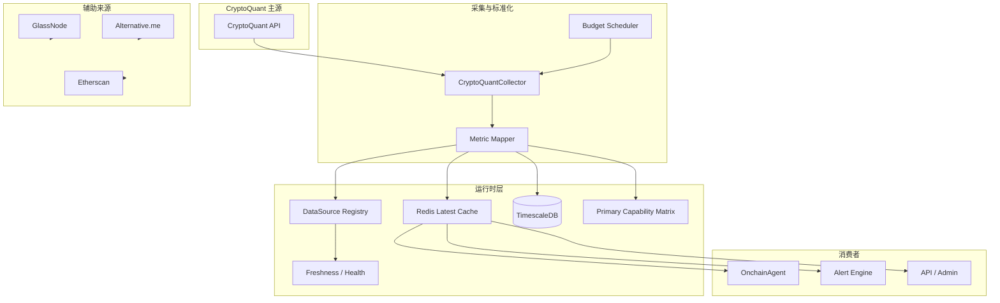

# 设计文档：CryptoQuant 链上主数据源

## 文档状态

- **当前定位**：本文件是 `four-primary-datasources` 下 `CryptoQuant` 子域设计文档。
- **主职责域**：`onchain`
- **设计前提**：已确认 Professional ($109/月)，`20 req/min`、仅按天分辨率、最长1天API历史、`1年`数据保留、仅限个人使用、节流式采集。
- **关系说明**：本设计是系统链上主能力对齐的设计入口，不替代系统级总纲。

## 概述

本设计的目标，是把当前分散在 `GlassNode / Alternative.me / 历史 CryptoQuant 表述 / 注释层` 中的链上能力，正式收口到 `CryptoQuant` 主源模型下，并为后续实现提供一条明确的对齐路径：

- 上游只认 `CryptoQuant` 为链上主 owner
- 下游消费系统稳定能力键，而不是供应商私有字段名
- 主源不可用时允许 fallback，但必须显式标记降级
- 首阶段严格服从个人档预算，不以高档位假设反推当前实现

## 架构

### 链上主源对齐架构图



## 核心设计决策

| 决策 | 选择 | 原因 |
|------|------|------|
| 链上主源 | CryptoQuant | 与四主源总纲一致，便于收敛 owner |
| 默认预算 | 20 req/min | Professional ($109) 实际限额 |
| 默认历史窗口 | 1年 | Professional 套餐数据保留期 |
| 首阶段币种数 | 3-4 个 | 控制预算与复杂度 |
| 首阶段指标数 | 约 10 个 | 优先高价值指标 |
| 调度策略 | 分层节流 | 避免所有指标同频拉取 |
| fallback 策略 | 显式降级 | 防止旧辅助源重新篡位 |

## 部署许可 gate

### 许可模式

- `personal_research`：当前默认 spec 前提，仅用于个人研究/验证路线
- `commercial_production`：多用户产品、会员服务、商业生产环境所需模式

### gate 规则

- 当前已确认 Professional ($109)，仅限个人使用
- 若部署目标为商业化多用户环境，必须升级至可商用档位
- 当前档位仅限个人研究/开发验证
- 未通过许可 gate 前，不得把 `cryptoquant` 标记为正式生产主源

## 组件设计

### 1. CryptoQuantCollector

**建议位置**：`backend/app/data/cryptoquant.py`

职责：

- 统一封装 CryptoQuant API 请求
- 管理鉴权、超时、限流、重试
- 将原始数据映射到系统能力键
- 输出给缓存和时序存储

```python
class CryptoQuantCollector:
    async def collect_snapshot(self, symbol: str) -> dict[str, object]:
        ...

    async def collect_metric(self, symbol: str, metric_key: str) -> object | None:
        ...

    async def collect_batch(self, symbol: str, metric_keys: list[str]) -> dict[str, object]:
        ...
```

### 2. BudgetScheduler

职责：

- 按分钟预算切片
- 区分高优先级与低优先级指标
- 限流时自动降级低优先级采集

```python
class CryptoQuantBudgetScheduler:
    req_per_minute: int = 20

    def build_plan(self, symbols: list[str], metrics: list[str]) -> list[ScheduledTask]:
        ...

    def prioritize(self, tasks: list[ScheduledTask]) -> list[ScheduledTask]:
        ...
```

### 3. MetricMapper

职责：

- 把供应商指标名映射为系统稳定能力键
- 补单位、方向语义、数据质量标签
- 输出主能力矩阵记录

#### 建议首阶段能力键

| 系统能力键 | 说明 | 优先级 |
|------------|------|--------|
| `exchange_netflow` | 交易所净流量 | P0 |
| `exchange_inflow` | 交易所流入 | P0 |
| `exchange_outflow` | 交易所流出 | P0 |
| `exchange_reserve` | 交易所储备/余额 | P0 |
| `whale_activity` | 鲸鱼活动 | P1 |
| `stablecoin_flow` | 稳定币流向 | P1 |
| `miner_activity` | 矿工相关活动 | P1，仅 BTC |
| `large_holder_balance` | 大户余额变化 | P1 |
| `exchange_whale_ratio` | 交易所鲸鱼比率 | P2 |
| `supply_activity` | 供给侧活动 | P2 |

#### endpoint family / 预算矩阵

以下矩阵使用 **endpoint family** 而非硬编码 URL，避免在未校验实际套餐权限前伪造供应商接口细节。实现前必须将 family 固化为具体 vendor endpoint 标识。

| capability_key | endpoint_family | 现有模型落点 | 适用币种 | 目标频率 | 预算优先级 | 说明 |
|----------------|-----------------|--------------|----------|----------|------------|------|
| `exchange_netflow` | exchange-netflow family | `exchange_netflow` | BTC/ETH/SOL/BNB | 5-15m | P0 | 首阶段最核心 owner 能力 |
| `exchange_inflow` | exchange-flow family | 新增字段或派生缓存 | BTC/ETH | 5-15m | P0 | 若现有模型不扩字段，可先缓存层承接 |
| `exchange_outflow` | exchange-flow family | 新增字段或派生缓存 | BTC/ETH | 5-15m | P0 | 与 inflow 成对管理 |
| `exchange_reserve` | exchange-reserve family | `exchange_balance` | BTC/ETH | 5-15m | P0 | 现有字段沿用兼容别名 |
| `whale_activity` | whale-address family | `whale_change_24h` / `large_tx_count` / `large_tx_volume` | BTC/ETH | 15-30m | P1 | 首阶段允许拆成多个兼容字段 |
| `stablecoin_flow` | stablecoin-flow family | 新增字段 | BTC/ETH | 15-30m | P1 | 若套餐不支持则推迟至 P1+ |
| `miner_activity` | miner family | `miner_reserve_change` | BTC | 30-60m | P1 | BTC 专属 |
| `exchange_whale_ratio` | whale-ratio family | 新增字段 | BTC | 30-60m | P2 | 非一期阻塞项 |
| `supply_activity` | supply family | `active_addresses` / `new_addresses` 待定 | BTC/ETH | 30-60m | P2 | 需先确认 vendor 能力与语义 |

#### 当前 `OnchainSnapshot` 兼容/迁移表

当前仓库 `OnchainSnapshot` 已存在以下字段：`exchange_netflow`、`whale_change_24h`、`fear_greed_index`、`mvrv`、`active_addresses`、`new_addresses`、`exchange_balance`、`large_tx_count`、`large_tx_volume`、`miner_reserve_change`。

| 当前字段 | 新能力语义 | 处理策略 | owner 归属说明 |
|----------|------------|----------|----------------|
| `exchange_netflow` | `exchange_netflow` | 直接保留 | 一期主 owner 可对齐 `cryptoquant` |
| `exchange_balance` | `exchange_reserve` | 保留字段名作兼容别名，同时允许新语义名 | 一期主 owner 可对齐 `cryptoquant` |
| `whale_change_24h` | `whale_activity` 子视图 | 继续保留，作为兼容字段 | 一期可由 `cryptoquant` 驱动，但不得强行代表全部鲸鱼能力 |
| `large_tx_count` | `whale_activity` 子视图 | 保留 | 可作为大额活动补充维度 |
| `large_tx_volume` | `whale_activity` 子视图 | 保留 | 可作为大额活动补充维度 |
| `miner_reserve_change` | `miner_activity` 子视图 | 保留 | 仅 BTC 适用 |
| `active_addresses` | `supply_activity` / 地址活跃度 | `owner pending`，先不默认宣称为一期主 owner | 需确认 CryptoQuant 可用端点后再升级 |
| `new_addresses` | `supply_activity` / 地址新增 | `owner pending`，先不默认宣称为一期主 owner | 需确认 CryptoQuant 可用端点后再升级 |
| `mvrv` | 估值/市场结构补充 | 保持兼容，但一期不默认宣称为 `cryptoquant` owner | 当前现状更接近旧 `GlassNode` 路径 |
| `fear_greed_index` | 情绪辅助指标 | 保留但移出链上主 owner 集 | 属于辅助情绪，不纳入 `onchain` 主域完整度 |

### 消费者兼容契约

- 现有 `OnchainService`、`playbook_sim_service`、分析编排侧仍直接读取旧字段名
- 一期切换时应优先保证旧字段继续可读，再逐步引入新 capability key
- 任何新能力键若未接入当前消费者，不得被描述为“已完成端到端落地”

## 数据模型建议

```python
class CryptoQuantCapabilityValue(BaseModel):
    capability_key: str
    symbol: str
    value: float | int | None
    unit: str | None
    as_of: datetime
    source_id: str = "cryptoquant"
    owner_source: str = "cryptoquant"
    freshness_state: str
    fallback_used: bool = False

class CryptoQuantSnapshot(BaseModel):
    symbol: str
    collected_at: datetime
    capabilities: dict[str, CryptoQuantCapabilityValue]
    completeness_score: float
    missing_capabilities: list[str]
```

## 调度设计

### 首阶段建议调度层级

- **P0 高频核心指标**：`5-15 分钟`
  - `exchange_netflow`
  - `exchange_inflow`
  - `exchange_outflow`
  - `exchange_reserve`

- **P1 中频增强指标**：`15-30 分钟`
  - `whale_activity`
  - `stablecoin_flow`
  - `large_holder_balance`

- **P2 低频补充指标**：`30-60 分钟`
  - `miner_activity`
  - `exchange_whale_ratio`
  - `supply_activity`

### 预算保护规则

- 每分钟预算固定为 `20` 请求（Professional 档位实际限额）
- 高优先级指标优先保活
- 失败重试应计入预算影响
- 低优先级任务可顺延到下一轮窗口

### 在线同步与历史回填分离

- `online_sync`：服务在线运行期间的主采集路径，严格受 `20 req/min` 预算约束
- `backfill`：首次建模或补历史时的单独任务，不得与在线主链路抢同一预算窗口
- 若仍使用个人档前提，则 `backfill` 默认只能采用低速、分批、可中断策略
- 未明确获得更高档位前，不得以“需要一次性补满 1 年历史”为理由挤占在线主链路预算

## 注册与健康设计

### datasource registry 对齐

应新增或对齐：

- `source_id = cryptoquant`
- `group/domain = onchain`
- `tier_or_plan = personal_default`
- `status = enabled/disabled/stale/error`

### freshness 语义

```python
class OnchainFreshness(BaseModel):
    source_id: str = "cryptoquant"
    symbol: str
    last_success_at: datetime | None
    age_seconds: int | None
    freshness_state: Literal["fresh", "stale", "missing", "error"]
```

建议阈值：

- `fresh`: <= 20 分钟
- `stale`: 20-60 分钟
- `missing`: > 60 分钟或从未成功

## 可观测性与告警建议

至少记录以下运行指标：

- `request_usage_per_minute`
- `rate_limit_errors`
- `retry_count`
- `budget_drops`
- `fallback_activations`
- `capability_missing_ratio`
- `quota_exhausted`

建议告警：

- 连续 `3` 个采集窗口 `quota_exhausted=true`
- 核心 P0 capability 连续 `2` 个窗口缺失
- fallback 触发持续超过 `30` 分钟
- `capability_missing_ratio` 高于约定阈值

## fallback 设计

### 可接受的 fallback

- `GlassNode`：适合作为部分链上指标的临时参考
- `Alternative.me`：只能补情绪，不应伪装成链上主事实
- `Etherscan`：适合大额转账或地址事件类补充

### fallback 约束

- fallback 只能补局部能力，不能替代完整链上主域
- 一旦 fallback 生效，`onchain` 域必须标记为主 owner 缺失
- 输出必须保留 `fallback_used=true`

## 对下游的影响

### OnchainAgent

- 改为优先读取 `cryptoquant` 主快照
- 旧 `GlassNode / Alternative.me` 路径退为补充
- 缺失主源时报告链上域降级

### Alert Engine

- 规则指标应绑定系统能力键，而不是供应商原始字段
- 阈值解释基于统一单位和方向语义

### Admin / Datasource UI

- `CryptoQuant` 作为链上一等主源展示
- 可见计划档位、最近更新时间、错误计数、freshness

## 当前实现差距

| 领域 | 当前现状 | 目标状态 |
|------|----------|----------|
| registry | 未见 `cryptoquant` 主注册项 | 有独立主源注册项 |
| collector | 当前主路径偏 `GlassNode / Alternative.me` | 增加 `CryptoQuantCollector` |
| worker | 无正式 CryptoQuant 调度主路径 | 有节流式链上调度 |
| cache | 旧链上缓存语义偏混合 | 统一到 `cryptoquant` owner 语义 |
| consumers | OnchainAgent 仍消费旧链上组合 | 对齐主能力矩阵 |
| admin | 未见完整主源状态语义 | 展示 CryptoQuant 一等状态 |

## 落地阶段

### Phase 1：规格与矩阵对齐

- 定义子域 spec
- 明确白名单与预算
- 对齐主能力矩阵

### Phase 2：采集与缓存落地

- 新增 `CryptoQuantCollector`
- 新增节流调度
- 对齐缓存和时序存储

### Phase 3：消费者切换

- OnchainAgent 切主源
- 后台状态页切主源
- fallback 语义补齐
