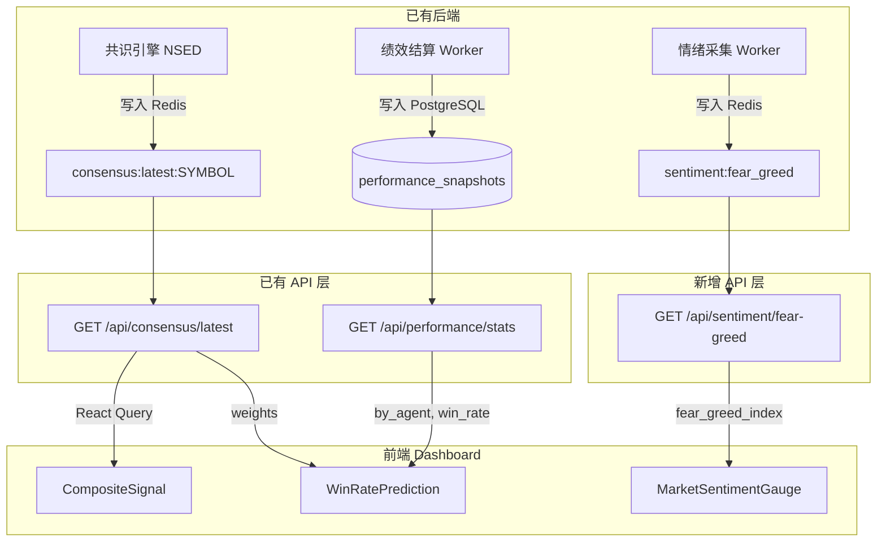
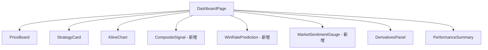

# 设计文档：仪表盘内容丰富化

## 概述

本设计为仪表盘页面（`/dashboard`）新增三个决策辅助模块：综合信号灯（CompositeSignal）、推测胜率（WinRatePrediction）和市场情绪仪表盘（MarketSentimentGauge）。这些模块复用已有后端数据源（ConsensusReport、PerformanceStats、OnchainSnapshot），无需新增后端 API 端点，仅需在前端新增一个轻量级 sentiment API 封装和三个展示组件。

### 设计决策

1. **无新增后端端点**：所有数据源已存在——共识报告通过 `/api/consensus/latest`、绩效统计通过 `/api/performance/stats`、恐贪指数通过 `/api/onchain`（`fear_greed_index` 字段）。新增一个专用的 `/api/sentiment/fear-greed` 端点从 Redis 缓存 `sentiment:fear_greed` 直接读取，避免依赖旗舰级权限的 onchain 端点。
2. **前端纯展示层**：三个新组件均为纯展示组件，业务计算（加权胜率）在组件内完成，不引入新的 Service 层。这符合"仪表盘二次聚合"的定位。
3. **会员权限前端控制**：免费用户的锁定覆盖层在前端渲染，后端 API 已有权限降级逻辑（如 `by_agent` 对免费用户返回空字典）。
4. **新增 sentiment 端点**：新增 `GET /api/sentiment/fear-greed` 端点，直接从 Redis 缓存 `sentiment:fear_greed` 读取恐贪指数，面向所有登录用户（免费用户也可查看情绪数据），避免前端依赖旗舰级 onchain 端点。

## 架构

### 数据流



### 组件层次




## 组件与接口

### 1. 后端：新增 Sentiment API 端点

**文件**：`backend/app/api/sentiment.py`

```python
# GET /api/sentiment/fear-greed
# 从 Redis 缓存 sentiment:fear_greed 读取恐贪指数
# 面向所有登录用户（无会员等级限制）
# 返回 SentimentResponse 或 404

class SentimentResponse(BaseModel):
    value: int  # 0-100
    classification: str  # "Extreme Fear" / "Fear" / "Neutral" / "Greed" / "Extreme Greed"
    timestamp: str
```

路由注册到 `backend/main.py` 的 `app.include_router()`。

### 2. 前端 API 封装

**文件**：`frontend/lib/api/sentiment.ts`

```typescript
export interface SentimentData {
  value: number;       // 0-100
  classification: string;
  timestamp: string;
}

export async function fetchFearGreed(): Promise<SentimentData | null>;
```

### 3. CompositeSignal 组件

**文件**：`frontend/components/cards/CompositeSignal.tsx`

```typescript
interface CompositeSignalProps {
  symbol: string;
  membershipLevel: number; // 0=free, 1=pro, 2=flagship
}
```

**行为**：
- 调用 `fetchConsensusLatest(symbol)` 获取 ConsensusReport
- 根据 `consensus_signal` 渲染信号方向（做多/做空/观望）+ 对应颜色主题
- 展示 `consensus_confidence` 百分比（免费用户锁定）
- 展示 `divergence` 分歧度（免费用户锁定），>50 时附加"分歧较大"警示
- 数据不可用时展示"暂无信号数据"占位

**信号映射**：

| consensus_signal | 标签 | 颜色主题 | 图标 |
|---|---|---|---|
| bullish | 做多 | 绿色 `#00F5A0` | 🚀 |
| bearish | 做空 | 红色 `#FF3B6F` | 💀 |
| neutral | 观望 | 灰色 `#6B7280` | 👁 |

### 4. WinRatePrediction 组件

**文件**：`frontend/components/cards/WinRatePrediction.tsx`

```typescript
interface WinRatePredictionProps {
  symbol: string;
  membershipLevel: number;
}
```

**行为**：
- 依赖 CompositeSignal 的信号方向（通过各自独立查询 consensus 数据）
- 当信号为 bullish/bearish 时：
  - 从 `PerformanceStats.by_agent` 获取各智能体准确率
  - 从 `ConsensusReport.weights` 获取各智能体权重
  - 加权计算：`predicted_win_rate = Σ(by_agent[key] × weights[key]) / Σ(weights[key])`
  - 展示历史基准胜率 `win_rate`、平均盈利 `avg_profit_pct`、平均亏损 `avg_loss_pct`
- 当信号为 neutral 时：展示"当前无方向性信号，不计算胜率"
- `settled_count < 5` 时附加"样本不足"警示
- 数据不可用时展示"暂无绩效数据"占位
- 免费用户展示锁定覆盖层

**加权胜率计算逻辑**（纯前端）：

```typescript
function computeWeightedWinRate(
  byAgent: Record<string, number>,
  weights: Record<string, number>
): number | null {
  let weightedSum = 0;
  let totalWeight = 0;
  for (const [key, weight] of Object.entries(weights)) {
    const agentRate = byAgent[key];
    if (agentRate !== undefined && weight > 0) {
      weightedSum += agentRate * weight;
      totalWeight += weight;
    }
  }
  if (totalWeight === 0) return null;
  return weightedSum / totalWeight;
}
```

### 5. MarketSentimentGauge 组件

**文件**：`frontend/components/cards/MarketSentimentGauge.tsx`

```typescript
interface MarketSentimentGaugeProps {
  // 无需 symbol，恐贪指数是全市场指标
}
```

**行为**：
- 调用 `fetchFearGreed()` 获取恐贪指数
- 使用 SVG 绘制半圆仪表盘，指针指向当前数值位置
- 中央显示数值和情绪文字标签
- 数据不可用时展示"数据缺失"占位

**区间颜色映射**：

| 区间 | 标签 | 颜色 |
|---|---|---|
| 0-20 | 极度恐慌 | 深红 `#991B1B` |
| 21-40 | 恐慌 | 红 `#FF3B6F` |
| 41-60 | 中性 | 灰 `#6B7280` |
| 61-80 | 贪婪 | 绿 `#00F5A0` |
| 81-100 | 极度贪婪 | 深绿 `#065F46` |

**SVG 半圆仪表盘实现要点**：
- 使用 SVG `<path>` 绘制半圆弧（180°）
- 五段弧线分别着色对应区间
- 指针使用 `<line>` 或 `<path>`，角度 = `180 - (value / 100) × 180`
- 中央文字使用 `<text>` 元素

### 6. Dashboard 布局集成

**修改文件**：`frontend/app/(main)/dashboard/page.tsx`

在 KlineChart 和 DerivativesPanel 之间插入新模块区域：

```tsx
{/* K线图 */}
<div className="h-[500px]">
  <KlineChart ... />
</div>

{/* === 新增决策辅助模块区域 === */}
<div className="grid grid-cols-1 gap-4 lg:grid-cols-2">
  <CompositeSignal symbol={symbol} membershipLevel={membershipLevel} />
  <WinRatePrediction symbol={symbol} membershipLevel={membershipLevel} />
</div>
<MarketSentimentGauge />

{/* 合约数据面板 */}
<DerivativesPanel ... />
```


## 数据模型

### 已有模型（无需修改）

#### ConsensusReport（后端 `app/consensus/engine.py`）

```python
class ConsensusReport(BaseModel):
    symbol: str
    timestamp: datetime
    consensus_signal: Literal["bullish", "bearish", "neutral"]
    consensus_confidence: float  # 0.0-1.0
    model_votes: list[ModelVote]
    weights: dict[str, float]  # 各智能体权重
    divergence: float  # 0.0-100.0
    minority_warnings: list[str]
```

#### PerformanceStats（后端 `app/models/performance.py`）

```python
class PerformanceStats(BaseModel):
    total_strategies: int
    settled_count: int
    win_rate: float
    avg_profit_pct: float
    avg_loss_pct: float
    profit_loss_ratio: float
    by_agent: dict[str, float]  # 各智能体准确率
```

#### 前端 ConsensusReport（`lib/api/consensus.ts`）

```typescript
interface ConsensusReport {
  symbol: string;
  timestamp: string;
  consensus_signal: "bullish" | "bearish" | "neutral";
  consensus_confidence: number;
  model_votes: ModelVote[];
  weights: Record<string, number>;
  divergence: number;
  minority_warnings: string[];
}
```

#### 前端 PerformanceStats（`lib/api/performance.ts`）

```typescript
interface PerformanceStats {
  total_strategies: number;
  settled_count: number;
  win_rate: number;
  avg_profit_pct: number;
  avg_loss_pct: number;
  profit_loss_ratio: number;
  by_agent: Record<string, number>;
}
```

### 新增模型

#### 后端 SentimentResponse（`app/api/sentiment.py`）

```python
class SentimentResponse(BaseModel):
    value: int  # 0-100
    classification: str
    timestamp: str
```

#### 前端 SentimentData（`lib/api/sentiment.ts`）

```typescript
interface SentimentData {
  value: number;       // 0-100
  classification: string;
  timestamp: string;
}
```

### 数据流转关系

| 组件 | 数据源 API | 关键字段 | 会员限制 |
|---|---|---|---|
| CompositeSignal | `/api/consensus/latest` | consensus_signal, consensus_confidence, divergence | 免费用户仅看信号方向 |
| WinRatePrediction | `/api/consensus/latest` + `/api/performance/stats` | weights, by_agent, win_rate, avg_profit_pct, avg_loss_pct, settled_count | 免费用户完全锁定 |
| MarketSentimentGauge | `/api/sentiment/fear-greed` | value (0-100) | 无限制 |


## 正确性属性

*属性（Property）是在系统所有合法执行中都应成立的特征或行为——本质上是对系统应做什么的形式化陈述。属性是人类可读规格说明与机器可验证正确性保证之间的桥梁。*

### Property 1: 信号方向与颜色/标签映射

*For any* `consensus_signal` 值（"bullish" | "bearish" | "neutral"），`mapSignalMeta(signal)` 返回的 `{ label, color }` 应满足：bullish → ("做多", "#00F5A0")，bearish → ("做空", "#FF3B6F")，neutral → ("观望", "#6B7280")。

**Validates: Requirements 1.3**

### Property 2: 分歧度警示阈值

*For any* `divergence` 值（0-100 的浮点数），当且仅当 `divergence > 50` 时，`shouldShowDivergenceWarning(divergence)` 返回 `true`。

**Validates: Requirements 1.4**

### Property 3: 加权胜率计算

*For any* 非空的 `by_agent: Record<string, number>` 和 `weights: Record<string, number>`（至少有一个共同 key 且对应 weight > 0），`computeWeightedWinRate(by_agent, weights)` 应等于 `Σ(by_agent[key] × weights[key]) / Σ(weights[key])`（对所有共同 key 求和）。

**Validates: Requirements 2.2**

### Property 4: 样本不足警示阈值

*For any* `settled_count` 整数值，当且仅当 `settled_count < 5` 时，`shouldShowSampleWarning(settled_count)` 返回 `true`。

**Validates: Requirements 2.6**

### Property 5: 仪表盘指针角度计算

*For any* `value`（0-100 的整数），`computeGaugeAngle(value)` 应返回 `180 - (value / 100) × 180` 度，即 value=0 时指针在最左（180°），value=100 时指针在最右（0°）。

**Validates: Requirements 3.1**

### Property 6: 恐贪指数区间映射

*For any* `value`（0-100 的整数），`mapFearGreedZone(value)` 返回的 `{ label, color }` 应满足：0-20 → ("极度恐慌", "#991B1B")，21-40 → ("恐慌", "#FF3B6F")，41-60 → ("中性", "#6B7280")，61-80 → ("贪婪", "#00F5A0")，81-100 → ("极度贪婪", "#065F46")。

**Validates: Requirements 3.2, 3.3**

### Property 7: 免费用户字段锁定

*For any* `membershipLevel === 0` 的状态下，CompositeSignal 组件应锁定 confidence 和 divergence 字段（渲染 LockedOverlay），WinRatePrediction 组件应渲染完整锁定覆盖层。

**Validates: Requirements 1.6, 2.8**

### Property 8: 模块错误隔离

*For any* 三个新增模块中任意子集加载失败的情况，未失败的模块应正常渲染，失败的模块应展示错误提示卡片。

**Validates: Requirements 4.4**

## 错误处理

### 后端 Sentiment API

| 场景 | 处理方式 |
|---|---|
| Redis 缓存 `sentiment:fear_greed` 不存在 | 返回 404，前端展示"数据缺失"占位 |
| Redis 连接失败 | 返回 500，记录日志，前端展示错误卡片 |

### 前端组件

| 场景 | 处理方式 |
|---|---|
| `/api/consensus/latest` 返回 404 | CompositeSignal 展示"暂无信号数据"占位 |
| `/api/consensus/latest` 返回 403（权限不足） | CompositeSignal 展示"暂无信号数据"占位（免费用户降级） |
| `/api/performance/stats` 请求失败 | WinRatePrediction 展示"暂无绩效数据"占位 |
| `/api/sentiment/fear-greed` 返回 404 | MarketSentimentGauge 展示"数据缺失"占位 |
| `by_agent` 为空字典（免费用户） | WinRatePrediction 无法计算加权胜率，展示锁定覆盖层 |
| `weights` 与 `by_agent` 无共同 key | `computeWeightedWinRate` 返回 null，展示"数据不足"提示 |
| 任一组件渲染异常 | React Error Boundary 捕获，展示错误提示卡片，不影响其他组件 |

### 降级策略

- CompositeSignal：共识 API 不可用时展示占位，不阻塞其他模块
- WinRatePrediction：依赖共识和绩效两个数据源，任一不可用时展示对应占位
- MarketSentimentGauge：sentiment API 不可用时展示占位

## 测试策略

### 属性测试（Property-Based Testing）

使用 `fast-check` 库进行属性测试，每个属性至少运行 100 次迭代。

| 属性 | 测试文件 | 生成器 |
|---|---|---|
| P1: 信号映射 | `__tests__/dashboard/compositeSignal.property.test.ts` | `fc.constantFrom("bullish", "bearish", "neutral")` |
| P2: 分歧度阈值 | 同上 | `fc.float({ min: 0, max: 100 })` |
| P3: 加权胜率 | `__tests__/dashboard/winRate.property.test.ts` | `fc.dictionary(fc.string(), fc.float({ min: 0, max: 1 }))` |
| P4: 样本不足阈值 | 同上 | `fc.integer({ min: 0, max: 100 })` |
| P5: 指针角度 | `__tests__/dashboard/sentimentGauge.property.test.ts` | `fc.integer({ min: 0, max: 100 })` |
| P6: 区间映射 | 同上 | `fc.integer({ min: 0, max: 100 })` |

每个测试用注释标注对应属性：
```typescript
// Feature: dashboard-enrichment, Property 1: 信号方向与颜色/标签映射
```

### 单元测试

| 测试场景 | 测试文件 |
|---|---|
| CompositeSignal 数据不可用占位 | `__tests__/dashboard/compositeSignal.test.ts` |
| WinRatePrediction 观望信号提示 | `__tests__/dashboard/winRate.test.ts` |
| WinRatePrediction 数据不可用占位 | 同上 |
| MarketSentimentGauge 数据缺失占位 | `__tests__/dashboard/sentimentGauge.test.ts` |
| 免费用户锁定覆盖层渲染 | `__tests__/dashboard/membershipLock.test.ts` |
| 模块错误隔离 | `__tests__/dashboard/errorIsolation.test.ts` |
| 后端 sentiment API 404/500 | `backend/tests/test_sentiment_api.py` |

### 后端测试

| 测试场景 | 测试文件 |
|---|---|
| Redis 有缓存时返回 SentimentResponse | `backend/tests/test_sentiment_api.py` |
| Redis 无缓存时返回 404 | 同上 |
| Redis 连接失败时返回 500 | 同上 |

单元测试和属性测试互补：单元测试覆盖具体边界案例和错误条件，属性测试验证纯函数在所有输入上的通用正确性。
