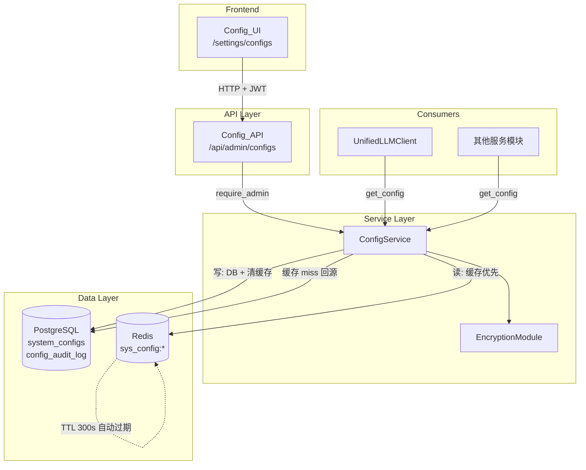
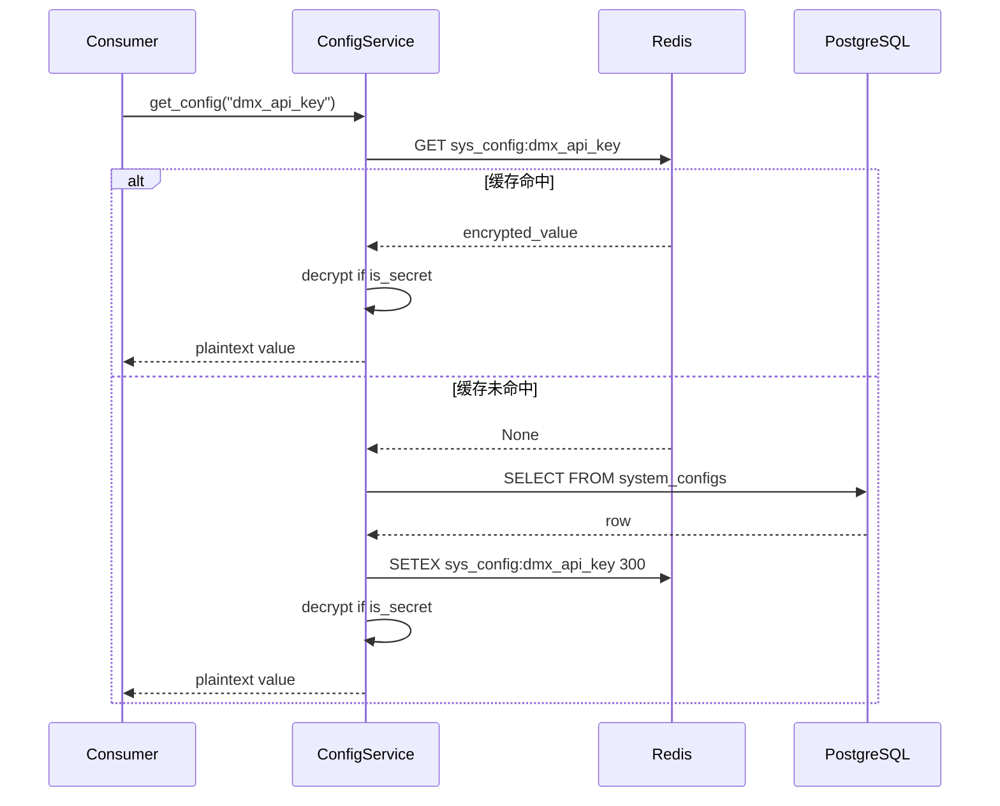
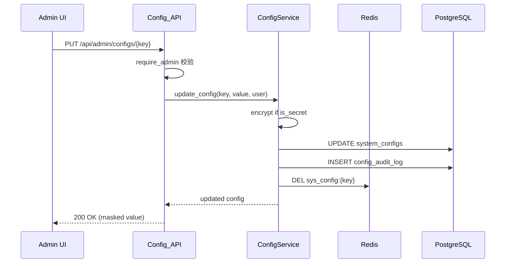

# Design Document — 动态配置管理

## Overview

本设计将系统配置从静态 `.env` 文件迁移到数据库存储，通过 Redis 缓存层加速读取，提供管理员专用 API 和前端界面进行动态管理。核心目标是实现配置热更新（无需重启服务），同时保证敏感配置值的加密存储和变更审计。

基础设施配置（`database_url`、`redis_url`、`jwt_secret_key` 等）仍保留在 `.env` 中，因为数据库连接本身依赖这些配置，形成循环依赖。

### 设计决策

1. **加密方案选择 Fernet**：基于 `jwt_secret_key` 派生 Fernet 密钥，无需额外管理密钥。Fernet 提供 AES-128-CBC + HMAC-SHA256，满足配置值加密需求。
2. **缓存策略选择 TTL + 主动失效**：写操作主动清除缓存，读操作 miss 时回源数据库并缓存 300s。TTL 作为兜底保证最终一致性。
3. **分层架构**：严格遵循项目编码规则，API 层只做参数校验，Service 层处理业务逻辑（加解密、缓存、审计），数据层只做读写。

## Architecture



### 读取流程



### 写入流程



## Components and Interfaces

### 1. EncryptionModule (`backend/app/core/encryption.py`)

```python
class EncryptionModule:
    """Fernet 加解密，基于 jwt_secret_key 派生密钥。"""

    def __init__(self, secret_key: str) -> None: ...
    def encrypt(self, plaintext: str) -> str: ...
    def decrypt(self, ciphertext: str) -> str: ...
    def mask_value(self, value: str) -> str: ...
```

- `encrypt`: 返回 Fernet token（base64 字符串）
- `decrypt`: 解密失败时记录日志并返回空字符串
- `mask_value`: 返回 `"****" + value[-4:]` 格式，值长度 < 4 时全部掩码

密钥派生：使用 `hashlib.sha256(secret_key.encode()).digest()` 取前 32 字节，再 base64url 编码为 Fernet 密钥。

### 2. ConfigService (`backend/app/services/config_service.py`)

```python
class ConfigService:
    """配置管理服务 — 缓存、加解密、审计一体化。"""

    CACHE_PREFIX: str = "sys_config:"
    CACHE_TTL: int = 300

    async def get_config(self, key: str, default: str = "") -> str: ...
    async def get_all_configs(self, category: str | None = None) -> list[SystemConfigResponse]: ...
    async def get_config_detail(self, key: str) -> SystemConfigResponse | None: ...
    async def create_config(self, data: ConfigCreate, admin_user_id: str) -> SystemConfigResponse: ...
    async def update_config(self, key: str, data: ConfigUpdate, admin_user_id: str) -> SystemConfigResponse | None: ...
    async def delete_config(self, key: str, admin_user_id: str) -> bool: ...
    async def get_audit_logs(self, page: int = 1, size: int = 20) -> tuple[list[AuditLogResponse], int]: ...
    async def load_all_to_cache(self) -> int: ...
```

- `get_config`: 内部使用方法，缓存优先 → 数据库 → default，返回解密后的明文
- `get_all_configs` / `get_config_detail`: API 使用，敏感值掩码返回
- `create_config` / `update_config` / `delete_config`: 写操作，自动写审计日志 + 清缓存
- `load_all_to_cache`: 启动时批量预热缓存

### 3. Config_API (`backend/app/api/admin_configs.py`)

| Method | Path | Description |
|--------|------|-------------|
| GET | `/api/admin/configs` | 配置列表（支持 `?category=` 过滤） |
| GET | `/api/admin/configs/audit-log` | 审计日志（支持 `?page=&size=` 分页） |
| GET | `/api/admin/configs/{key}` | 单条配置详情 |
| POST | `/api/admin/configs` | 创建配置 |
| PUT | `/api/admin/configs/{key}` | 更新配置 |
| DELETE | `/api/admin/configs/{key}` | 删除配置 |

所有接口通过 `Depends(require_admin)` 校验管理员权限。

### 4. Admin 权限扩展

- `User` 模型新增 `is_admin: bool` 字段（默认 `false`）
- `UserInfo` 新增 `is_admin: bool` 字段
- `deps.py` 新增 `require_admin` 依赖函数
- `get_current_user` 查询 SQL 新增 `u.is_admin` 字段

### 5. Config_UI (`frontend/app/settings/configs/page.tsx`)

- 按分类分组展示配置列表（glass-card 风格）
- 敏感值默认掩码显示，点击切换明文/掩码
- 内联编辑 + 新增配置表单
- 删除确认对话框
- 审计日志区域（底部折叠面板）
- 非管理员显示权限不足提示

### 6. Frontend API Module (`frontend/lib/api/configs.ts`)

```typescript
export async function fetchConfigs(category?: string): Promise<SystemConfig[]>
export async function fetchConfigDetail(key: string): Promise<SystemConfig>
export async function createConfig(data: ConfigCreate): Promise<SystemConfig>
export async function updateConfig(key: string, data: ConfigUpdate): Promise<SystemConfig>
export async function deleteConfig(key: string): Promise<void>
export async function fetchAuditLogs(page?: number, size?: number): Promise<AuditLogPage>
```

## Data Models

### 数据库表

#### system_configs

| Column | Type | Constraints | Description |
|--------|------|-------------|-------------|
| id | UUID | PK, DEFAULT gen_random_uuid() | 主键 |
| config_key | VARCHAR(100) | UNIQUE NOT NULL | 配置键名 |
| encrypted_value | TEXT | NOT NULL | 加密后的值 |
| category | VARCHAR(50) | NOT NULL | 分类：ai_model, data_source, payment, notification, monitoring |
| description | TEXT | | 配置描述 |
| is_secret | BOOLEAN | DEFAULT true | 是否敏感配置 |
| created_at | TIMESTAMPTZ | DEFAULT NOW() | 创建时间 |
| updated_at | TIMESTAMPTZ | DEFAULT NOW() | 更新时间 |

索引：
- `UNIQUE INDEX idx_system_configs_key ON system_configs (config_key)`
- `INDEX idx_system_configs_category ON system_configs (category)`

#### config_audit_log

| Column | Type | Constraints | Description |
|--------|------|-------------|-------------|
| id | UUID | PK, DEFAULT gen_random_uuid() | 主键 |
| admin_user_id | UUID | FK → users(id) | 操作人 |
| config_key | VARCHAR(100) | NOT NULL | 配置键名 |
| action | VARCHAR(20) | NOT NULL | create / update / delete |
| old_value_masked | TEXT | | 旧值（掩码） |
| new_value_masked | TEXT | | 新值（掩码） |
| created_at | TIMESTAMPTZ | DEFAULT NOW() | 操作时间 |

索引：
- `INDEX idx_audit_log_created ON config_audit_log (created_at DESC)`

### Pydantic 模型

```python
class ConfigCreate(BaseModel):
    config_key: str
    value: str
    category: str
    description: str = ""
    is_secret: bool = True

class ConfigUpdate(BaseModel):
    value: str
    description: str | None = None
    is_secret: bool | None = None

class SystemConfigResponse(BaseModel):
    id: str
    config_key: str
    value: str          # 掩码或明文（取决于上下文）
    category: str
    description: str
    is_secret: bool
    created_at: str
    updated_at: str

class AuditLogResponse(BaseModel):
    id: str
    admin_user_id: str
    config_key: str
    action: str
    old_value_masked: str | None
    new_value_masked: str | None
    created_at: str
```

### ORM 模型

```python
class SystemConfig(Base):
    __tablename__ = "system_configs"
    id: Mapped[uuid.UUID]          # UUID PK
    config_key: Mapped[str]        # VARCHAR(100) UNIQUE
    encrypted_value: Mapped[str]   # TEXT
    category: Mapped[str]          # VARCHAR(50)
    description: Mapped[str | None]
    is_secret: Mapped[bool]        # DEFAULT true
    created_at: Mapped[datetime]
    updated_at: Mapped[datetime]

class ConfigAuditLog(Base):
    __tablename__ = "config_audit_log"
    id: Mapped[uuid.UUID]
    admin_user_id: Mapped[uuid.UUID]  # FK → users.id
    config_key: Mapped[str]
    action: Mapped[str]
    old_value_masked: Mapped[str | None]
    new_value_masked: Mapped[str | None]
    created_at: Mapped[datetime]
```

### Redis 缓存结构

| Key Pattern | Value | TTL |
|-------------|-------|-----|
| `sys_config:{config_key}` | JSON: `{"encrypted_value": "...", "is_secret": true}` | 300s |

缓存存储加密值 + is_secret 标记，解密在 ConfigService 层完成，避免明文存入 Redis。


## Correctness Properties

*A property is a characteristic or behavior that should hold true across all valid executions of a system — essentially, a formal statement about what the system should do. Properties serve as the bridge between human-readable specifications and machine-verifiable correctness guarantees.*

### Property 1: Encryption round-trip

*For any* plaintext string, encrypting it with EncryptionModule and then decrypting the result should produce the original plaintext string.

**Validates: Requirements 3.1, 3.3**

### Property 2: Secret configs stored encrypted

*For any* config with `is_secret=true` and any non-empty plaintext value, after saving via ConfigService, the `encrypted_value` stored in the database should not equal the original plaintext value.

**Validates: Requirements 3.2**

### Property 3: Value masking format

*For any* string of length ≥ 4, `mask_value` should return `"****"` concatenated with the last 4 characters. *For any* string of length < 4, `mask_value` should return `"****"` (fully masked, no trailing characters).

**Validates: Requirements 3.4**

### Property 4: Admin-only access enforcement

*For any* non-admin user (is_admin=false) and any config management API endpoint, the system should return HTTP 403 with an error message indicating insufficient permissions.

**Validates: Requirements 1.2, 1.4, 5.6**

### Property 5: Config CRUD round-trip

*For any* valid config key, value, and category: creating a config via ConfigService, then reading it with `get_config`, should return the original value. Updating the value, then reading again, should return the new value. Deleting the config, then reading, should return the default parameter.

**Validates: Requirements 5.3, 5.4, 5.5, 7.1**

### Property 6: Cache invalidation on write

*For any* config key that exists in the Redis cache, after an update or delete operation via ConfigService, the corresponding `sys_config:{key}` cache entry should no longer exist in Redis.

**Validates: Requirements 4.5, 9.1**

### Property 7: Bulk cache loading

*For any* set of configs stored in the database, after calling `load_all_to_cache`, every config should have a corresponding `sys_config:{key}` entry in Redis.

**Validates: Requirements 4.6, 7.2**

### Property 8: API responses mask secret values

*For any* config with `is_secret=true`, when retrieved via the list or detail API endpoints, the returned `value` field should be the masked form (matching the mask_value output), not the plaintext.

**Validates: Requirements 5.1, 5.2**

### Property 9: Category filtering correctness

*For any* category value used as a filter parameter on the config list endpoint, every config in the response should have a `category` field equal to the requested filter value.

**Validates: Requirements 5.7**

### Property 10: Audit log on mutation with masked values

*For any* config mutation (create, update, or delete), the system should create exactly one audit log entry with the correct `action` type, `config_key`, and `admin_user_id`. For secret configs, the `old_value_masked` and `new_value_masked` fields should contain masked values (not plaintext).

**Validates: Requirements 6.2, 6.4**

## Error Handling

| Scenario | Handling | Response |
|----------|----------|----------|
| 解密失败（密钥变更/数据损坏） | 记录 ERROR 日志，返回空字符串 | 内部调用返回 `""`，API 返回 `"****"` |
| Redis 不可用 | 跳过缓存，直接查数据库，记录 WARNING | 服务降级但不中断 |
| 数据库查询失败 | 记录 ERROR 日志，抛出 HTTPException | API 返回 500 |
| config_key 重复（创建时） | 数据库唯一约束拒绝 | API 返回 409 Conflict |
| config_key 不存在（更新/删除时） | Service 返回 None | API 返回 404 Not Found |
| 非管理员访问 | require_admin 依赖拦截 | API 返回 403 Forbidden |
| 加密模块初始化失败 | 启动时抛出异常，阻止服务启动 | 服务无法启动，日志记录原因 |
| 审计日志写入失败 | 记录 ERROR 日志，但不回滚配置变更 | 配置变更成功，审计降级 |

## Testing Strategy

### 属性测试（Property-Based Testing）

使用 `hypothesis` 库（Python PBT 标准库），每个属性测试最少运行 100 次迭代。

每个测试用注释标注对应的设计属性：
```python
# Feature: dynamic-config-management, Property 1: Encryption round-trip
```

属性测试覆盖：
- Property 1: 生成随机字符串，验证 encrypt → decrypt 恒等
- Property 2: 生成随机配置数据（is_secret=true），验证存储值 ≠ 明文
- Property 3: 生成随机字符串，验证 mask_value 输出格式
- Property 4: 生成随机非管理员用户，验证所有 admin 端点返回 403
- Property 5: 生成随机 key/value/category，验证 CRUD 全流程
- Property 6: 生成随机配置，写入缓存后执行 update/delete，验证缓存已清除
- Property 7: 生成随机配置集合，验证 load_all_to_cache 后全部在缓存中
- Property 8: 生成随机 secret 配置，验证 API 响应中值为掩码格式
- Property 9: 生成随机 category，验证过滤结果只包含该 category
- Property 10: 生成随机配置变更操作，验证审计日志正确记录且敏感值掩码

### 单元测试

单元测试聚焦具体示例和边界情况，不重复属性测试已覆盖的通用逻辑：

- `is_admin` 默认值为 false（Req 1.1）
- `UserInfo` 包含 `is_admin` 字段（Req 1.3）
- `system_configs` 表结构正确（Req 2.1）
- `config_key` 唯一约束生效（Req 2.2）
- 解密失败返回空字符串（Req 3.5）
- 缓存键前缀为 `sys_config:`（Req 4.3）
- 缓存 TTL 为 300 秒（Req 4.4）
- `get_config` 无配置无默认值时返回空字符串并记录警告（Req 7.5）
- Settings 类保留基础设施配置字段（Req 7.3）
- UnifiedLLMClient 通过 ConfigService 获取配置（Req 7.4）
- 审计日志 API 分页功能（Req 6.3）
- 迁移脚本正确导入 .env 配置（Req 2.4）
