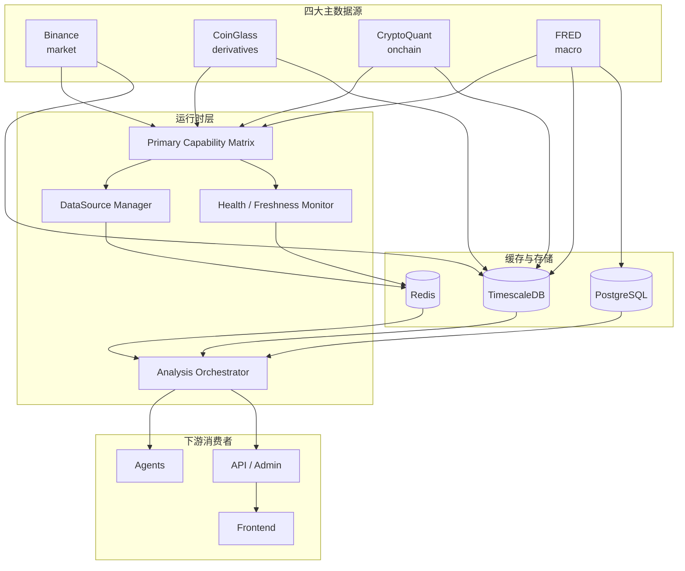

# 设计文档：四大主数据源

## 文档状态

- **当前定位**：本文件描述当前产品级主数据源架构设计。
- **主真相源**：`Binance / CoinGlass / CryptoQuant / FRED`
- **关系说明**：
  - `cryptoquant-onchain-source` 保留为 `CryptoQuant` 子域 spec。
  - `fred-macro-source` 保留为 `FRED` 子域 spec。
  - `multi-datasource-management` 保留为运行时管理层与旧组合抽象说明。
  - `whale-position-detection` 保留为 `CoinGlass` 子域 spec。
  - `omnimind-system`、`omnimind-v2-enhancements` 保留为历史阶段文档。

## 概述

四大主数据源架构的目标不是把所有外部接口都堆进系统，而是把系统需要的核心事实切成四个能力域，并为每个能力域指定唯一 owner：

- `Binance` → `market`
- `CoinGlass` → `derivatives`
- `CryptoQuant` → `onchain`
- `FRED` → `macro`

该设计的核心是：

- **单能力单 owner**：避免多真相源冲突
- **域级完整度**：替代旧的交易所加权完整度模型
- **显式降级**：缺失任一主域时，下游必须感知
- **旧文档归位**：历史 spec 继续保留，但不再占据主真相源位置

## 架构

### 主能力域架构图



## 分层职责

### 1. 主真相源层

负责定义每个能力域的事实来源与边界。

- `Binance`：盘面基线
- `CoinGlass`：衍生品增强
- `CryptoQuant`：链上
- `FRED`：宏观

### 2. 运行时管理层

负责：

- 数据源注册与状态
- 能力状态缓存
- freshness 计算
- 开关和健康监控
- 域级完整度聚合

### 3. 消费层

负责：

- 智能体分析
- API 输出
- 后台展示
- 数据降级提示

## 核心设计决策

| 决策 | 选择 | 原因 |
|------|------|------|
| 主数据源数量 | 4 个 | 收敛产品边界，减少一等配置噪音 |
| 完整度模型 | 域级完整度 | 比交易所权重更符合当前架构 |
| 宏观主源 | FRED | 官方序列稳定、可回溯、适合后台采集 |
| 衍生品主源 | CoinGlass Standard 基线 | 数据深度和商业使用能力更匹配生产目标 |
| 链上主源 | CryptoQuant | 与用户确认方向一致，适合作为主链上源 |
| 历史 spec 处理 | 保留但降级 | 保留上下文，同时阻止误导 |

## Primary Capability Matrix

### 能力矩阵字段

```python
class PrimaryCapabilityRecord(BaseModel):
    capability_key: str
    data_domain: Literal["market", "derivatives", "onchain", "macro"]
    owner_source: Literal["binance", "coinglass", "cryptoquant", "fred"]
    runtime_writer: str | None
    cache_key: str | None
    api_endpoint: str | None
    primary_consumers: list[str]
    fallback_policy: str | None
    freshness_sla_seconds: int | None
    status_source: str | None
```

### 第一阶段能力映射

| capability_key | domain | owner | 说明 |
|----------------|--------|-------|------|
| `latest_price` | market | Binance | 实时价格基线 |
| `trade_stream` | market | Binance | 成交流 |
| `kline` | market | Binance | 多周期K线 |
| `liquidation_base` | market | Binance | 基础强平事件 |
| `net_position` | derivatives | CoinGlass | 主力净方向 |
| `taker_volume` | derivatives | CoinGlass | 主动买卖方向 |
| `liquidation_heatmap` | derivatives | CoinGlass | 爆仓区间定位 |
| `cvd` | derivatives | CoinGlass | 累计成交量差 |
| `netflow_derivatives` | derivatives | CoinGlass | 衍生品净流入 |
| `option_max_pain` | derivatives | CoinGlass | 期权最大痛点 |
| `exchange_netflow` | onchain | CryptoQuant | 链上主能力 |
| `whale_activity` | onchain | CryptoQuant | 鲸鱼/地址行为 |
| `macro_cpi` | macro | FRED | 通胀 |
| `macro_rate` | macro | FRED | 利率 |
| `macro_labor` | macro | FRED | 就业 |
| `macro_growth` | macro | FRED | GDP / 增长 |

## 各主源职责边界

### Binance

**职责**：

- 价格
- 成交
- K线
- 标记价
- 基础爆仓事件
- 基础衍生品快照

**非职责**：

- 全网衍生品增强解释
- 链上
- 宏观

### CoinGlass

**职责**：

- 全网衍生品结构化增强数据
- Taker、热力图、净持仓、资金费率套利
- CVD、NetFlow、订单簿增强、大单、期权增强

**非职责**：

- 盘面基线 owner
- 链上真相源
- 宏观真相源

### CryptoQuant

**职责**：

- 交易所流入/流出
- 储备
- 地址 / 鲸鱼 / 矿工 / 稳定币等链上指标

**非职责**：

- 衍生品结构
- 宏观
- 实时盘面基线

### FRED

**职责**：

- 美国宏观官方序列
- 发布日历 / release 元数据
- 数据 revision / vintage（可选增强）

**非职责**：

- 新闻解释
- 加密事件日历
- 链上或衍生品

## Freshness 与降级设计

### 域级 freshness

```python
class DomainFreshness(BaseModel):
    domain: Literal["market", "derivatives", "onchain", "macro"]
    source_id: str
    last_success_at: datetime | None
    age_seconds: int | None
    freshness_state: Literal["fresh", "stale", "missing"]
```

### 分析输出契约

```python
class DataDomainStatus(BaseModel):
    market: str
    derivatives: str
    onchain: str
    macro: str

class AnalysisDataQuality(BaseModel):
    data_completeness: float
    missing_domains: list[str]
    domain_status: DataDomainStatus
    freshness: dict[str, DomainFreshness]
    completeness_warning: str | None
```

### 降级规则

- `market` 缺失：禁止输出高置信度交易结论
- `derivatives` 缺失：允许输出基础分析，但必须提示衍生品盲区
- `onchain` 缺失：链上结论降级，禁止伪装成完整 dealer 行为解释
- `macro` 缺失：趋势/风险输出必须标记宏观上下文缺失

## 旧 spec 的归位策略

### `multi-datasource-management`

保留为：

- 运行时管理抽象
- 历史的 Exchange Combo 设计记录
- 数据源开关/健康/缓存管理经验

不再承担：

- 产品主数据源总纲

### `whale-position-detection`

保留为：

- `CoinGlass` 子域 spec
- 点杀/建仓预警与套餐能力子设计

不再承担：

- 系统级主数据源定义

### `omnimind-system` / `omnimind-v2-enhancements`

保留为：

- 历史阶段设计记录
- 旧目标、旧能力扩展背景

不再承担：

- 当前产品级主数据源依据

## 后续落地拆分

### 第一阶段：文档清理与主真相源固化

- 建立 `four-primary-datasources` 总纲
- 给旧 spec 增加状态说明
- 在主文档中引用旧子域 spec

### 第二阶段：运行时矩阵对齐

- DataSourceRegistry 展示层改为四主源
- 域级完整度替换旧 combo 完整度叙事
- capability matrix 补 owner/fallback/status

### 第三阶段：缺口实现

- `CoinGlass Standard` 未闭环能力补齐
- `CryptoQuant` 正式接入
- `FRED` 正式接入
