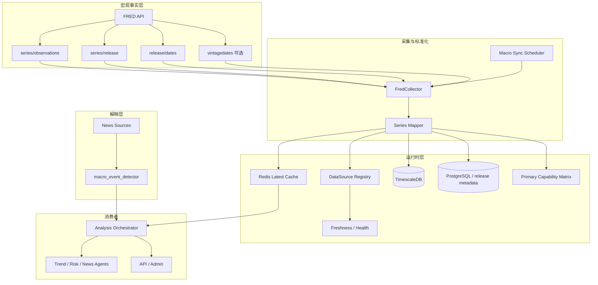

# 设计文档：FRED 宏观主数据源

## 文档状态

- **当前定位**：本文件是 `four-primary-datasources` 下 `FRED` 子域设计文档。
- **主职责域**：`macro`
- **关系说明**：本设计是系统宏观主能力对齐的设计入口，负责把官方数列层与新闻解释层彻底分开。
- **当前现实约束**：仓库现有 `macro_event_detector` 是新闻关键词解释层，不是 FRED 主事实层实现。

## 概述

本设计的目标，是把当前依赖新闻文本识别的宏观能力，提升为由 `FRED` 官方时间序列驱动的宏观主事实层，并建立清晰的双层结构：

- **事实层**：`FRED` 官方数列与发布时间
- **解释层**：`macro_event_detector` 基于新闻与关键词的事件解释

这意味着：

- 趋势和风险分析优先读取 FRED 官方值
- 新闻层只能解释“为什么市场在谈某个宏观事件”
- 没有 FRED 时，系统必须明确说是 `macro` 主源缺失，而不是假装宏观能力完整

## 架构

### 宏观主源双层结构图



## 核心设计决策

| 决策 | 选择 | 原因 |
|------|------|------|
| 宏观主源 | FRED | 官方序列稳定、可回溯、适合后台采集 |
| 事实层 / 解释层分离 | 是 | 避免新闻替代官方数列 |
| 第一阶段重点 | observations + release dates | 先拿到稳定宏观事实与 freshness |
| vintage 能力 | 可选增强 | 重要，但不阻塞一期主源落地 |
| 状态输出 | freshness + 发布日语义 | 宏观数据不能按高频行情的 stale 规则简单套用 |

## 当前接线锚点

当前仓库宏观路径的已知事实：

- `analysis_orchestrator` 直接调用 `detect_macro_events()`
- 当前输出更接近 `macro_events` 解释层 section
- 尚不存在正式 `FRED` 事实层 section 或统一 `MacroSnapshot` 主快照

本设计要求：

- 新增 FRED 事实层时，不是替换掉解释层，而是把解释层降为第二层
- 编排顺序改为：`MacroSnapshot -> macro_events`
- 在过渡阶段保留旧 `macro_events` section，但不得把它继续表述为宏观主真相

## 组件设计

### 1. FredCollector

**建议位置**：`backend/app/data/fred.py`

职责：

- 封装 FRED API 调用
- 拉取核心 series 的 observations
- 记录 release / release dates
- 输出标准化宏观能力键

```python
class FredCollector:
    async def collect_series(self, series_id: str) -> FredSeriesSnapshot:
        ...

    async def collect_release_metadata(self, series_id: str) -> FredReleaseMetadata:
        ...

    async def collect_vintage_dates(self, series_id: str) -> list[date]:
        ...
```

### 2. SeriesMapper

职责：

- 将 FRED `series_id` 映射为系统宏观能力键
- 附带单位、语义、发布时间规则
- 输出主能力矩阵记录

#### 首阶段建议映射

| series_id | 系统能力键 | 说明 |
|-----------|------------|------|
| `CPIAUCSL` | `macro_cpi` | 美国 CPI |
| `CPILFESL` | `macro_core_cpi` | 美国核心 CPI |
| `UNRATE` | `macro_unemployment` | 失业率 |
| `ICSA` | `macro_jobless_claims` | 初请失业金 |
| `FEDFUNDS` | `macro_rate` | 联邦基金利率 |
| `GDPC1` | `macro_growth` | 实际 GDP |
| `PCEPI` | `macro_pce` | PCE 价格指数 |
| `PAYEMS` | `macro_payrolls` | 非农就业人数 |

### 3. MacroSyncScheduler

职责：

- 根据不同 series 的天然更新频率安排同步
- 区分日 / 周 / 月 / 季宏观数列
- 避免用单一 stale 规则误伤低频数列

#### 首阶段频率分层矩阵

| 系统能力键 | series_id | 频率层级 | 建议同步策略 | freshness 重点 |
|------------|-----------|----------|--------------|----------------|
| `macro_jobless_claims` | `ICSA` | weekly | 发布窗口前后加密检查，其余时间低频轮询 | 周更，不应按日更误判 |
| `macro_unemployment` | `UNRATE` | monthly | 月度发布窗口检查 + 非窗口期低频保活 | 发布窗口与自然等待区分 |
| `macro_cpi` | `CPIAUCSL` | monthly | 月度发布窗口检查 + 非窗口期低频保活 | CPI 发布时间敏感 |
| `macro_core_cpi` | `CPILFESL` | monthly | 与 CPI 同步策略对齐 | 与 CPI 同窗口 |
| `macro_pce` | `PCEPI` | monthly | 月度发布窗口检查 | 通胀补充指标 |
| `macro_payrolls` | `PAYEMS` | monthly | 月度发布窗口检查 | 与就业解释层强相关 |
| `macro_rate` | `FEDFUNDS` | monthly | 月度低频同步 + 议息窗口重点校验 | 发布与决议叙事要区分 |
| `macro_growth` | `GDPC1` | quarterly | 季度发布窗口检查 | 低频，不得套高频 stale 规则 |

## 数据模型建议

```python
class FredObservationValue(BaseModel):
    capability_key: str
    series_id: str
    observation_date: date
    value: float | None
    unit: str | None
    released_at: datetime | None
    collected_at: datetime
    source_id: str = "fred"
    owner_source: str = "fred"
    freshness_state: str

class FredSeriesSnapshot(BaseModel):
    series_id: str
    capability_key: str
    latest_value: FredObservationValue | None
    previous_value: FredObservationValue | None
    next_release_hint: datetime | None

class MacroCapabilityValue(BaseModel):
    capability_key: str
    series_id: str
    latest_value: float | None
    previous_value: float | None
    unit: str | None
    last_release_at: datetime | None
    last_sync_at: datetime | None
    freshness_state: str

class MacroSnapshot(BaseModel):
    as_of: datetime
    source_id: str = "fred"
    owner_source: str = "fred"
    capabilities: dict[str, MacroCapabilityValue]
    last_release_at: datetime | None
    last_sync_at: datetime | None
    freshness_state: str
    missing_capabilities: list[str]
```

### 系统级输出契约

- `FredSeriesSnapshot`：面向单个 series 的采集/标准化中间模型
- `MacroSnapshot`：面向系统下游的宏观聚合快照
- 下游编排、后台、前端默认消费 `MacroSnapshot`，而不是直接消费零散 `series_id`

## freshness 设计

### 宏观 freshness 与行情 freshness 不同

宏观数据的 stale 判断必须结合：

- series 自身更新频率
- 最近官方发布日期
- 最近一次同步是否成功

### 建议状态模型

```python
class MacroFreshness(BaseModel):
    source_id: str = "fred"
    capability_key: str
    last_release_at: datetime | None
    last_sync_at: datetime | None
    expected_frequency: Literal["daily", "weekly", "monthly", "quarterly"]
    freshness_state: Literal["fresh", "scheduled_wait", "stale", "missing", "error"]
```

### 建议解释

- `fresh`：已在预期发布窗口内拿到最新值
- `scheduled_wait`：尚未到下一次自然发布窗口
- `stale`：已超过预期发布/同步容忍窗口
- `missing`：从未拿到该核心 series 有效值
- `error`：同步或解析失败

### 建议窗口策略

- `daily`：按天检查，但仍需容忍官方发布时间延迟
- `weekly`：按周发布窗口判断，非窗口期优先使用 `scheduled_wait`
- `monthly`：默认按月判断，不得因月中未更新而记为 `stale`
- `quarterly`：默认按季度判断，发布前长窗口应维持 `scheduled_wait`

## 解释层归位设计

### 当前解释层

当前仓库已有：

- `macro_event_detector.py`
- 基于新闻关键词识别 `FOMC / CPI / NFP / GDP / PCE / SEC` 等事件

### 归位原则

- 保留解释层价值
- 不再让其承担主事实角色
- 输出中显式标明解释层与事实层分别来自哪里

### 与事实层的关系

| 层级 | 来源 | 作用 |
|------|------|------|
| 事实层 | FRED | 提供官方宏观数值与发布时间 |
| 解释层 | macro_event_detector + 新闻源 | 提供事件语义与叙事解释 |

### section 接线契约

建议最终对外输出两类 section：

| section_key | 来源 | 说明 |
|-------------|------|------|
| `macro_fact` | `MacroSnapshot` | 官方宏观事实层，包含能力键、最新值、发布日期、freshness |
| `macro_events` | `macro_event_detector` | 新闻解释层，包含事件类别、影响分、方向、warning |

接线原则：

- 先组装 `macro_fact`
- 再组装 `macro_events`
- 若 `macro_fact` 缺失但 `macro_events` 存在，必须显式输出降级说明
- `macro_events` 不得覆盖或伪装成 `macro_fact`

## 注册与健康设计

### datasource registry 对齐

应新增或对齐：

- `source_id = fred`
- `group/domain = macro`
- `status = enabled/disabled/scheduled_wait/stale/error`

### 后台状态展示

后台至少展示：

- `fred` 是否启用
- 最近同步时间
- 最近官方发布日期
- 核心 series 最新值
- freshness 状态

## 可观测性与告警建议

至少记录：

- `last_release_at`
- `last_sync_at`
- `release_delay`
- `missing_series_ratio`
- `scheduled_wait_count`
- `sync_error_count`

建议告警：

- 核心月度/周度 series 超过约定 `Release_Window` 仍未同步
- `missing_series_ratio` 高于约定阈值
- 连续多个同步窗口 `sync_error_count` 增长

## 对下游的影响

### Analysis Orchestrator

- 优先读取 `MacroSnapshot` 宏观主快照
- 再叠加 `macro_event_detector` 事件信号
- `FRED` 缺失时输出 `macro` 域降级
- 过渡阶段可保留现有 `宏观事件` section，但应新增 `macro_fact` 对应事实层 section

### Risk / Trend 输出

- 支持引用官方数值与发布时间
- 不再只引用“新闻提到 CPI / FOMC”这种解释层信息

### Admin / Frontend

- `FRED` 作为宏观一等主源展示
- `macro_event_detector` 标为解释层或辅助来源

## 当前实现差距

| 领域 | 当前现状 | 目标状态 |
|------|----------|----------|
| registry | 未见 `fred` 主注册项 | 有独立主源注册项 |
| collector | 无正式 FRED 采集器 | 增加 `FredCollector` |
| cache | 无宏观主快照统一语义 | 统一到 `fred` owner 语义 |
| consumer | 现有宏观能力主要来自新闻解释层 | 对齐事实层优先 |
| admin | 无 FRED 一等展示 | 展示主源状态和 freshness |
| revision | 尚未建设 | 作为二阶段增强 |

## 落地阶段

### Phase 1：规格与主能力矩阵对齐

- 建立 `fred-macro-source` 子域 spec
- 固化核心 series 白名单
- 明确事实层 / 解释层边界

### Phase 2：事实层采集落地

- 新增 `FredCollector`
- 落地 observations / release metadata
- 对齐缓存与状态输出

### Phase 3：消费者切换

- 编排层优先消费 FRED
- 将 `macro_event_detector` 明确降为解释层
- 后台与前端切换为 `FRED` 主来源语义
