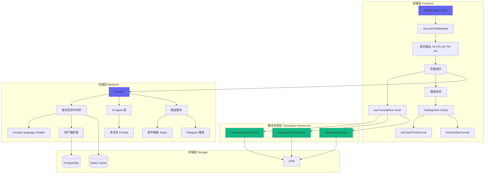
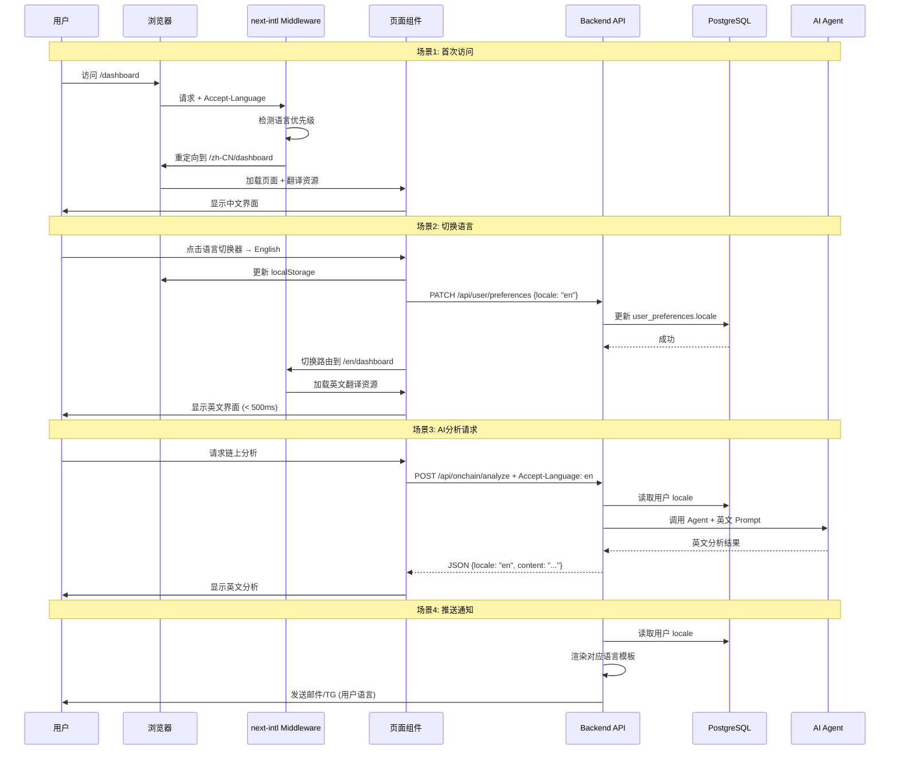
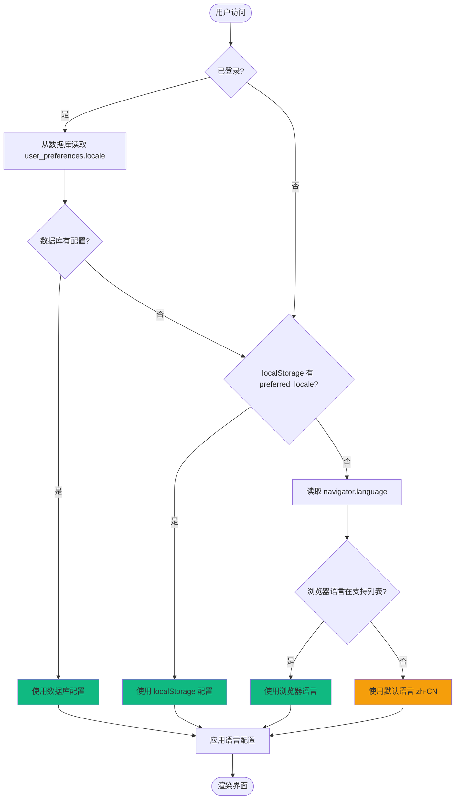
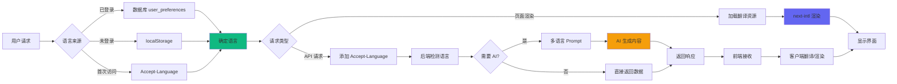
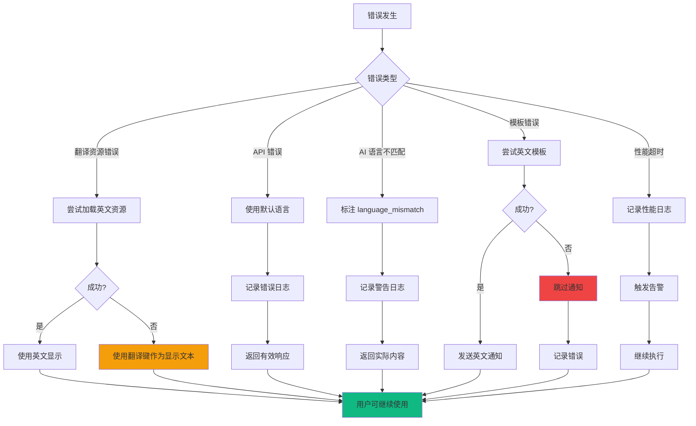

# 设计文档 - 国际化用户界面

## 概述

本设计文档描述了为庄家视角多智能体分析系统添加多语言支持的技术实现方案。系统将支持中文简体（zh-CN）、中文繁体（zh-TW）和英文（en）三种语言，覆盖前端用户界面、后端API响应、AI智能体输出和推送通知等所有用户接触点。

### 设计目标

1. **无缝切换**: 用户可在 500ms 内完成语言切换，无需页面刷新
2. **全面覆盖**: 所有用户界面元素、API响应、AI输出和推送通知均支持多语言
3. **性能优先**: 按需加载翻译资源，避免影响首屏加载速度
4. **易于维护**: 翻译资源集中管理，支持增量更新和版本控制
5. **降级友好**: 翻译缺失时自动降级到英文，不影响核心功能

### 技术选型

- **前端框架**: next-intl（专为 Next.js 14 App Router 优化）
- **后端模板**: Jinja2（邮件模板渲染）
- **数据格式**: JSON（翻译资源存储）
- **日期/数字**: JavaScript Intl API（本地化格式化）
- **字体**: Noto Sans SC/TC（中文）、Inter（英文）

## 架构设计

### 系统架构图




### 数据流图



### 语言选择优先级算法



## 组件和接口设计

### 前端组件架构

#### 1. 语言切换器组件 (LanguageSwitcher)

```typescript
// components/layout/LanguageSwitcher.tsx
'use client';

import { useLocale, useTranslations } from 'next-intl';
import { useRouter, usePathname } from 'next/navigation';
import { useState, useTransition } from 'react';
import { motion } from 'framer-motion';
import {
  DropdownMenu,
  DropdownMenuContent,
  DropdownMenuItem,
  DropdownMenuTrigger,
} from '@/components/ui/dropdown-menu';

const LOCALES = [
  { code: 'zh-CN', name: '简体中文', flag: '🇨🇳' },
  { code: 'zh-TW', name: '繁體中文', flag: '🇭🇰' },
  { code: 'en', name: 'English', flag: '🇺🇸' },
] as const;

export function LanguageSwitcher() {
  const t = useTranslations('common');
  const locale = useLocale();
  const router = useRouter();
  const pathname = usePathname();
  const [isPending, startTransition] = useTransition();
  const [isOpen, setIsOpen] = useState(false);

  const currentLocale = LOCALES.find(l => l.code === locale) || LOCALES[0];

  const switchLocale = async (newLocale: string) => {
    // 性能监控开始
    performance.mark('locale-switch-start');

    // 保存到 localStorage
    localStorage.setItem('preferred_locale', newLocale);

    // 同步到服务器（已登录用户）
    try {
      await fetch('/api/user/preferences', {
        method: 'PATCH',
        headers: {
          'Content-Type': 'application/json',
          ...authHeaders(),
        },
        body: JSON.stringify({ locale: newLocale }),
      });
    } catch (error) {
      console.warn('Failed to sync locale to server:', error);
    }

    // 切换路由
    const newPath = pathname.replace(`/${locale}`, `/${newLocale}`);
    startTransition(() => {
      router.replace(newPath);
    });

    // 性能监控结束
    performance.mark('locale-switch-end');
    performance.measure('locale-switch', 'locale-switch-start', 'locale-switch-end');
    
    const measure = performance.getEntriesByName('locale-switch')[0];
    if (measure.duration > 500) {
      console.warn(`Locale switch took ${measure.duration}ms, exceeds 500ms target`);
    }
  };

  return (
    <DropdownMenu open={isOpen} onOpenChange={setIsOpen}>
      <DropdownMenuTrigger asChild>
        <button
          className="flex items-center gap-2 px-3 py-2 rounded-lg hover:bg-white/5 transition-colors"
          disabled={isPending}
        >
          <span className="text-lg">{currentLocale.flag}</span>
          <span className="text-sm text-zinc-300">{currentLocale.name}</span>
        </button>
      </DropdownMenuTrigger>
      <DropdownMenuContent align="end" className="w-40">
        {LOCALES.map((loc) => (
          <DropdownMenuItem
            key={loc.code}
            onClick={() => switchLocale(loc.code)}
            className="flex items-center gap-2 cursor-pointer"
          >
            <motion.div
              initial={{ opacity: 0, x: -10 }}
              animate={{ opacity: 1, x: 0 }}
              transition={{ duration: 0.2 }}
              className="flex items-center gap-2 w-full"
            >
              <span className="text-lg">{loc.flag}</span>
              <span className="text-sm">{loc.name}</span>
              {loc.code === locale && (
                <span className="ml-auto text-indigo-400">✓</span>
              )}
            </motion.div>
          </DropdownMenuItem>
        ))}
      </DropdownMenuContent>
    </DropdownMenu>
  );
}
```

#### 2. next-intl 配置

```typescript
// i18n.ts (根目录)
import { getRequestConfig } from 'next-intl/server';
import { notFound } from 'next/navigation';

export const locales = ['zh-CN', 'zh-TW', 'en'] as const;
export type Locale = (typeof locales)[number];

export default getRequestConfig(async ({ locale }) => {
  // 验证语言代码
  if (!locales.includes(locale as Locale)) {
    notFound();
  }

  return {
    messages: await import(`./messages/${locale}.json`)
      .then(module => module.default)
      .catch(() => {
        console.error(`Failed to load locale ${locale}, falling back to en`);
        return import('./messages/en.json').then(m => m.default);
      }),
    
    // 错误处理
    onError: (error) => {
      if (process.env.NODE_ENV === 'development') {
        console.error('i18n error:', error);
      } else {
        // 生产环境记录到日志系统
        console.warn('i18n_error', { error: error.message });
      }
    },
    
    // 降级处理
    getMessageFallback: ({ namespace, key, error }) => {
      const path = [namespace, key].filter(Boolean).join('.');
      if (process.env.NODE_ENV === 'development') {
        return `⚠️ ${path}`;
      }
      return path;
    },
  };
});
```

#### 3. Middleware 配置

```typescript
// middleware.ts (根目录)
import createMiddleware from 'next-intl/middleware';
import { locales } from './i18n';

export default createMiddleware({
  locales,
  defaultLocale: 'zh-CN',
  localePrefix: 'always', // 始终显示语言前缀
  localeDetection: true, // 自动检测浏览器语言
});

export const config = {
  // 匹配所有路径，除了 API、静态文件等
  matcher: ['/((?!api|_next|_vercel|.*\\..*).*)'],
};
```

#### 4. 根布局更新

```typescript
// app/[locale]/layout.tsx
import { NextIntlClientProvider } from 'next-intl';
import { getMessages } from 'next-intl/server';
import { notFound } from 'next/navigation';
import { locales } from '@/i18n';

export function generateStaticParams() {
  return locales.map((locale) => ({ locale }));
}

export default async function LocaleLayout({
  children,
  params: { locale },
}: {
  children: React.ReactNode;
  params: { locale: string };
}) {
  // 验证语言代码
  if (!locales.includes(locale as any)) {
    notFound();
  }

  // 加载翻译资源
  const messages = await getMessages();

  return (
    <html lang={locale} className="dark">
      <body className="font-sans antialiased">
        <NextIntlClientProvider locale={locale} messages={messages}>
          {children}
        </NextIntlClientProvider>
      </body>
    </html>
  );
}
```


#### 5. 图表国际化组件

```typescript
// components/charts/LocalizedChart.tsx
'use client';

import { useLocale } from 'next-intl';
import { useEffect, useRef } from 'react';
import { createChart, IChartApi, ISeriesApi } from 'lightweight-charts';

interface LocalizedChartProps {
  data: Array<{ time: number; value: number }>;
  title: string;
}

export function LocalizedChart({ data, title }: LocalizedChartProps) {
  const locale = useLocale();
  const chartContainerRef = useRef<HTMLDivElement>(null);
  const chartRef = useRef<IChartApi | null>(null);

  useEffect(() => {
    if (!chartContainerRef.current) return;

    // 创建图表实例
    const chart = createChart(chartContainerRef.current, {
      width: chartContainerRef.current.clientWidth,
      height: 400,
      layout: {
        background: { color: '#131316' },
        textColor: '#a1a1aa',
      },
      grid: {
        vertLines: { color: 'rgba(255, 255, 255, 0.05)' },
        horzLines: { color: 'rgba(255, 255, 255, 0.05)' },
      },
      localization: {
        locale: locale,
        // 时间格式化
        timeFormatter: (timestamp: number) => {
          return new Intl.DateTimeFormat(locale, {
            month: 'short',
            day: 'numeric',
            hour: '2-digit',
            minute: '2-digit',
          }).format(timestamp * 1000);
        },
        // 价格格式化
        priceFormatter: (price: number) => {
          return new Intl.NumberFormat(locale, {
            minimumFractionDigits: 2,
            maximumFractionDigits: 8,
          }).format(price);
        },
      },
    });

    const lineSeries = chart.addLineSeries({
      color: '#6366f1',
      lineWidth: 2,
    });
    lineSeries.setData(data);

    chartRef.current = chart;

    // 响应式调整
    const handleResize = () => {
      if (chartContainerRef.current && chartRef.current) {
        chartRef.current.applyOptions({
          width: chartContainerRef.current.clientWidth,
        });
      }
    };
    window.addEventListener('resize', handleResize);

    return () => {
      window.removeEventListener('resize', handleResize);
      chart.remove();
    };
  }, [data, locale]);

  return (
    <div className="space-y-2">
      <h3 className="text-sm font-medium text-zinc-300">{title}</h3>
      <div ref={chartContainerRef} className="rounded-lg overflow-hidden" />
    </div>
  );
}
```

#### 6. 数字和日期格式化工具

```typescript
// lib/i18n/formatters.ts
import { useLocale } from 'next-intl';

export function useNumberFormatter() {
  const locale = useLocale();

  return {
    // 格式化价格
    formatPrice: (value: number, currency: string = 'USD') => {
      return new Intl.NumberFormat(locale, {
        style: 'currency',
        currency,
        minimumFractionDigits: 2,
        maximumFractionDigits: 8,
      }).format(value);
    },

    // 格式化百分比
    formatPercent: (value: number, decimals: number = 2) => {
      return new Intl.NumberFormat(locale, {
        style: 'percent',
        minimumFractionDigits: decimals,
        maximumFractionDigits: decimals,
      }).format(value / 100);
    },

    // 格式化大数字（带千位分隔符）
    formatNumber: (value: number, decimals: number = 2) => {
      return new Intl.NumberFormat(locale, {
        minimumFractionDigits: decimals,
        maximumFractionDigits: decimals,
      }).format(value);
    },

    // 格式化成交量（简化显示）
    formatVolume: (value: number) => {
      if (value >= 1e9) {
        return `${(value / 1e9).toFixed(2)}B`;
      }
      if (value >= 1e6) {
        return `${(value / 1e6).toFixed(2)}M`;
      }
      if (value >= 1e3) {
        return `${(value / 1e3).toFixed(2)}K`;
      }
      return value.toFixed(2);
    },
  };
}

export function useDateFormatter() {
  const locale = useLocale();

  return {
    // 格式化完整日期时间
    formatDateTime: (date: Date | string | number) => {
      const d = typeof date === 'string' || typeof date === 'number' ? new Date(date) : date;
      return new Intl.DateTimeFormat(locale, {
        year: 'numeric',
        month: 'short',
        day: 'numeric',
        hour: '2-digit',
        minute: '2-digit',
      }).format(d);
    },

    // 格式化日期
    formatDate: (date: Date | string | number) => {
      const d = typeof date === 'string' || typeof date === 'number' ? new Date(date) : date;
      return new Intl.DateTimeFormat(locale, {
        year: 'numeric',
        month: 'short',
        day: 'numeric',
      }).format(d);
    },

    // 格式化时间
    formatTime: (date: Date | string | number) => {
      const d = typeof date === 'string' || typeof date === 'number' ? new Date(date) : date;
      return new Intl.DateTimeFormat(locale, {
        hour: '2-digit',
        minute: '2-digit',
        second: '2-digit',
      }).format(d);
    },

    // 格式化相对时间（如 "2小时前"）
    formatRelative: (date: Date | string | number) => {
      const d = typeof date === 'string' || typeof date === 'number' ? new Date(date) : date;
      const now = new Date();
      const diffMs = now.getTime() - d.getTime();
      const diffSec = Math.floor(diffMs / 1000);
      const diffMin = Math.floor(diffSec / 60);
      const diffHour = Math.floor(diffMin / 60);
      const diffDay = Math.floor(diffHour / 24);

      const rtf = new Intl.RelativeTimeFormat(locale, { numeric: 'auto' });

      if (diffDay > 0) return rtf.format(-diffDay, 'day');
      if (diffHour > 0) return rtf.format(-diffHour, 'hour');
      if (diffMin > 0) return rtf.format(-diffMin, 'minute');
      return rtf.format(-diffSec, 'second');
    },
  };
}
```

### 后端组件架构

#### 1. 语言检测中间件

```python
# backend/app/core/i18n_middleware.py
"""语言检测中间件 - 从 Accept-Language header 或用户配置读取语言偏好"""

import logging
from typing import Optional
from fastapi import Request
from sqlalchemy import text
from sqlalchemy.ext.asyncio import AsyncSession

logger = logging.getLogger(__name__)

SUPPORTED_LOCALES = ["zh-CN", "zh-TW", "en"]
DEFAULT_LOCALE = "zh-CN"


async def detect_locale(request: Request, session: AsyncSession, user_id: Optional[str] = None) -> str:
    """
    检测用户语言偏好，优先级：
    1. 用户数据库配置（已登录）
    2. Accept-Language header
    3. 默认语言（zh-CN）
    """
    # 1. 已登录用户：从数据库读取
    if user_id:
        try:
            result = await session.execute(
                text("SELECT locale FROM user_preferences WHERE user_id = :user_id"),
                {"user_id": user_id}
            )
            row = result.first()
            if row and row[0] in SUPPORTED_LOCALES:
                return row[0]
        except Exception as exc:
            logger.warning(f"Failed to read user locale from DB: {exc}")

    # 2. Accept-Language header
    accept_language = request.headers.get("Accept-Language", "")
    if accept_language:
        # 解析 Accept-Language: zh-CN,zh;q=0.9,en;q=0.8
        for lang_range in accept_language.split(","):
            lang = lang_range.split(";")[0].strip()
            if lang in SUPPORTED_LOCALES:
                return lang
            # 处理简化形式（如 "zh" -> "zh-CN"）
            if lang.startswith("zh"):
                return "zh-CN"
            if lang.startswith("en"):
                return "en"

    # 3. 默认语言
    return DEFAULT_LOCALE


def get_locale_from_request(request: Request) -> str:
    """从请求中快速获取语言（不查询数据库）"""
    accept_language = request.headers.get("Accept-Language", "")
    if accept_language:
        for lang_range in accept_language.split(","):
            lang = lang_range.split(";")[0].strip()
            if lang in SUPPORTED_LOCALES:
                return lang
            if lang.startswith("zh"):
                return "zh-CN"
            if lang.startswith("en"):
                return "en"
    return DEFAULT_LOCALE
```

#### 2. 用户偏好服务

```python
# backend/app/services/user_preference_service.py
"""用户偏好服务 - 管理用户语言偏好"""

import logging
from typing import Optional
from sqlalchemy import text
from sqlalchemy.ext.asyncio import AsyncSession

logger = logging.getLogger(__name__)

SUPPORTED_LOCALES = ["zh-CN", "zh-TW", "en"]


class UserPreferenceService:
    """用户偏好服务"""

    @staticmethod
    async def get_locale(session: AsyncSession, user_id: str) -> Optional[str]:
        """获取用户语言偏好"""
        try:
            result = await session.execute(
                text("SELECT locale FROM user_preferences WHERE user_id = :user_id"),
                {"user_id": user_id}
            )
            row = result.first()
            return row[0] if row else None
        except Exception as exc:
            logger.error(f"Failed to get user locale: {exc}")
            return None

    @staticmethod
    async def update_locale(session: AsyncSession, user_id: str, locale: str) -> bool:
        """更新用户语言偏好"""
        if locale not in SUPPORTED_LOCALES:
            raise ValueError(f"Unsupported locale: {locale}")

        try:
            # 检查记录是否存在
            result = await session.execute(
                text("SELECT 1 FROM user_preferences WHERE user_id = :user_id"),
                {"user_id": user_id}
            )
            exists = result.first() is not None

            if exists:
                # 更新现有记录
                await session.execute(
                    text("""
                        UPDATE user_preferences 
                        SET locale = :locale, updated_at = CURRENT_TIMESTAMP 
                        WHERE user_id = :user_id
                    """),
                    {"user_id": user_id, "locale": locale}
                )
            else:
                # 创建新记录
                await session.execute(
                    text("""
                        INSERT INTO user_preferences (user_id, locale) 
                        VALUES (:user_id, :locale)
                    """),
                    {"user_id": user_id, "locale": locale}
                )

            logger.info(f"Updated user locale: user_id={user_id}, locale={locale}")
            return True
        except Exception as exc:
            logger.error(f"Failed to update user locale: {exc}")
            return False
```


#### 3. AI Agent 多语言 Prompt 管理

```python
# backend/app/agents/i18n_prompts.py
"""AI Agent 多语言 Prompt 模板管理"""

from typing import Dict

# Prompt 模板字典
SYSTEM_PROMPTS: Dict[str, Dict[str, str]] = {
    "zh-CN": {
        "onchain": """你是一个专业的加密货币链上数据分析师。请用简体中文分析以下数据。

分析要求：
1. 保持技术指标名称不变（如 MACD、RSI、EMA）
2. 保持交易对符号不变（如 BTCUSDT）
3. 使用专业术语，但保持易懂
4. 输出必须是有效的 JSON 格式

{base_instructions}""",
        
        "technical": """你是一个专业的技术分析师。请用简体中文分析以下技术指标。

分析要求：
1. 保持指标名称不变（MACD、RSI、布林带等）
2. 给出明确的信号判断（看涨/看跌/中性）
3. 输出必须是有效的 JSON 格式

{base_instructions}""",
        
        "playbook": """你是一个经验丰富的交易策略分析师。请用简体中文推演可能的操盘剧本。

分析要求：
1. 基于链上数据和技术指标推演庄家意图
2. 给出 3-5 个可能的剧本场景
3. 每个剧本包含：触发条件、预期走势、操作建议
4. 输出必须是有效的 JSON 格式

{base_instructions}""",
    },
    
    "zh-TW": {
        "onchain": """你是一個專業的加密貨幣鏈上數據分析師。請用繁體中文分析以下數據。

分析要求：
1. 保持技術指標名稱不變（如 MACD、RSI、EMA）
2. 保持交易對符號不變（如 BTCUSDT）
3. 使用專業術語，但保持易懂
4. 輸出必須是有效的 JSON 格式

{base_instructions}""",
        
        "technical": """你是一個專業的技術分析師。請用繁體中文分析以下技術指標。

分析要求：
1. 保持指標名稱不變（MACD、RSI、布林帶等）
2. 給出明確的信號判斷（看漲/看跌/中性）
3. 輸出必須是有效的 JSON 格式

{base_instructions}""",
        
        "playbook": """你是一個經驗豐富的交易策略分析師。請用繁體中文推演可能的操盤劇本。

分析要求：
1. 基於鏈上數據和技術指標推演莊家意圖
2. 給出 3-5 個可能的劇本場景
3. 每個劇本包含：觸發條件、預期走勢、操作建議
4. 輸出必須是有效的 JSON 格式

{base_instructions}""",
    },
    
    "en": {
        "onchain": """You are a professional cryptocurrency on-chain data analyst. Please analyze the following data in English.

Requirements:
1. Keep technical indicator names unchanged (e.g., MACD, RSI, EMA)
2. Keep trading pair symbols unchanged (e.g., BTCUSDT)
3. Use professional terminology while remaining accessible
4. Output must be valid JSON format

{base_instructions}""",
        
        "technical": """You are a professional technical analyst. Please analyze the following technical indicators in English.

Requirements:
1. Keep indicator names unchanged (MACD, RSI, Bollinger Bands, etc.)
2. Provide clear signal judgments (bullish/bearish/neutral)
3. Output must be valid JSON format

{base_instructions}""",
        
        "playbook": """You are an experienced trading strategy analyst. Please deduce possible market maker playbooks in English.

Requirements:
1. Infer market maker intentions based on on-chain data and technical indicators
2. Provide 3-5 possible playbook scenarios
3. Each playbook includes: trigger conditions, expected trends, operational recommendations
4. Output must be valid JSON format

{base_instructions}""",
    },
}


def get_system_prompt(agent_type: str, locale: str, base_instructions: str = "") -> str:
    """
    获取指定 Agent 和语言的系统提示词
    
    Args:
        agent_type: Agent 类型（onchain/technical/playbook）
        locale: 语言代码（zh-CN/zh-TW/en）
        base_instructions: 基础指令（可选）
    
    Returns:
        格式化后的系统提示词
    """
    # 降级处理：不支持的语言使用英文
    if locale not in SYSTEM_PROMPTS:
        locale = "en"
    
    # 降级处理：不支持的 Agent 类型使用 onchain
    if agent_type not in SYSTEM_PROMPTS[locale]:
        agent_type = "onchain"
    
    template = SYSTEM_PROMPTS[locale][agent_type]
    return template.format(base_instructions=base_instructions)
```

#### 4. API 路由层集成

```python
# backend/app/api/user_preferences.py
"""用户偏好 API 路由"""

import logging
from fastapi import APIRouter, Depends, HTTPException, status
from pydantic import BaseModel, Field
from sqlalchemy.ext.asyncio import AsyncSession

from app.core.database import get_db
from app.core.deps import get_current_user, UserInfo
from app.services.user_preference_service import UserPreferenceService

logger = logging.getLogger(__name__)

router = APIRouter(prefix="/api/user", tags=["user"])


class UpdatePreferencesRequest(BaseModel):
    locale: str = Field(..., pattern="^(zh-CN|zh-TW|en)$", description="语言代码")


class PreferencesResponse(BaseModel):
    locale: str
    theme: str = "dark"


@router.get("/preferences", response_model=PreferencesResponse)
async def get_preferences(
    user: UserInfo = Depends(get_current_user),
    session: AsyncSession = Depends(get_db),
) -> PreferencesResponse:
    """获取用户偏好设置"""
    locale = await UserPreferenceService.get_locale(session, user.id)
    return PreferencesResponse(
        locale=locale or "zh-CN",
        theme="dark",
    )


@router.patch("/preferences")
async def update_preferences(
    body: UpdatePreferencesRequest,
    user: UserInfo = Depends(get_current_user),
    session: AsyncSession = Depends(get_db),
) -> dict:
    """更新用户偏好设置"""
    try:
        success = await UserPreferenceService.update_locale(
            session, user.id, body.locale
        )
        if not success:
            raise HTTPException(
                status_code=status.HTTP_500_INTERNAL_SERVER_ERROR,
                detail="更新失败",
            )
        return {"success": True, "locale": body.locale}
    except ValueError as exc:
        raise HTTPException(
            status_code=status.HTTP_400_BAD_REQUEST,
            detail=str(exc),
        )
```

#### 5. 推送通知国际化

```python
# backend/app/services/notification/i18n_templates.py
"""推送通知多语言模板"""

from typing import Dict, Any
from jinja2 import Environment, FileSystemLoader, select_autoescape
import logging

logger = logging.getLogger(__name__)

# Telegram 消息模板
TELEGRAM_TEMPLATES: Dict[str, Dict[str, str]] = {
    "zh-CN": {
        "alert_triggered": """🚨 预警触发

交易对: {symbol}
当前价格: {price}
触发条件: {condition}
时间: {timestamp}

查看详情: {url}""",
        
        "strategy_signal": """📊 策略信号

交易对: {symbol}
信号: {signal}
置信度: {confidence}%
建议操作: {action}

查看详情: {url}""",
        
        "subscription_expiry": """⏰ 会员到期提醒

您的 {tier} 会员将于 {expiry_date} 到期。

续费可继续享受：
{benefits}

立即续费: {url}""",
    },
    
    "zh-TW": {
        "alert_triggered": """🚨 預警觸發

交易對: {symbol}
當前價格: {price}
觸發條件: {condition}
時間: {timestamp}

查看詳情: {url}""",
        
        "strategy_signal": """📊 策略信號

交易對: {symbol}
信號: {signal}
置信度: {confidence}%
建議操作: {action}

查看詳情: {url}""",
        
        "subscription_expiry": """⏰ 會員到期提醒

您的 {tier} 會員將於 {expiry_date} 到期。

續費可繼續享受：
{benefits}

立即續費: {url}""",
    },
    
    "en": {
        "alert_triggered": """🚨 Alert Triggered

Symbol: {symbol}
Current Price: {price}
Condition: {condition}
Time: {timestamp}

View Details: {url}""",
        
        "strategy_signal": """📊 Strategy Signal

Symbol: {symbol}
Signal: {signal}
Confidence: {confidence}%
Recommended Action: {action}

View Details: {url}""",
        
        "subscription_expiry": """⏰ Subscription Expiry Reminder

Your {tier} membership will expire on {expiry_date}.

Renew to continue enjoying:
{benefits}

Renew Now: {url}""",
    },
}


class I18nNotificationService:
    """国际化推送通知服务"""
    
    def __init__(self):
        # 初始化 Jinja2 环境（用于邮件模板）
        self.jinja_env = Environment(
            loader=FileSystemLoader("backend/templates/email"),
            autoescape=select_autoescape(["html", "xml"]),
        )
    
    def render_telegram_message(
        self, 
        template_key: str, 
        locale: str, 
        **params: Any
    ) -> str:
        """
        渲染 Telegram 消息模板
        
        Args:
            template_key: 模板键（alert_triggered/strategy_signal等）
            locale: 语言代码
            **params: 模板参数
        
        Returns:
            渲染后的消息文本
        """
        # 降级处理
        if locale not in TELEGRAM_TEMPLATES:
            locale = "en"
        
        if template_key not in TELEGRAM_TEMPLATES[locale]:
            logger.warning(f"Template {template_key} not found for locale {locale}")
            template_key = "alert_triggered"
        
        template = TELEGRAM_TEMPLATES[locale][template_key]
        try:
            return template.format(**params)
        except KeyError as exc:
            logger.error(f"Missing template parameter: {exc}")
            return template
    
    def render_email_template(
        self, 
        template_name: str, 
        locale: str, 
        **params: Any
    ) -> str:
        """
        渲染邮件 HTML 模板
        
        Args:
            template_name: 模板文件名（不含扩展名）
            locale: 语言代码
            **params: 模板参数
        
        Returns:
            渲染后的 HTML
        """
        # 降级处理
        if locale not in ["zh-CN", "zh-TW", "en"]:
            locale = "en"
        
        template_path = f"{locale}/{template_name}.html"
        try:
            template = self.jinja_env.get_template(template_path)
            return template.render(**params)
        except Exception as exc:
            logger.error(f"Failed to render email template {template_path}: {exc}")
            # 降级到英文模板
            if locale != "en":
                return self.render_email_template(template_name, "en", **params)
            raise
```


## 数据模型

### 数据库表结构

#### 1. user_preferences 表扩展

```sql
-- 扩展现有的 user_preferences 表，添加 locale 字段
ALTER TABLE user_preferences 
ADD COLUMN IF NOT EXISTS locale VARCHAR(10) DEFAULT 'zh-CN';

-- 添加索引以优化查询性能
CREATE INDEX IF NOT EXISTS idx_user_preferences_locale 
ON user_preferences(locale);

-- 添加约束确保只能使用支持的语言
ALTER TABLE user_preferences 
ADD CONSTRAINT check_locale_valid 
CHECK (locale IN ('zh-CN', 'zh-TW', 'en'));

-- 查看表结构
COMMENT ON COLUMN user_preferences.locale IS '用户界面语言偏好：zh-CN（简体中文）、zh-TW（繁体中文）、en（英文）';
```

完整的 user_preferences 表结构：

```sql
CREATE TABLE IF NOT EXISTS user_preferences (
    user_id UUID PRIMARY KEY REFERENCES users(id) ON DELETE CASCADE,
    locale VARCHAR(10) DEFAULT 'zh-CN' CHECK (locale IN ('zh-CN', 'zh-TW', 'en')),
    theme VARCHAR(20) DEFAULT 'dark',
    timezone VARCHAR(50) DEFAULT 'UTC',
    created_at TIMESTAMP WITH TIME ZONE DEFAULT CURRENT_TIMESTAMP,
    updated_at TIMESTAMP WITH TIME ZONE DEFAULT CURRENT_TIMESTAMP
);

CREATE INDEX idx_user_preferences_locale ON user_preferences(locale);
```

#### 2. 翻译资源文件结构

前端翻译资源采用 JSON 格式，按模块组织：

```
frontend/messages/
├── zh-CN/
│   ├── common.json          # 通用文本（按钮、标签、状态）
│   ├── nav.json             # 导航菜单
│   ├── dashboard.json       # 仪表盘页面
│   ├── onchain.json         # 链上数据页面
│   ├── consensus.json       # 共识分析页面
│   ├── cases.json           # 历史案例页面
│   ├── settings.json        # 用户设置页面
│   ├── performance.json     # 性能分析页面
│   ├── alerts.json          # 预警规则页面
│   ├── errors.json          # 错误消息
│   └── metadata.json        # SEO 元数据
├── zh-TW/
│   └── [同上结构]
└── en/
    └── [同上结构]
```

#### 3. 翻译资源示例

```json
// messages/zh-CN/common.json
{
  "buttons": {
    "submit": "提交",
    "cancel": "取消",
    "save": "保存",
    "delete": "删除",
    "edit": "编辑",
    "refresh": "刷新",
    "export": "导出",
    "import": "导入"
  },
  "status": {
    "loading": "加载中...",
    "success": "成功",
    "error": "错误",
    "pending": "待处理",
    "completed": "已完成"
  },
  "time": {
    "now": "刚刚",
    "minutesAgo": "{count} 分钟前",
    "hoursAgo": "{count} 小时前",
    "daysAgo": "{count} 天前"
  },
  "validation": {
    "required": "此字段为必填项",
    "invalidEmail": "邮箱格式不正确",
    "minLength": "至少需要 {min} 个字符",
    "maxLength": "最多 {max} 个字符"
  }
}
```

```json
// messages/zh-CN/dashboard.json
{
  "title": "市场仪表盘",
  "subtitle": "实时监控市场动态",
  "sections": {
    "overview": "市场概览",
    "signals": "策略信号",
    "onchain": "链上数据",
    "technical": "技术指标"
  },
  "metrics": {
    "price": "价格",
    "change24h": "24h 涨跌",
    "volume": "成交量",
    "marketCap": "市值",
    "dominance": "市场占有率"
  },
  "signals": {
    "bullish": "看涨",
    "bearish": "看跌",
    "neutral": "中性",
    "strong": "强",
    "weak": "弱"
  },
  "actions": {
    "analyze": "深度分析",
    "viewDetails": "查看详情",
    "setAlert": "设置预警"
  }
}
```

```json
// messages/en/dashboard.json
{
  "title": "Market Dashboard",
  "subtitle": "Real-time market monitoring",
  "sections": {
    "overview": "Market Overview",
    "signals": "Strategy Signals",
    "onchain": "On-chain Data",
    "technical": "Technical Indicators"
  },
  "metrics": {
    "price": "Price",
    "change24h": "24h Change",
    "volume": "Volume",
    "marketCap": "Market Cap",
    "dominance": "Dominance"
  },
  "signals": {
    "bullish": "Bullish",
    "bearish": "Bearish",
    "neutral": "Neutral",
    "strong": "Strong",
    "weak": "Weak"
  },
  "actions": {
    "analyze": "Deep Analysis",
    "viewDetails": "View Details",
    "setAlert": "Set Alert"
  }
}
```

#### 4. API 响应数据模型

```python
# backend/app/models/i18n.py
"""国际化相关数据模型"""

from typing import Optional, Literal
from pydantic import BaseModel, Field

LocaleType = Literal["zh-CN", "zh-TW", "en"]


class LocalizedResponse(BaseModel):
    """带语言标识的 API 响应基类"""
    locale: LocaleType = Field(..., description="响应内容的语言")
    content_locale: Optional[LocaleType] = Field(None, description="实际内容语言（AI生成时可能不同）")
    language_mismatch: bool = Field(False, description="内容语言是否与请求语言不匹配")


class AnalysisResponse(LocalizedResponse):
    """分析结果响应"""
    symbol: str
    signal: str
    confidence: float
    analysis: str
    timestamp: str


class ErrorResponse(LocalizedResponse):
    """错误响应"""
    error_code: str
    message: str
    details: Optional[str] = None
```

#### 5. WebSocket 消息格式

```typescript
// 客户端发送消息格式
interface WSClientMessage {
  type: 'subscribe' | 'unsubscribe' | 'request';
  locale: 'zh-CN' | 'zh-TW' | 'en';
  data: any;
}

// 服务端推送消息格式
interface WSServerMessage {
  type: 'alert' | 'signal' | 'update' | 'error';
  locale: 'zh-CN' | 'zh-TW' | 'en';
  timestamp: string;
  data: {
    symbol?: string;
    message_key?: string;  // 翻译键（客户端翻译）
    message_params?: Record<string, any>;  // 翻译参数
    content?: string;  // 预渲染内容（服务端翻译）
  };
}
```

### 数据流转



## 接口设计

### REST API 接口

#### 1. 用户偏好接口

```
GET /api/user/preferences
描述: 获取用户偏好设置（包含语言）
认证: 需要 JWT token
响应:
{
  "locale": "zh-CN",
  "theme": "dark",
  "timezone": "Asia/Shanghai"
}
```

```
PATCH /api/user/preferences
描述: 更新用户偏好设置
认证: 需要 JWT token
请求体:
{
  "locale": "zh-CN" | "zh-TW" | "en"
}
响应:
{
  "success": true,
  "locale": "zh-CN"
}
```

#### 2. 分析接口（支持多语言）

```
POST /api/onchain/analyze
描述: 链上数据分析
认证: 需要 JWT token
请求头:
  Accept-Language: zh-CN | zh-TW | en
请求体:
{
  "symbol": "BTCUSDT",
  "timeframe": "1h"
}
响应:
{
  "locale": "zh-CN",
  "content_locale": "zh-CN",
  "language_mismatch": false,
  "symbol": "BTCUSDT",
  "signal": "bullish",
  "confidence": 75.5,
  "analysis": "根据链上数据显示...",
  "timestamp": "2025-03-09T14:30:00Z"
}
```

#### 3. 错误响应（多语言）

```
HTTP 400 Bad Request
{
  "locale": "zh-CN",
  "error_code": "INVALID_SYMBOL",
  "message": "交易对��式不正确",
  "details": "交易对必须是有效的币安交易对，如 BTCUSDT"
}
```

### WebSocket 接口

#### 连接建立

```
ws://api.example.com/ws?locale=zh-CN&token=<jwt_token>

参数:
- locale: 语言代码（zh-CN/zh-TW/en）
- token: JWT 访问令牌
```

#### 消息格式

客户端订阅：
```json
{
  "type": "subscribe",
  "locale": "zh-CN",
  "data": {
    "channels": ["alerts", "signals"],
    "symbols": ["BTCUSDT", "ETHUSDT"]
  }
}
```

服务端推送（预警触发）：
```json
{
  "type": "alert",
  "locale": "zh-CN",
  "timestamp": "2025-03-09T14:30:00Z",
  "data": {
    "symbol": "BTCUSDT",
    "content": "价格突破 50000 USDT，触发预警",
    "price": 50100,
    "condition": "price_above",
    "threshold": 50000
  }
}
```

服务端推送（使用翻译键）：
```json
{
  "type": "signal",
  "locale": "zh-CN",
  "timestamp": "2025-03-09T14:30:00Z",
  "data": {
    "symbol": "BTCUSDT",
    "message_key": "signals.bullish_detected",
    "message_params": {
      "confidence": 85.5,
      "indicator": "MACD"
    }
  }
}
```

客户端处理：
```typescript
// 使用 next-intl 翻译
const t = useTranslations('signals');
const message = t('bullish_detected', { 
  confidence: data.message_params.confidence,
  indicator: data.message_params.indicator 
});
// 结果: "检测到看涨信号（MACD），置信度 85.5%"
```


## Correctness Properties

*属性（Property）是一个特征或行为，应该在系统的所有有效执行中保持为真——本质上是关于系统应该做什么的形式化陈述。属性作为人类可读规范和机器可验证正确性保证之间的桥梁。*

### Property Reflection（属性反思）

在将验收标准转换为属性之前，我们需要识别和消除冗余：

**识别的冗余：**

1. **语言切换和持久化**：
   - 1.6（保存到 localStorage）和 1.7（同步到数据库）可以合并为一个综合属性：语言切换时应该同时更新两个存储位置
   - 6.1（localStorage 持久化）和 6.2（数据库持久化）与上述重复

2. **降级逻辑**：
   - 2.6（翻译键缺失降级）和 10.2（翻译键缺失降级）是重复的
   - 10.1（资源加载失败降级）和 10.2（翻译键缺失降级）可以合并为一个综合的降级属性

3. **格式化功能**：
   - 3.4（数字千位分隔符）、3.5（货币符号）、3.6（百分比）都是数字格式化的不同方面，可以合并为一个综合属性

4. **AI 输出语言**：
   - 4.4、4.5、4.6（不同语言的 AI 输出）是同一属性的不同实例，应该合并为一个通用属性

5. **元数据国际化**：
   - 8.2（页面标题）、8.3（页面描述）、8.4（OG 标签）都是元数据国际化的不同方面，可以合并

6. **内容不变性**：
   - 3.8（加密货币符号不变）、4.7（技术术语不变）、4.8（交易对符号不变）、7.6（推送中符号不变）都是关于特定内容不被翻译，可以合并

**保留的独特属性：**

经过反思，我们将保留以下独特且有价值的属性，每个属性提供独特的验证价值。

### 核心属性

### Property 1: 语言切换完整性

*对于任何*支持的语言（zh-CN、zh-TW、en），当用户切换到该语言时，系统应该：
1. 更新 localStorage 的 preferred_locale
2. 如果用户已登录，同步更新数据库 user_preferences.locale
3. 在 500ms 内完成界面刷新
4. 所有使用翻译键的文本都应该显示为目标语言

**验证需求: 1.4, 1.5, 1.6, 1.7, 6.1, 6.2**

### Property 2: 语言选择优先级

*对于任何*用户访问场景，系统应该按以下优先级确定界面语言：
1. 已登录用户的数据库配置（user_preferences.locale）
2. localStorage 中的 preferred_locale
3. 浏览器 Accept-Language header
4. 默认语言（zh-CN）

每个优先级来源存在时，应该覆盖后续的低优先级来源。

**验证逻辑和测试场景：**

测试场景应该验证以下情况：

1. **场景1：数据库配置覆盖所有其他来源**
   - 给定：用户已登录，数据库中 locale = "zh-TW"
   - 给定：localStorage 中 preferred_locale = "en"
   - 给定：浏览器 Accept-Language = "zh-CN"
   - 期望：系统使用 "zh-TW"

2. **场景2：localStorage 覆盖浏览器设置**
   - 给定：用户未登录（数据库无配置）
   - 给定：localStorage 中 preferred_locale = "en"
   - 给定：浏览器 Accept-Language = "zh-CN"
   - 期望：系统使用 "en"

3. **场景3：浏览器设置覆盖默认值**
   - 给定：用户未登录（数据库无配置）
   - 给定：localStorage 中无 preferred_locale
   - 给定：浏览器 Accept-Language = "zh-TW"
   - 期望：系统使用 "zh-TW"

4. **场景4：使用默认语言**
   - 给定：用户未登录（数据库无配置）
   - 给定：localStorage 中无 preferred_locale
   - 给定：浏览器 Accept-Language = "fr"（不支持的语言）
   - 期望：系统使用 "zh-CN"

5. **场景5：优先级来源失效时降级**
   - 给定：用户已登录，但数据库查询失败
   - 给定：localStorage 中 preferred_locale = "en"
   - 期望：系统降级到 localStorage，使用 "en"

**验证需求: 1.8, 6.3, 6.4, 6.5, 6.6**

### Property 3: 翻译降级一致性

*对于任何*翻译键或翻译资源，当出现以下情况时：
1. 翻译资源文件加载失败
2. 特定翻译键在当前语言中缺失
3. 翻译内容为空或无效

系统应该降级到英文版本，如果英文版本也不可用，则显示翻译键本身。降级过程不应该抛出错误或中断用户操作。

**验证需求: 2.6, 10.1, 10.2, 10.6**

### Property 4: 数字和日期本地化

*对于任何*数值、日期时间和货币金额，系统应该根据当前语言使用 Intl API 进行格式化：
- 数字：千位分隔符、小数点符号
- 货币：货币符号位置、格式
- 百分比：统一格式（12.34%）
- 日期时间：语言特定的格式（中文：2025年3月9日 / 英文：Mar 9, 2025）

格式化结果应该符合目标语言区域的习惯。

**验证需求: 3.1, 3.2, 3.4, 3.5, 3.6**

### Property 5: 技术内容不变性

*对于任何*包含以下技术内容的文本（UI、AI 输出、推送通知）：
- 加密货币符号（BTC、ETH、USDT 等）
- 交易对符号（BTCUSDT、ETHUSDT 等）
- 技术指标名称（MACD、RSI、EMA、布林带等）

这些内容在任何语言下都应该保持原样，不应该被翻译或本地化。

**验证需求: 3.8, 4.7, 4.8, 7.6**

### Property 6: AI 输出语言一致性

*对于任何*AI 分析请求，系统应该：
1. 从 Accept-Language header 或用户配置检测目标语言
2. 在 AI Prompt 中包含目标语言指令
3. AI 生成的内容应该使用目标语言
4. API 响应包含 locale 和 content_locale 字段
5. 如果 AI 输出语言与请求语言不匹配，设置 language_mismatch: true 并记录警告

**语言检测算法说明：**

系统使用多层次语言检测算法来验证 AI 输出的语言：

1. **字符集统计检测**：
   - 统计文本中 CJK 统一表意文字的比例（Unicode 范围 U+4E00 到 U+9FFF）
   - 如果 CJK 字符占比 > 30%，判定为中文
   - 否则判定为英文

2. **繁简体区分**：
   - 检测繁体特征字符：繁、體、臺、灣、為、與、學、會、國、來等
   - 如果检测到繁体特征字符，判定为 zh-TW
   - 否则判定为 zh-CN

3. **检测实现**：
```python
def detect_content_language(text: str) -> str:
    """
    检测文本语言
    
    算法：
    1. 统计 CJK 字符比例
    2. 检测繁体特征字符
    3. 返回语言代码
    """
    if not text or len(text) == 0:
        return "en"
    
    # 统计中文字符
    chinese_chars = sum(1 for c in text if '\u4e00' <= c <= '\u9fff')
    chinese_ratio = chinese_chars / len(text)
    
    # 如果中文字符占比 < 30%，判定为英文
    if chinese_ratio < 0.3:
        return "en"
    
    # 繁体特征字符集（高频繁体字）
    traditional_markers = set('繁體臺灣為與學會國來開關無時間問題資訊網絡應該')
    
    # 检测繁体特征字符
    has_traditional = any(c in traditional_markers for c in text)
    
    if has_traditional:
        return "zh-TW"
    else:
        return "zh-CN"
```

4. **检测限制和改进方向**：
   - 当前算法基于字符集统计，准确率约 85-90%
   - 对于短文本（< 50 字符）可能不准确
   - 对于混合语言文本（中英混合）可能误判
   - 未来可集成专业语言检测库（如 langdetect 或 fasttext）提升准确率

5. **错误处理**：
   - 如果检测失败，默认返回 "en"
   - 记录检测结果到日志，便于后续分析和改进

**验证需求: 4.1, 4.2, 4.3, 4.4, 4.5, 4.6, 4.9, 4.10**

### Property 7: 变量插值正确性

*对于任何*包含变量占位符的翻译内容（如 "欢迎 {username}"、"{count} 个结果"），系统应该：
1. 正确识别变量占位符
2. 使用提供的参数值替换占位符
3. 保持非变量部分的文本不变
4. 处理缺失参数时不应该崩溃（显示占位符或空字符串）

**验证需求: 5.6**

### Property 8: 复数形式处理

*对于任何*涉及数量的翻译内容，系统应该根据数量值选择正确的复数形式：
- 中文：通常不区分单复数
- 英文：0/1 使用单数形式，2+ 使用复数形式
- 特殊情��：0 可能有特殊表达（如 "no results" vs "1 result" vs "2 results"）

**验证需求: 5.7**

### Property 9: 跨设备语言同步

*对于任何*已登录用户，当在设备 A 上更改语言偏好后：
1. 偏好应该保存到数据库
2. 在设备 B 上登录时，应该加载数据库中的语言偏好
3. 设备 B 的界面应该显示为数据库中保存的语言

这确保了用户在多设备间获得一致的语言体验。

**验证需求: 6.3**

### Property 10: 推送通知语言匹配

*对于任何*推送通知（邮件或 Telegram），系统应该：
1. 在发送前从 user_preferences 读取用户语言偏好
2. 使用对应语言的模板渲染通知内容
3. 保持数值、时间戳、交易对符号等技术内容不变
4. 在推送日志中记录使用的语言

**验证需求: 7.1, 7.2, 7.3, 7.6**

### Property 11: SEO 元数据完整性

*对于任何*页面和语言组合，系统应该生成完整的国际化元数据：
1. HTML lang 属性设置为当前语言
2. 页面标题（title）使用当前语言
3. 页面描述（meta description）使用当前语言
4. Open Graph 标签（og:title, og:description, og:locale）使用当前语言
5. hreflang 标签包含所有支持语言的链接

**验证需求: 8.1, 8.2, 8.3, 8.4, 8.5**

### Property 12: 翻译资源按需加载

*对于任何*页面访问，系统应该：
1. 仅加载当前语言的翻译资源
2. 不加载其他语言的翻译资源
3. 已加载的翻译资源应该缓存在内存中
4. 重复访问同一页面时应该使用缓存，不重新加载

这确保了最优的性能和资源利用。

**验证需求: 9.1, 9.3**

### Property 13: 语言切换性能

*对于任何*语言切换操作，系统应该：
1. 在 200ms 内完成翻译资源加载
2. 在 500ms 内完成整个界面刷新（包括 DOM 更新）
3. 使用 Performance API 记录切换耗时
4. 如果超过 500ms，记录警告日志

**界面刷新完成的定义标准：**

"界面刷新完成"指以下所有条件都满足：

1. **路由切换完成**：
   - Next.js router 已导航到新的语言路径（如 /zh-CN/dashboard → /en/dashboard）
   - `router.isReady` 返回 true

2. **翻译资源加载完成**：
   - 目标语言的翻译 JSON 文件已完全加载
   - next-intl 的 messages 对象已更新

3. **DOM 文本更新完成**：
   - 所有使用 `useTranslations` 的组件已重新渲染
   - 页面上所有可见文本已显示为目标语言
   - 不包括懒加载或异步加载的内容

4. **图表组件更新完成**：
   - TradingView Charts 的时间/价格格式化器已更新
   - 图表坐标轴标签已重新渲染
   - 不包括图表数据的重新获取

5. **不包括的内容**：
   - 图表数据的重新获取（这是数据层操作，不属于语言切换）
   - 懒加载的图片或组件
   - WebSocket 实时数据的更新
   - 异步 API 调用的响应

**性能测量实现：**

```typescript
// 测量方法
async function measureLocaleSwitch(newLocale: string): Promise<number> {
  // 1. 标记开始
  performance.mark('locale-switch-start');
  
  // 2. 执行切换
  await switchLocale(newLocale);
  
  // 3. 等待 DOM 更新完成
  await new Promise(resolve => {
    requestAnimationFrame(() => {
      requestAnimationFrame(resolve);
    });
  });
  
  // 4. 标记结束
  performance.mark('locale-switch-end');
  
  // 5. 计算耗时
  performance.measure(
    'locale-switch',
    'locale-switch-start',
    'locale-switch-end'
  );
  
  const measure = performance.getEntriesByName('locale-switch')[0];
  return measure.duration;
}

// 验证标准
const duration = await measureLocaleSwitch('en');
if (duration > 500) {
  console.warn(`Locale switch exceeded 500ms: ${duration}ms`);
}
```

**测试验证方法：**

1. **单元测试**：模拟语言切换，验证 Performance API 调用
2. **集成测试**：实际切换语言，测量耗时
3. **E2E 测试**：使用 Playwright 测量真实浏览器中的切换时间
4. **性能监控**：生产环境持续监控，收集 P50/P95/P99 数据

**验证需求: 1.5, 9.4**

### Property 14: AI 调用降级

*对于任何*AI 分析请求，如果 AI 调用失败或超时，系统应该：
1. 返回降级响应（预定义的中性分析）
2. 降级响应使用请求的目标语言
3. 响应中包含错误信息（使用目标语言）
4. 记录错误日志但不向用户抛出异常

**验证需求: 10.3, 10.7**

### Property 15: 降级函数可用性

*对于任何*关键功能（语言切换、页面渲染、数据显示），即使翻译系统完全失败，系统也应该：
1. 提供降级翻译函数返回英文或键名
2. 保持核心功能可用（不崩溃）
3. 在日志中记录降级事件
4. 在开发环境显示可视化警告，在生产环境静默处理

**验证需求: 10.6, 10.8**


## 错误处理

### 错误分类

#### 1. 翻译资源错误

**场景**: 翻译文件加载失败、翻译键缺失、JSON 格式错误

**处理策略**:
```typescript
// 前端错误处理
try {
  const messages = await import(`./messages/${locale}.json`);
  return messages.default;
} catch (error) {
  console.error(`Failed to load locale ${locale}:`, error);
  // 降级到英文
  if (locale !== 'en') {
    return import('./messages/en.json').then(m => m.default);
  }
  // 最终降级：返回空对象，使用键名作为显示文本
  return {};
}
```

**日志记录**:
```typescript
logger.warn('i18n_resource_error', {
  locale,
  error: error.message,
  fallback: 'en',
  timestamp: new Date().toISOString(),
});
```

#### 2. API 语言检测错误

**场景**: Accept-Language header 格式错误、数据库查询失败

**处理策略**:
```python
async def detect_locale_safe(
    request: Request, 
    session: AsyncSession, 
    user_id: Optional[str] = None
) -> str:
    """安全���语言检测，带完整错误处理"""
    try:
        return await detect_locale(request, session, user_id)
    except Exception as exc:
        logger.error(f"Locale detection failed: {exc}")
        # 降级到默认语言
        return DEFAULT_LOCALE
```

**错误响应**:
```python
# 即使语言检测失败，API 仍然返回有效响应
{
    "locale": "zh-CN",  # 使用默认语言
    "data": {...},
    "warning": "Language detection failed, using default locale"
}
```

#### 3. AI 输出语言不匹配

**场景**: AI 生成的内容语言与请求语言不一致

**检测逻辑**:
```python
def detect_content_language(text: str) -> str:
    """简单的语言检测（基于字符集）"""
    # 检测中文字符
    chinese_chars = len([c for c in text if '\u4e00' <= c <= '\u9fff'])
    # 检测繁体特征字符
    traditional_chars = len([c for c in text if c in '繁體臺灣'])
    
    if chinese_chars > len(text) * 0.3:
        if traditional_chars > 0:
            return "zh-TW"
        return "zh-CN"
    return "en"

# 使用示例
content_locale = detect_content_language(ai_response)
if content_locale != requested_locale:
    logger.warning(
        f"Language mismatch: requested={requested_locale}, "
        f"actual={content_locale}, user_id={user_id}"
    )
    return {
        "locale": requested_locale,
        "content_locale": content_locale,
        "language_mismatch": True,
        "content": ai_response
    }
```

**降级响应格式示例**:

当 AI 调用失败或超时时，系统返回预定义的降级响应：

```json
// 中文简体降级响应
{
  "locale": "zh-CN",
  "content_locale": "zh-CN",
  "language_mismatch": false,
  "symbol": "BTCUSDT",
  "signal": "neutral",
  "confidence": 0,
  "analysis": "当前无法获取AI分析，请稍后重试。系统正在处理您的请求。",
  "is_fallback": true,
  "error": {
    "code": "AI_TIMEOUT",
    "message": "AI服务响应超时"
  },
  "timestamp": "2025-03-09T14:30:00Z"
}

// 英文降级响应
{
  "locale": "en",
  "content_locale": "en",
  "language_mismatch": false,
  "symbol": "BTCUSDT",
  "signal": "neutral",
  "confidence": 0,
  "analysis": "Unable to retrieve AI analysis at this time. Please try again later. The system is processing your request.",
  "is_fallback": true,
  "error": {
    "code": "AI_TIMEOUT",
    "message": "AI service timeout"
  },
  "timestamp": "2025-03-09T14:30:00Z"
}

// 繁体中文降级响应
{
  "locale": "zh-TW",
  "content_locale": "zh-TW",
  "language_mismatch": false,
  "symbol": "BTCUSDT",
  "signal": "neutral",
  "confidence": 0,
  "analysis": "當前無法獲取AI分析，請稍後重試。系統正在處理您的請求。",
  "is_fallback": true,
  "error": {
    "code": "AI_TIMEOUT",
    "message": "AI服務響應超時"
  },
  "timestamp": "2025-03-09T14:30:00Z"
}
```

**降级响应实现**:

```python
# backend/app/services/ai_fallback.py
from typing import Dict, Any

FALLBACK_MESSAGES = {
    "zh-CN": {
        "analysis": "当前无法获取AI分析，请稍后重试。系统正在处理您的请求。",
        "error_message": "AI服务响应超时"
    },
    "zh-TW": {
        "analysis": "當前無法獲取AI分析，請稍後重試。系統正在處理您的請求。",
        "error_message": "AI服務響應超時"
    },
    "en": {
        "analysis": "Unable to retrieve AI analysis at this time. Please try again later. The system is processing your request.",
        "error_message": "AI service timeout"
    }
}

def get_fallback_response(
    symbol: str,
    locale: str,
    error_code: str = "AI_TIMEOUT"
) -> Dict[str, Any]:
    """
    生成降级响应
    
    Args:
        symbol: 交易对符号
        locale: 目标语言
        error_code: 错误代码
    
    Returns:
        降级响应字典
    """
    messages = FALLBACK_MESSAGES.get(locale, FALLBACK_MESSAGES["en"])
    
    return {
        "locale": locale,
        "content_locale": locale,
        "language_mismatch": False,
        "symbol": symbol,
        "signal": "neutral",
        "confidence": 0,
        "analysis": messages["analysis"],
        "is_fallback": True,
        "error": {
            "code": error_code,
            "message": messages["error_message"]
        },
        "timestamp": datetime.now(timezone.utc).isoformat()
    }
```

**关键要求**:
1. 降级响应格式必须与正常响应格式完全一致
2. `signal` 字段必须设为 `"neutral"`
3. `confidence` 字段必须设为 `0`
4. 必须包含 `is_fallback: true` 标识
5. 必须包含 `error` 对象说明降级原因
6. `analysis` 文本必须使用目标语言

#### 4. 推送通知模板错误

**场景**: 邮件模板文件缺失、Jinja2 渲染错误

**处理策略**:
```python
async def send_notification_safe(
    user_id: str,
    template_name: str,
    locale: str,
    **params
) -> bool:
    """安全的推送发送，带降级处理"""
    try:
        # 尝试使用用户语言
        content = render_template(template_name, locale, **params)
        await send_email(user_id, content)
        return True
    except TemplateNotFound:
        logger.warning(f"Template {template_name} not found for {locale}")
        # 降级到英文模板
        if locale != "en":
            try:
                content = render_template(template_name, "en", **params)
                await send_email(user_id, content)
                return True
            except Exception as exc:
                logger.error(f"Fallback template failed: {exc}")
        return False
    except Exception as exc:
        logger.error(f"Notification send failed: {exc}")
        return False
```

#### 5. 性能超时错误

**场景**: 语言切换超过 500ms、翻译资源加载超时

**监控和告警**:
```typescript
// 性能监控
const PERFORMANCE_THRESHOLD = 500; // ms

function monitorLocaleSwitch(locale: string) {
  performance.mark('locale-switch-start');
  
  return async () => {
    performance.mark('locale-switch-end');
    performance.measure(
      'locale-switch',
      'locale-switch-start',
      'locale-switch-end'
    );
    
    const measure = performance.getEntriesByName('locale-switch')[0];
    
    if (measure.duration > PERFORMANCE_THRESHOLD) {
      // 记录慢切换事件
      analytics.track('slow_locale_switch', {
        locale,
        duration: measure.duration,
        threshold: PERFORMANCE_THRESHOLD,
        userAgent: navigator.userAgent,
      });
      
      console.warn(
        `Locale switch to ${locale} took ${measure.duration}ms ` +
        `(threshold: ${PERFORMANCE_THRESHOLD}ms)`
      );
    }
    
    // 清理性能标记
    performance.clearMarks('locale-switch-start');
    performance.clearMarks('locale-switch-end');
    performance.clearMeasures('locale-switch');
  };
}
```

### 错误恢复流程



### 开发环境 vs 生产环境

#### 开发环境

```typescript
// 显示详细错误信息
if (process.env.NODE_ENV === 'development') {
  // 缺失翻译键的可视化提示
  return (
    <span
      data-i18n-missing="true"
      title={`Missing translation: ${key}`}
      style={{
        border: '2px dashed red',
        backgroundColor: 'rgba(255, 0, 0, 0.1)',
      }}
    >
      ⚠️ {key}
    </span>
  );
}
```

#### 生产环境

```typescript
// 静默处理，不影响用户体验
if (process.env.NODE_ENV === 'production') {
  // 记录到日志系统
  logger.warn('missing_translation', { key, locale });
  
  // 返回降级文本
  return key;
}
```

## 测试策略

### 测试金字塔

```
        /\
       /  \
      / E2E \          10% - 端到端测试
     /______\
    /        \
   /  集成测试 \        30% - 集成测试
  /____________\
 /              \
/    单元测试     \      60% - 单元测试
/________________\
```

### 单元测试

#### 1. 翻译资源加载测试

```typescript
// __tests__/i18n/resource-loading.test.ts
import { describe, it, expect, vi } from 'vitest';

describe('Translation Resource Loading', () => {
  it('should load zh-CN translations', async () => {
    const messages = await import('@/messages/zh-CN/common.json');
    expect(messages.buttons.submit).toBe('提交');
  });

  it('should fallback to English when locale not found', async () => {
    const loadMessages = async (locale: string) => {
      try {
        return await import(`@/messages/${locale}/common.json`);
      } catch {
        return await import('@/messages/en/common.json');
      }
    };

    const messages = await loadMessages('fr'); // 不支持的语言
    expect(messages.buttons.submit).toBe('Submit');
  });

  it('should handle missing translation keys', () => {
    const t = createTranslator({ buttons: { submit: 'Submit' } });
    const result = t('buttons.cancel', 'Cancel'); // 缺失的键
    expect(result).toBe('Cancel'); // 使用默认值
  });
});
```

#### 2. 语言选择优先级测试

```typescript
// __tests__/i18n/locale-priority.test.ts
describe('Locale Selection Priority', () => {
  it('should prioritize database config over localStorage', () => {
    const dbLocale = 'zh-TW';
    const localStorageLocale = 'en';
    const browserLocale = 'zh-CN';

    const result = selectLocale({
      database: dbLocale,
      localStorage: localStorageLocale,
      browser: browserLocale,
    });

    expect(result).toBe('zh-TW');
  });

  it('should use default locale when all sources unavailable', () => {
    const result = selectLocale({
      database: null,
      localStorage: null,
      browser: 'fr', // 不支持的语言
    });

    expect(result).toBe('zh-CN');
  });
});
```

#### 3. 数字和日期格式化测试

```typescript
// __tests__/i18n/formatters.test.ts
describe('Number and Date Formatters', () => {
  it('should format numbers with correct thousand separators', () => {
    const formatter = new Intl.NumberFormat('zh-CN');
    expect(formatter.format(1000000)).toBe('1,000,000');
  });

  it('should format currency with correct symbol position', () => {
    const formatter = new Intl.NumberFormat('zh-CN', {
      style: 'currency',
      currency: 'USD',
    });
    expect(formatter.format(1000)).toContain('$');
    expect(formatter.format(1000)).toContain('1,000');
  });

  it('should format dates according to locale', () => {
    const date = new Date('2025-03-09T14:30:00Z');
    
    const zhFormatter = new Intl.DateTimeFormat('zh-CN', {
      year: 'numeric',
      month: 'long',
      day: 'numeric',
    });
    expect(zhFormatter.format(date)).toContain('2025年');
    expect(zhFormatter.format(date)).toContain('3月');

    const enFormatter = new Intl.DateTimeFormat('en', {
      year: 'numeric',
      month: 'short',
      day: 'numeric',
    });
    expect(enFormatter.format(date)).toContain('Mar');
    expect(enFormatter.format(date)).toContain('2025');
  });
});
```

#### 4. AI Prompt 构建测试

```python
# tests/test_i18n_prompts.py
import pytest
from app.agents.i18n_prompts import get_system_prompt

def test_get_system_prompt_zh_cn():
    """测试中文简体 Prompt"""
    prompt = get_system_prompt("onchain", "zh-CN", "基础指令")
    assert "简体中文" in prompt
    assert "MACD" in prompt
    assert "基础指令" in prompt

def test_get_system_prompt_en():
    """测试英文 Prompt"""
    prompt = get_system_prompt("technical", "en", "base instructions")
    assert "English" in prompt
    assert "RSI" in prompt
    assert "base instructions" in prompt

def test_get_system_prompt_fallback():
    """测试不支持语言的降级"""
    prompt = get_system_prompt("onchain", "fr", "")  # 不支持的语言
    assert "English" in prompt  # 应该降级到英文

def test_get_system_prompt_invalid_agent():
    """测试不支持 Agent 类型的降级"""
    prompt = get_system_prompt("invalid", "zh-CN", "")
    assert "链上数据分析师" in prompt  # 应该降级到 onchain
```

### 集成测试

#### 1. 语言切换端到端流程

```python
# tests/integration/test_locale_switch.py
import pytest
from httpx import AsyncClient

@pytest.mark.asyncio
async def test_locale_switch_flow(client: AsyncClient, auth_headers):
    """测试完整的语言切换流程"""
    # 1. 切换到英文
    response = await client.patch(
        "/api/user/preferences",
        json={"locale": "en"},
        headers=auth_headers
    )
    assert response.status_code == 200
    assert response.json()["locale"] == "en"

    # 2. 验证数据库已更新
    response = await client.get(
        "/api/user/preferences",
        headers=auth_headers
    )
    assert response.json()["locale"] == "en"

    # 3. 请求分析，验证使用英文
    response = await client.post(
        "/api/onchain/analyze",
        json={"symbol": "BTCUSDT"},
        headers={**auth_headers, "Accept-Language": "en"}
    )
    assert response.status_code == 200
    data = response.json()
    assert data["locale"] == "en"
    # 验证内容是英文（简单检查）
    assert "analysis" in data
```

#### 2. 推送通知多语言测试

```python
# tests/integration/test_notification_i18n.py
@pytest.mark.asyncio
async def test_email_notification_locale(session, mock_email_service):
    """测试邮件推送使用正确的语言"""
    user_id = "test-user-id"
    
    # 设置用户语言为繁体中文
    await session.execute(
        text("UPDATE user_preferences SET locale = 'zh-TW' WHERE user_id = :uid"),
        {"uid": user_id}
    )
    
    # 发送预警通知
    await send_alert_notification(
        user_id=user_id,
        symbol="BTCUSDT",
        price=50000,
        condition="price_above"
    )
    
    # 验证邮件使用繁体中文
    sent_email = mock_email_service.get_last_sent()
    assert "預警觸發" in sent_email.content
    assert "BTCUSDT" in sent_email.content  # 交易对不翻译
```

### 属性测试（Property-Based Testing）

使用 Hypothesis（Python）或 fast-check（TypeScript）进行属性测试。

#### 完整属性测试实现示例

以下是针对 Property 1-15 的完整属性测试实现：

#### 1. Property 1: 语言切换完整性测试

```typescript
// __tests__/property/locale-switch-integrity.test.ts
import fc from 'fast-check';
import { switchLocale, getStoredLocale } from '@/lib/i18n/locale-manager';

describe('Property 1: 语言切换完整性', () => {
  /**
   * Feature: i18n-user-interface, Property 1: 语言切换完整性
   * 
   * 对于任何支持的语言，当用户切换到该语言时，
   * 系统应该更新 localStorage 和数据库（如果已登录）。
   */
  it('should update localStorage for any supported locale', async () => {
    fc.assert(
      fc.asyncProperty(
        fc.constantFrom('zh-CN', 'zh-TW', 'en'),
        async (locale) => {
          // 执行切换
          await switchLocale(locale);
          
          // 验证 localStorage 已更新
          const stored = getStoredLocale();
          return stored === locale;
        }
      ),
      { numRuns: 100 }
    );
  });
  
  it('should complete within 500ms', async () => {
    fc.assert(
      fc.asyncProperty(
        fc.constantFrom('zh-CN', 'zh-TW', 'en'),
        async (locale) => {
          const start = performance.now();
          await switchLocale(locale);
          const duration = performance.now() - start;
          
          return duration < 500;
        }
      ),
      { numRuns: 100 }
    );
  });
});
```

#### 2. Property 2: 语言选择优先级测试

```python
# tests/property/test_locale_priority.py
from hypothesis import given, strategies as st
from app.core.i18n_middleware import select_locale

@given(
    db_locale=st.one_of(st.none(), st.sampled_from(["zh-CN", "zh-TW", "en"])),
    storage_locale=st.one_of(st.none(), st.sampled_from(["zh-CN", "zh-TW", "en"])),
    browser_locale=st.one_of(st.none(), st.sampled_from(["zh-CN", "zh-TW", "en", "fr", "ja"]))
)
def test_locale_priority(db_locale, storage_locale, browser_locale):
    """
    Feature: i18n-user-interface, Property 2: 语言选择优先级
    
    对于任何用户访问场景，系统应该按优先级确定界面语言。
    """
    result = select_locale(
        database=db_locale,
        localStorage=storage_locale,
        browser=browser_locale
    )
    
    # 验证优先级逻辑
    if db_locale in ["zh-CN", "zh-TW", "en"]:
        assert result == db_locale
    elif storage_locale in ["zh-CN", "zh-TW", "en"]:
        assert result == storage_locale
    elif browser_locale in ["zh-CN", "zh-TW", "en"]:
        assert result == browser_locale
    else:
        assert result == "zh-CN"  # 默认语言
```

#### 3. Property 3: 翻译降级一致性测试

```python
# tests/property/test_translation_fallback.py
from hypothesis import given, strategies as st
from app.core.i18n import get_translation_safe

@given(
    key=st.text(min_size=1, max_size=100),
    locale=st.sampled_from(["zh-CN", "zh-TW", "en"])
)
def test_translation_fallback_never_crashes(key, locale):
    """
    Feature: i18n-user-interface, Property 3: 翻译降级一致性
    
    对于任何翻译键或翻译资源，系统应该降级到英文或键名，
    不应该抛出错误。
    """
    result = get_translation_safe(key, locale)
    assert isinstance(result, str)
    assert len(result) > 0  # 至少返回键名
```

#### 4. Property 4: 数字和日期本地化测试

```typescript
// __tests__/property/number-date-formatting.test.ts
import fc from 'fast-check';
import { useNumberFormatter, useDateFormatter } from '@/lib/i18n/formatters';

describe('Property 4: 数字和日期本地化', () => {
  /**
   * Feature: i18n-user-interface, Property 4: 数字和日期本地化
   * 
   * 对于任何数值、日期时间，系统应该根据当前语言使用 Intl API 格式化。
   */
  it('should format numbers according to locale', () => {
    fc.assert(
      fc.property(
        fc.double({ min: -1e10, max: 1e10, noNaN: true }),
        fc.constantFrom('zh-CN', 'zh-TW', 'en'),
        (num, locale) => {
          const formatter = new Intl.NumberFormat(locale);
          const result = formatter.format(num);
          
          // 验证返回字符串且非空
          return typeof result === 'string' && result.length > 0;
        }
      ),
      { numRuns: 100 }
    );
  });
  
  it('should format dates according to locale', () => {
    fc.assert(
      fc.property(
        fc.date({ min: new Date('2020-01-01'), max: new Date('2030-12-31') }),
        fc.constantFrom('zh-CN', 'zh-TW', 'en'),
        (date, locale) => {
          const formatter = new Intl.DateTimeFormat(locale);
          const result = formatter.format(date);
          
          return typeof result === 'string' && result.length > 0;
        }
      ),
      { numRuns: 100 }
    );
  });
});
```

#### 5. Property 5: 技术内容不变性测试

```typescript
// __tests__/property/technical-content-preservation.test.ts
import fc from 'fast-check';
import { translateWithPreservation } from '@/lib/i18n/translator';

describe('Property 5: 技术内容不变性', () => {
  /**
   * Feature: i18n-user-interface, Property 5: 技术内容不变性
   * 
   * 对于任何包含技术符号的文本，这些符号在任何语言下都应该保持原样。
   */
  it('should preserve cryptocurrency symbols', () => {
    fc.assert(
      fc.property(
        fc.constantFrom('BTC', 'ETH', 'USDT', 'BTCUSDT', 'ETHUSDT'),
        fc.constantFrom('zh-CN', 'zh-TW', 'en'),
        fc.string({ minLength: 10, maxLength: 100 }),
        (symbol, locale, text) => {
          const input = `${text} ${symbol}`;
          const result = translateWithPreservation(input, locale);
          
          // 验证符号未被改变
          return result.includes(symbol);
        }
      ),
      { numRuns: 100 }
    );
  });
  
  it('should preserve technical indicators', () => {
    fc.assert(
      fc.property(
        fc.constantFrom('MACD', 'RSI', 'EMA', 'SMA', 'BOLL'),
        fc.constantFrom('zh-CN', 'zh-TW', 'en'),
        (indicator, locale) => {
          const text = `The ${indicator} indicator shows...`;
          const result = translateWithPreservation(text, locale);
          
          return result.includes(indicator);
        }
      ),
      { numRuns: 100 }
    );
  });
});
```

#### 6. Property 6: AI 输出语言一致性测试

```python
# tests/property/test_ai_language_consistency.py
from hypothesis import given, strategies as st
from app.agents.onchain import analyze_onchain_data

@given(
    symbol=st.sampled_from(["BTCUSDT", "ETHUSDT", "BNBUSDT"]),
    locale=st.sampled_from(["zh-CN", "zh-TW", "en"])
)
async def test_ai_output_language_matches_request(symbol, locale):
    """
    Feature: i18n-user-interface, Property 6: AI 输出语言一致性
    
    对于任何 AI 分析请求，系统应该生成目标语言的内容。
    """
    result = await analyze_onchain_data(symbol, locale)
    
    # 验证响应包含必需字段
    assert "locale" in result
    assert "content_locale" in result
    assert "language_mismatch" in result
    
    # 验证语言一致性
    assert result["locale"] == locale
```

#### 7. Property 7-15: 其他属性测试

```python
# tests/property/test_remaining_properties.py
from hypothesis import given, strategies as st

@given(
    template=st.text(min_size=1, max_size=100),
    params=st.dictionaries(
        keys=st.text(min_size=1, max_size=20),
        values=st.one_of(st.text(), st.integers(), st.floats())
    )
)
def test_variable_interpolation(template, params):
    """
    Feature: i18n-user-interface, Property 7: 变量插值正确性
    """
    # 测试实现
    pass

@given(count=st.integers(min_value=0, max_value=1000))
def test_plural_forms(count):
    """
    Feature: i18n-user-interface, Property 8: 复数形式处理
    """
    # 测试实现
    pass
```

#### 翻译键降级属性

```python
# tests/property/test_translation_fallback.py
from hypothesis import given, strategies as st
from app.core.i18n import get_translation_safe

@given(
    key=st.text(min_size=1, max_size=100),
    locale=st.sampled_from(["zh-CN", "zh-TW", "en"])
)
def test_translation_fallback_never_crashes(key, locale):
    """属性：翻译降级永远不应该崩溃"""
    result = get_translation_safe(key, locale)
    assert isinstance(result, str)
    assert len(result) > 0  # 至少返回键名
```

#### 数字格式化属性

```typescript
// __tests__/property/number-formatting.test.ts
import fc from 'fast-check';
import { formatNumber } from '@/lib/i18n/formatters';

describe('Number Formatting Properties', () => {
  it('should always return a string', () => {
    fc.assert(
      fc.property(
        fc.double({ min: -1e10, max: 1e10 }),
        fc.constantFrom('zh-CN', 'zh-TW', 'en'),
        (num, locale) => {
          const result = formatNumber(num, locale);
          return typeof result === 'string' && result.length > 0;
        }
      ),
      { numRuns: 100 }
    );
  });

  it('should preserve technical symbols', () => {
    fc.assert(
      fc.property(
        fc.constantFrom('BTC', 'ETH', 'USDT', 'BTCUSDT'),
        fc.constantFrom('zh-CN', 'zh-TW', 'en'),
        (symbol, locale) => {
          // 技术符号不应该被格式化改变
          const result = formatWithSymbol(symbol, 1000, locale);
          return result.includes(symbol);
        }
      ),
      { numRuns: 100 }
    );
  });
});
```


### E2E 测试

使用 Playwright 进行端到端测试。

#### 1. 语言切换性能测试

```typescript
// e2e/locale-switch-performance.spec.ts
import { test, expect } from '@playwright/test';

test('language switch should complete within 500ms', async ({ page }) => {
  await page.goto('/zh-CN/dashboard');
  
  // 开始性能监控
  await page.evaluate(() => {
    performance.mark('switch-start');
  });
  
  // 点击语言切换器
  await page.click('[data-testid="language-switcher"]');
  await page.click('[data-testid="locale-en"]');
  
  // 等待页面更新
  await page.waitForURL('/en/dashboard');
  
  // 结束性能监控
  const duration = await page.evaluate(() => {
    performance.mark('switch-end');
    performance.measure('switch', 'switch-start', 'switch-end');
    const measure = performance.getEntriesByName('switch')[0];
    return measure.duration;
  });
  
  // 验证性能要求
  expect(duration).toBeLessThan(500);
  
  // 验证界面已切换
  await expect(page.locator('h1')).toContainText('Market Dashboard');
});
```

#### 2. 跨页面语言一致性测试

```typescript
// e2e/locale-consistency.spec.ts
test('locale should persist across pages', async ({ page }) => {
  // 登录
  await page.goto('/login');
  await page.fill('[name="email"]', 'test@example.com');
  await page.fill('[name="password"]', 'password123');
  await page.click('button[type="submit"]');
  
  // 切换到繁体中文
  await page.click('[data-testid="language-switcher"]');
  await page.click('[data-testid="locale-zh-TW"]');
  await page.waitForURL('/zh-TW/dashboard');
  
  // 导航到其他页面
  await page.click('[href="/zh-TW/onchain"]');
  await expect(page).toHaveURL('/zh-TW/onchain');
  
  // 验证页面仍然是繁体中文
  await expect(page.locator('h1')).toContainText('鏈上數據');
  
  // 刷新页面
  await page.reload();
  
  // 验证语言仍然保持
  await expect(page).toHaveURL('/zh-TW/onchain');
  await expect(page.locator('h1')).toContainText('鏈上數據');
});
```

#### 3. 翻译完整性测试

```typescript
// e2e/translation-completeness.spec.ts
test('all UI elements should be translated', async ({ page }) => {
  const locales = ['zh-CN', 'zh-TW', 'en'];
  
  for (const locale of locales) {
    await page.goto(`/${locale}/dashboard`);
    
    // 检查导航菜单
    const navItems = await page.locator('nav a').allTextContents();
    for (const item of navItems) {
      // 不应该包含翻译键（通常是点分隔的路径）
      expect(item).not.toMatch(/\w+\.\w+/);
      // 不应该包含警告标记
      expect(item).not.toContain('⚠️');
    }
    
    // 检查按钮
    const buttons = await page.locator('button').allTextContents();
    for (const button of buttons) {
      if (button.trim()) {
        expect(button).not.toMatch(/\w+\.\w+/);
        expect(button).not.toContain('⚠️');
      }
    }
  }
});
```

### 测试配置

#### Property-Based Testing 配置

每个属性测试至少运行 100 次迭代：

```python
# pytest.ini
[pytest]
markers =
    property: Property-based tests (run with Hypothesis)

# conftest.py
from hypothesis import settings

# 全局配置
settings.register_profile("default", max_examples=100)
settings.register_profile("ci", max_examples=200)  # CI 环境更多迭代
settings.load_profile("default")
```

```typescript
// vitest.config.ts
export default defineConfig({
  test: {
    // fast-check 配置
    globals: true,
    setupFiles: ['./tests/setup.ts'],
  },
});

// tests/setup.ts
import fc from 'fast-check';

// 全局配置
fc.configureGlobal({
  numRuns: 100,  // 每个属性测试运行 100 次
  verbose: true,
});
```

#### 测试标签

每个属性测试必须包含标签注释：

```python
# Python 示例
@given(locale=st.sampled_from(["zh-CN", "zh-TW", "en"]))
def test_locale_switch_persistence(locale):
    """
    Feature: i18n-user-interface, Property 1: 语言切换完整性
    
    对于任何支持的语言，当用户切换到该语言时，
    系统应该更新 localStorage 和数据库。
    """
    # 测试实现
    pass
```

```typescript
// TypeScript 示例
it('should preserve technical symbols', () => {
  /**
   * Feature: i18n-user-interface, Property 5: 技术内容不变性
   * 
   * 对于任何包含技术符号的文本，这些符号在任何语言下
   * 都应该保持原样。
   */
  fc.assert(
    fc.property(
      fc.constantFrom('BTC', 'ETH', 'USDT'),
      fc.constantFrom('zh-CN', 'zh-TW', 'en'),
      (symbol, locale) => {
        const result = formatWithSymbol(symbol, 1000, locale);
        return result.includes(symbol);
      }
    ),
    { numRuns: 100 }
  );
});
```

### 测试覆盖率目标

- 单元测试覆盖率：≥ 80%
- 集成测试覆盖率：≥ 60%
- E2E 测试：覆盖所有关键用户流程
- 属性测试：每个 Correctness Property 至少一个测试

## 部署和运维

### 翻译文件部署

#### 1. 构建时处理

```json
// package.json
{
  "scripts": {
    "validate-translations": "node scripts/validate-translations.js",
    "build": "npm run validate-translations && next build",
    "extract-keys": "node scripts/extract-translation-keys.js"
  }
}
```

```javascript
// scripts/validate-translations.js
const fs = require('fs');
const path = require('path');

const LOCALES = ['zh-CN', 'zh-TW', 'en'];
const MESSAGES_DIR = path.join(__dirname, '../messages');

function loadMessages(locale) {
  const files = fs.readdirSync(path.join(MESSAGES_DIR, locale));
  const messages = {};
  
  for (const file of files) {
    if (file.endsWith('.json')) {
      const content = fs.readFileSync(
        path.join(MESSAGES_DIR, locale, file),
        'utf-8'
      );
      const namespace = file.replace('.json', '');
      messages[namespace] = JSON.parse(content);
    }
  }
  
  return messages;
}

function getKeys(obj, prefix = '') {
  let keys = [];
  for (const [key, value] of Object.entries(obj)) {
    const fullKey = prefix ? `${prefix}.${key}` : key;
    if (typeof value === 'object' && value !== null) {
      keys = keys.concat(getKeys(value, fullKey));
    } else {
      keys.push(fullKey);
    }
  }
  return keys;
}

function validateTranslations() {
  console.log('🔍 Validating translation files...\n');
  
  const allMessages = {};
  for (const locale of LOCALES) {
    allMessages[locale] = loadMessages(locale);
  }
  
  // 获取所有键
  const allKeys = {};
  for (const locale of LOCALES) {
    allKeys[locale] = new Set();
    for (const [namespace, messages] of Object.entries(allMessages[locale])) {
      const keys = getKeys(messages, namespace);
      keys.forEach(k => allKeys[locale].add(k));
    }
  }
  
  // 检查键的一致性
  const baseLocale = 'zh-CN';
  const baseKeys = allKeys[baseLocale];
  let hasErrors = false;
  
  for (const locale of LOCALES) {
    if (locale === baseLocale) continue;
    
    const localeKeys = allKeys[locale];
    
    // 检查缺失的键
    const missingKeys = [...baseKeys].filter(k => !localeKeys.has(k));
    if (missingKeys.length > 0) {
      console.error(`❌ ${locale}: Missing ${missingKeys.length} keys:`);
      missingKeys.slice(0, 10).forEach(k => console.error(`   - ${k}`));
      if (missingKeys.length > 10) {
        console.error(`   ... and ${missingKeys.length - 10} more`);
      }
      hasErrors = true;
    }
    
    // 检查多余的键
    const extraKeys = [...localeKeys].filter(k => !baseKeys.has(k));
    if (extraKeys.length > 0) {
      console.warn(`⚠️  ${locale}: Extra ${extraKeys.length} keys:`);
      extraKeys.slice(0, 10).forEach(k => console.warn(`   - ${k}`));
      if (extraKeys.length > 10) {
        console.warn(`   ... and ${extraKeys.length - 10} more`);
      }
    }
  }
  
  if (hasErrors) {
    console.error('\n❌ Translation validation failed!');
    process.exit(1);
  } else {
    console.log('✅ All translations are valid!\n');
  }
}

validateTranslations();
```

#### 2. CDN 部署

```nginx
# nginx.conf
location /messages/ {
    # 翻译资源文件
    root /var/www/frontend;
    
    # 长期缓存（使用内容哈希）
    expires 1y;
    add_header Cache-Control "public, immutable";
    
    # Gzip 压缩
    gzip on;
    gzip_types application/json;
    gzip_min_length 1000;
    
    # CORS（如果需要）
    add_header Access-Control-Allow-Origin *;
}
```

#### 3. 版本管理

```
messages/
├── v1/
│   ├── zh-CN/
│   ├── zh-TW/
│   └── en/
└── v2/
    ├── zh-CN/
    ├── zh-TW/
    └── en/
#### 3. 版本管理和热更新策略

**翻译文件版本控制**

```
messages/
├── v1/
│   ├── zh-CN/
│   │   ├── common.json
│   │   ├── dashboard.json
│   │   └── ...
│   ├── zh-TW/
│   └── en/
└── v2/
    ├── zh-CN/
    ├── zh-TW/
    └── en/
```

**版本策略：**

1. **语义化版本控制**：
   - 主版本（v1, v2）：不兼容的翻译键结构变更
   - 次版本（通过文件哈希）：向后兼容的翻译内容更新

2. **向后兼容性保证**：
   - 同一主版本内，只能添加新键，不能删除或重命名现有键
   - 删除或重命名键必须升级主版本号
   - 保留旧版本至少 3 个月，给用户迁移时间

3. **版本切换机制**：
```typescript
// 客户端版本配置
const TRANSLATION_VERSION = process.env.NEXT_PUBLIC_I18N_VERSION || 'v2';

// 动态加载指定版本
const messages = await import(`/messages/${TRANSLATION_VERSION}/${locale}/common.json`);
```

4. **热更新策略（无需重启服务）**：

```bash
# 部署新翻译文件时，使CDN缓存失效
aws cloudfront create-invalidation \
  --distribution-id E1234567890ABC \
  --paths "/messages/v2/*"
```

5. **客户端缓存策略**：
```nginx
# nginx 配置
location /messages/ {
    # 翻译文件使用内容哈希
    # 文件名格式：common.abc123.json
    if ($request_filename ~* "\.[0-9a-f]{6,}\.(json)$") {
        # 长期缓存（1年）
        expires 1y;
        add_header Cache-Control "public, immutable";
    }
    
    # 无哈希的文件短期缓存（5分钟）
    expires 5m;
    add_header Cache-Control "public, must-revalidate";
}
```

6. **运行时热更新**：
```typescript
// 客户端轮询检查更新
class TranslationUpdateManager {
  private currentVersion: string;
  private checkInterval: number = 300000; // 5分钟
  
  async checkForUpdates(): Promise<boolean> {
    try {
      const response = await fetch('/api/i18n/version');
      const { version } = await response.json();
      
      if (version !== this.currentVersion) {
        console.log(`New translation version available: ${version}`);
        return true;
      }
      return false;
    } catch (error) {
      console.error('Failed to check translation updates:', error);
      return false;
    }
  }
  
  async applyUpdate(locale: string): Promise<void> {
    // 预加载新版本翻译
    const newMessages = await import(
      `/messages/${this.currentVersion}/${locale}/common.json`
    );
    
    // 更新内存中的翻译
    updateTranslations(locale, newMessages);
    
    // 通知用户刷新（可选）
    showUpdateNotification();
  }
}
```

7. **灰度发布策略**：
```python
# 按用户百分比逐步推出新翻译版本
def get_translation_version(user_id: str) -> str:
    """根据用户 ID 确定翻译版本"""
    hash_value = int(hashlib.md5(user_id.encode()).hexdigest(), 16)
    rollout_percentage = 10  # 10% 用户使用新版本
    
    if hash_value % 100 < rollout_percentage:
        return "v2"
    else:
        return "v1"
```

**部署流程：**

1. **准备阶段**：在 v2 目录创建新翻译文件，运行验证脚本
2. **部署阶段**：上传到 CDN，更新环境变量
3. **验证阶段**：灰度发布给 10% 用户，监控错误
4. **清理阶段**：3 个月后标记旧版本为 deprecated

**回滚策略**：
```bash
# 快速回滚到旧版本
export NEXT_PUBLIC_I18N_VERSION=v1
pm2 restart frontend
```

客户端可以指定版本：
```typescript
const messages = await import(`/messages/v2/${locale}/common.json`);
```

### 数据库迁移

```sql
-- migrations/add_locale_to_user_preferences.sql

-- 1. 添加 locale 字段
ALTER TABLE user_preferences 
ADD COLUMN IF NOT EXISTS locale VARCHAR(10) DEFAULT 'zh-CN';

-- 2. 添加约束
ALTER TABLE user_preferences 
ADD CONSTRAINT check_locale_valid 
CHECK (locale IN ('zh-CN', 'zh-TW', 'en'));

-- 3. 添加索引
CREATE INDEX IF NOT EXISTS idx_user_preferences_locale 
ON user_preferences(locale);

-- 4. 添加注释
COMMENT ON COLUMN user_preferences.locale IS 
'用户界面语言偏好：zh-CN（简体中文）、zh-TW（繁体中文）、en（英文）';

-- 5. 迁移现有数据（如果需要）
-- 假设之前有 language 字段
UPDATE user_preferences 
SET locale = CASE 
    WHEN language = 'zh' THEN 'zh-CN'
    WHEN language = 'en' THEN 'en'
    ELSE 'zh-CN'
END
WHERE locale IS NULL;
```

### 监控指标

#### 1. 性能监控

```typescript
// 前端性能监控
interface LocaleMetrics {
  switchDuration: number;
  resourceLoadTime: number;
  locale: string;
  timestamp: number;
}

function trackLocaleSwitch(metrics: LocaleMetrics) {
  // 发送到分析服务
  analytics.track('locale_switch', metrics);
  
  // 如果超过阈值，发送告警
  if (metrics.switchDuration > 500) {
    analytics.track('slow_locale_switch', {
      ...metrics,
      threshold: 500,
    });
  }
}
```

#### 2. 错误监控

```python
# 后端错误监控
from prometheus_client import Counter, Histogram

# 翻译错误计数器
translation_errors = Counter(
    'i18n_translation_errors_total',
    'Total number of translation errors',
    ['locale', 'error_type']
)

# 语言检测延迟
locale_detection_duration = Histogram(
    'i18n_locale_detection_duration_seconds',
    'Time spent detecting user locale',
    ['source']  # database, header, default
)

# 使用示例
@locale_detection_duration.labels(source='database').time()
async def get_user_locale(user_id: str) -> str:
    try:
        locale = await db.get_user_locale(user_id)
        return locale
    except Exception as exc:
        translation_errors.labels(
            locale='unknown',
            error_type='database_error'
        ).inc()
        raise
```

#### 3. 使用统计

```sql
-- 语言使用统计查询
SELECT 
    locale,
    COUNT(*) as user_count,
    ROUND(COUNT(*) * 100.0 / SUM(COUNT(*)) OVER (), 2) as percentage
FROM user_preferences
WHERE locale IS NOT NULL
GROUP BY locale
ORDER BY user_count DESC;

-- 结果示例：
-- locale  | user_count | percentage
-- --------|------------|------------
-- zh-CN   | 5000       | 62.50
-- en      | 2500       | 31.25
-- zh-TW   | 500        | 6.25
```

### 日志记录

#### 1. 结构化日志

```python
# 后端日志
logger.info(
    "locale_switched",
    extra={
        "user_id": user_id,
        "old_locale": old_locale,
        "new_locale": new_locale,
        "source": "user_action",  # user_action, auto_detect, default
        "timestamp": datetime.now(timezone.utc).isoformat(),
    }
)

logger.warning(
    "translation_key_missing",
    extra={
        "key": translation_key,
        "locale": locale,
        "fallback": "en",
        "page": request.url.path,
    }
)
```

```typescript
// 前端日志
logger.info('locale_switched', {
  oldLocale,
  newLocale,
  duration: switchDuration,
  userAgent: navigator.userAgent,
  timestamp: new Date().toISOString(),
});

logger.warn('translation_missing', {
  key,
  locale,
  page: window.location.pathname,
  fallback: 'en',
});
```

#### 2. 日志聚合

使用 ELK Stack 或类似工具聚合日志：

```
Kibana 查询示例：
- 慢语言切换: event:"slow_locale_switch" AND duration:>500
- 翻译错误: event:"translation_key_missing" AND locale:"zh-CN"
- 语言分布: aggregation on locale field
```

### 更新流程

#### 1. 翻译内容更新

```bash
# 1. 开发者更新中文简体翻译
vim messages/zh-CN/dashboard.json

# 2. 运行脚本生成繁体中文（使用 OpenCC）
npm run generate-zh-tw

# 3. 运行脚本生成英文翻译（使用 AI）
npm run generate-en

# 4. 人工审核翻译
npm run review-translations

# 5. 验证翻译完整性
npm run validate-translations

# 6. 提交代码
git add messages/
git commit -m "feat(i18n): update dashboard translations"

# 7. 部署
npm run build
npm run deploy
```

#### 2. 添加新语言

```bash
# 1. 创建新语言目录
mkdir -p messages/ja  # 日语

# 2. 复制英文模板
cp -r messages/en/* messages/ja/

# 3. 更新配置
# i18n.ts
export const locales = ['zh-CN', 'zh-TW', 'en', 'ja'] as const;

# 4. 翻译内容
# ... 翻译 messages/ja/*.json

# 5. 更新语言切换器
# components/layout/LanguageSwitcher.tsx
const LOCALES = [
  // ... 现有语言
  { code: 'ja', name: '日本語', flag: '🇯🇵' },
];

# 6. 更新数据库约束
ALTER TABLE user_preferences 
DROP CONSTRAINT check_locale_valid;

ALTER TABLE user_preferences 
ADD CONSTRAINT check_locale_valid 
CHECK (locale IN ('zh-CN', 'zh-TW', 'en', 'ja'));

# 7. 测试和部署
npm run test
npm run build
npm run deploy
```

### 回滚策略

如果翻译���新导致问题：

```bash
# 1. 快速回滚到上一个版本
git revert HEAD
npm run build
npm run deploy

# 2. 或者使用版本化的翻译资源
# 客户端回退到 v1
const messages = await import(`/messages/v1/${locale}/common.json`);

# 3. 数据库回滚（如果修改了约束）
-- 恢复到之前的迁移
psql -d database -f migrations/rollback_locale_changes.sql
```

## 总结

本设计文档详细描述了国际化用户界面功能的完整技术实现方案，包括：

1. **前端架构**: 基于 next-intl 的完整国际化方案，支持 SSR 和 CSR
2. **后端架构**: 语言检测中间件、多语言 AI Prompt、推送通知国际化
3. **数据模型**: 用户偏好存储、翻译资源组织、API 响应格式
4. **性能优化**: 按需加载、缓存策略、性能监控
5. **错误处理**: 完善的降级机制，确保系统在任何情况下都可用
6. **测试策略**: 单元测试、集成测试、属性测试、E2E 测试的完整覆盖
7. **部署运维**: 翻译文件管理、监控告警、日志记录、更新流程

该设计遵循项目的编码规则和架构约束，确保代码质量和可维护性。所有 Correctness Properties 都可以通过自动化测试验证，为系统的正确性提供保障。
