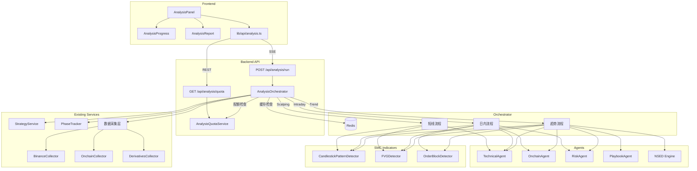
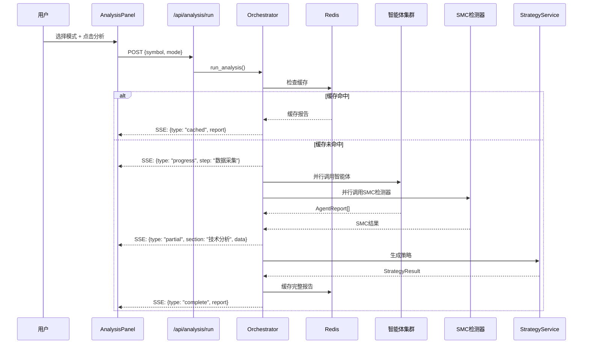

# 设计文档：一键综合分析面板

## 概述

本设计将现有的 AI 聊天侧边栏替换为结构化的"一键综合分析"面板。用户选择交易对和分析模式（实时短线/日内博弈/趋势布局）后，系统根据模式编排不同的智能体和 SMC 指标检测器，通过 SSE 实时推送分析进度，最终生成分层结构化报告。

核心设计决策：
- **编排器模式**：新增 `AnalysisOrchestrator` 服务统一协调各模式的执行流程，而非在路由层编排
- **复用现有基础设施**：复用 `BaseAgent`/`AgentReport`、`NSED Engine`、`StrategyService`、`PhaseTracker`、Redis 缓存工具
- **配额服务独立**：基于现有 `ChatQuotaService` 模式，新建 `AnalysisQuotaService`，按模式维度独立计数
- **SMC 指标模块化**：K线形态、FVG、OrderBlock 三个检测器作为纯计算模块放入 `backend/app/data/smc_indicators.py`，与 `IndicatorCalculator` 同层

## 架构

### 系统组件图



### 各模式执行流程



## 组件与接口

### 后端新增文件

| 文件路径 | 职责 |
|---------|------|
| `backend/app/services/analysis_orchestrator.py` | 分析编排服务，根据模式协调执行流程 |
| `backend/app/services/analysis_quota.py` | 分析配额服务，按模式独立计数 |
| `backend/app/api/analysis.py` | 分析 API 路由（run + quota） |
| `backend/app/data/smc_indicators.py` | SMC 指标检测器（K线形态、FVG、OrderBlock） |

### 后端需修改文件

| 文件路径 | 修改内容 |
|---------|---------|
| `backend/app/models/market_data.py` | 新增 `klines_5m` 和 `klines_30m` 字段到 `MarketData` |
| `backend/main.py` | 注册 `/api/analysis` 路由 |

### 前端新增文件

| 文件路径 | 职责 |
|---------|------|
| `frontend/components/analysis/AnalysisPanel.tsx` | 分析面板主组件（替代 ChatSidebar） |
| `frontend/components/analysis/AnalysisProgress.tsx` | 步骤进度指示器 |
| `frontend/components/analysis/AnalysisReport.tsx` | 结构化报告展示 |
| `frontend/lib/api/analysis.ts` | 分析 API 客户端 |

### 前端需修改文件

| 文件路径 | 修改内容 |
|---------|---------|
| `frontend/components/layout/TopNav.tsx` | 将 ChatSidebar 替换为 AnalysisPanel |

### 关键接口定义

#### AnalysisOrchestrator

```python
class AnalysisOrchestrator:
    """分析编排服务 — 根据模式协调智能体和SMC检测器执行。"""

    async def run_analysis(
        self,
        user_id: UUID,
        symbol: str,
        mode: AnalysisMode,
        force_refresh: bool = False,
    ) -> AsyncGenerator[str, None]:
        """执行分析流程，yield SSE 事件字符串。"""
        ...

    async def _run_scalping(self, symbol: str, market_data: MarketData) -> AnalysisReport:
        """实时短线模式流程。"""
        ...

    async def _run_intraday(self, symbol: str, market_data: MarketData) -> AnalysisReport:
        """日内博弈模式流程。"""
        ...

    async def _run_trend(self, symbol: str, market_data: MarketData) -> AnalysisReport:
        """趋势布局模式流程。"""
        ...
```

#### AnalysisQuotaService

```python
class AnalysisQuotaService:
    """分析配额服务 — 按模式独立计数，复用 ChatQuotaService 的 Redis 计数器模式。"""

    async def check_and_increment(
        self, user_id: UUID, level: int, mode: AnalysisMode
    ) -> tuple[bool, int]:
        """检查并递增计数。返回 (是否允许, 剩余次数)。"""
        ...

    async def get_remaining(
        self, user_id: UUID, level: int, mode: AnalysisMode
    ) -> int:
        """查询当日剩余次数。"""
        ...

    async def get_all_quotas(
        self, user_id: UUID, level: int
    ) -> dict[str, QuotaInfo]:
        """查询所有模式的配额信息。"""
        ...
```

#### SMC 检测器接口

```python
class CandlestickPatternDetector:
    @staticmethod
    def detect(klines: list[KlineData]) -> list[CandlestickPattern]:
        """从K线数据检测经典形态，纯计算无IO。"""
        ...

class FVGDetector:
    @staticmethod
    def detect(
        klines: list[KlineData],
        current_price: float,
        filter_mode: int = 1,
        atr_values: list[float] | None = None,
    ) -> list[FVGResult]:
        """检测公允价值缺口，支持ATR过滤。"""
        ...

class OrderBlockDetector:
    @staticmethod
    def detect(
        klines: list[KlineData],
        current_price: float,
        phase: MarketPhase | None = None,
    ) -> list[OrderBlockResult]:
        """检测机构订单块，支持阶段感知。"""
        ...
```


## 数据模型

### 枚举与基础类型

```python
# backend/app/models/analysis.py

from enum import Enum
from datetime import datetime
from typing import Literal, Optional
from uuid import UUID
from pydantic import BaseModel, Field


class AnalysisMode(str, Enum):
    """分析模式枚举。"""
    SCALPING = "scalping"      # 实时短线
    INTRADAY = "intraday"      # 日内博弈
    TREND = "trend"            # 趋势布局


# 模式对应的会员等级要求
MODE_LEVEL_REQUIREMENTS: dict[AnalysisMode, int] = {
    AnalysisMode.SCALPING: 0,   # 免费可用
    AnalysisMode.INTRADAY: 1,   # 专业及以上
    AnalysisMode.TREND: 2,      # 旗舰专属
}

# 模式对应的缓存 TTL（秒）
MODE_CACHE_TTL: dict[AnalysisMode, int] = {
    AnalysisMode.SCALPING: 300,    # 5 分钟
    AnalysisMode.INTRADAY: 900,    # 15 分钟
    AnalysisMode.TREND: 1800,      # 30 分钟
}

# 模式对应的总超时（秒）
MODE_TOTAL_TIMEOUT: dict[AnalysisMode, int] = {
    AnalysisMode.SCALPING: 90,
    AnalysisMode.INTRADAY: 180,
    AnalysisMode.TREND: 300,
}

# 模式对应的K线周期
MODE_KLINE_INTERVALS: dict[AnalysisMode, list[str]] = {
    AnalysisMode.SCALPING: ["5m", "15m", "30m"],
    AnalysisMode.INTRADAY: ["15m", "1h", "4h"],
    AnalysisMode.TREND: ["4h", "1d"],
}
```

### 请求/响应模型

```python
class AnalysisRequest(BaseModel):
    """分析请求。"""
    symbol: str
    mode: AnalysisMode
    force_refresh: bool = False  # 忽略缓存，重新分析


class QuotaInfo(BaseModel):
    """单个模式的配额信息。"""
    mode: AnalysisMode
    remaining: int
    limit: int
    locked: bool  # 会员等级不足时为 True


class AnalysisQuotaResponse(BaseModel):
    """配额查询响应。"""
    quotas: dict[str, QuotaInfo]  # key = mode.value
    level: int
```

### SMC 指标结果模型

```python
class CandlestickPattern(BaseModel):
    """K线形态识别结果。"""
    pattern_name: str          # 如 "bullish_engulfing", "pin_bar_hammer"
    display_name: str          # 中文名，如 "看涨吞没", "锤子线"
    direction: Literal["bullish", "bearish"]
    strength: float = Field(ge=0.0, le=1.0)
    candle_index: int          # 触发K线在输入列表中的索引


class FVGResult(BaseModel):
    """FVG 检测结果。"""
    direction: Literal["bullish", "bearish"]
    gap_high: float            # FVG 区域上沿
    gap_low: float             # FVG 区域下沿
    gap_size: float            # 缺口大小（绝对值）
    candle_index: int          # 第2根K线（中间K线）的索引
    interval: str              # 所在周期
    mitigated: bool = False    # 是否已回补
    mitigation_type: Optional[Literal["partial", "full"]] = None
    mitigation_time: Optional[datetime] = None
    distance_pct: float        # 距当前价格的距离百分比
    filter_mode: int = 1       # 使用的过滤模式
    atr_fallback: bool = False # 是否因ATR数据不足回退到Mode 0


class OrderBlockResult(BaseModel):
    """订单块检测结果。"""
    ob_type: Literal["demand", "supply"]
    trigger: Literal["main_choch", "sub_choch", "bos"]
    ob_high: float             # OB 区域上沿
    ob_low: float              # OB 区域下沿
    candle_index: int          # OB 所在K线索引
    interval: str              # 所在周期
    distance_pct: float        # 距当前价格的距离百分比
    phase_context: Optional[str] = None  # 当前操盘阶段
    phase_confidence: float = 0.0        # 阶段感知置信度
    whale_confirmed: bool = False        # 是否经巨鲸交叉验证确认
```

### 分析报告模型

```python
class ReportSection(BaseModel):
    """报告分段。"""
    title: str
    status: Literal["completed", "failed", "timeout", "missing"] = "completed"
    data: dict  # 各分段的具体数据，结构因分段类型而异
    note: Optional[str] = None  # 降级/超时/缺失时的说明


class AnalysisReport(BaseModel):
    """完整分析报告。"""
    symbol: str
    mode: AnalysisMode
    timestamp: datetime
    signal: Literal["bullish", "bearish", "neutral"]
    confidence: float = Field(ge=0.0, le=1.0)
    sections: list[ReportSection]
    strategy: Optional[dict] = None  # StrategyResult 序列化
    is_partial: bool = False         # 是否为部分完成的报告
    cached: bool = False             # 是否来自缓存
    cached_at: Optional[datetime] = None
    execution_time_ms: int = 0       # 总执行耗时
```

### SSE 事件模型

```python
class SSEEvent(BaseModel):
    """SSE 事件基类。"""
    type: Literal["progress", "partial", "complete", "cached", "error"]


class ProgressEvent(SSEEvent):
    """进度事件。"""
    type: Literal["progress"] = "progress"
    step: str           # 步骤名称
    status: Literal["running", "completed", "failed", "timeout"]
    message: str        # 中文描述


class PartialEvent(SSEEvent):
    """部分结果事件 — 某个分段完成时推送。"""
    type: Literal["partial"] = "partial"
    section: ReportSection


class CompleteEvent(SSEEvent):
    """完成事件 — 包含完整报告。"""
    type: Literal["complete"] = "complete"
    report: AnalysisReport


class CachedEvent(SSEEvent):
    """缓存命中事件。"""
    type: Literal["cached"] = "cached"
    report: AnalysisReport


class ErrorEvent(SSEEvent):
    """错误事件。"""
    type: Literal["error"] = "error"
    code: str           # 错误码：quota_exceeded, permission_denied, timeout, internal
    message: str
    reset_time: Optional[str] = None  # 配额重置时间（仅 quota_exceeded）
```

### MarketData 扩展

需要在现有 `MarketData` 模型中新增 `klines_5m` 和 `klines_30m` 字段以支持 Scalping 模式：

```python
# 修改 backend/app/models/market_data.py
class MarketData(BaseModel):
    symbol: str
    current_price: float
    klines_5m: list[KlineData] = []   # 新增
    klines_15m: list[KlineData] = []
    klines_30m: list[KlineData] = []  # 新增
    klines_1h: list[KlineData] = []
    klines_4h: list[KlineData] = []
    klines_1d: list[KlineData] = []
    indicators: Optional[IndicatorResult] = None
    onchain: Optional[OnchainSnapshot] = None
    derivatives: Optional[DerivativesData] = None
```

### 配额 Redis Key 模式

```
analysis_quota:{user_id}:{mode}:{date}
```

每个模式独立计数，TTL 到次日 UTC 00:00。默认限额配置：

| 模式 | 免费(0) | 专业(1) | 旗舰(2) |
|------|---------|---------|---------|
| scalping | 5 | 50 | 200 |
| intraday | 0（锁定） | 20 | 100 |
| trend | 0（锁定） | 0（锁定） | 50 |

### 缓存 Redis Key 模式

```
analysis:cache:{symbol}:{mode}
```

值为 `AnalysisReport` 的 JSON 序列化，TTL 按模式设定（5min/15min/30min）。

### 分析日志 Redis Key 模式

```
analysis:log:{user_id}:{date}
```

使用 Redis List 记录每次分析的元数据（用户ID、交易对、模式、各智能体耗时、总耗时、是否缓存），TTL 7天。


## 正确性属性

*正确性属性是系统在所有有效执行中都应保持为真的特征或行为——本质上是关于系统应该做什么的形式化陈述。属性是人类可读规范与机器可验证正确性保证之间的桥梁。*

### Property 1: 模式权限映射正确性

*For any* 用户等级 level（0/1/2）和分析模式 mode（scalping/intraday/trend），权限检查函数应返回 `level >= MODE_LEVEL_REQUIREMENTS[mode]` 的结果。即：level=0 仅可访问 scalping；level=1 可访问 scalping 和 intraday；level=2 可访问全部三种模式。

**Validates: Requirements 1.2, 1.3, 1.4, 9.4**

### Property 2: 配额计数器独立性与限额执行

*For any* 用户 ID、会员等级和分析模式，对某一模式执行 `check_and_increment` N 次（N = 该等级该模式的限额），前 N 次应全部返回 `(True, remaining)`，第 N+1 次应返回 `(False, 0)`。且对一个模式的递增操作不应影响其他模式的计数器值。

**Validates: Requirements 2.1, 2.2, 2.3, 2.4, 2.5**

### Property 3: 报告分段完整性

*For any* 分析模式和成功完成的分析执行，生成的 `AnalysisReport` 应包含该模式要求的全部分段。Scalping 模式应包含：技术指标摘要、K线形态信号、FVG 区域、策略建议；Intraday 模式应包含：技术分析、链上数据、合约数据、风险评估、策略建议；Trend 模式应包含：技术分析、链上深度解读、剧本推演、共识报告、操盘阶段、策略建议。

**Validates: Requirements 3.5, 4.3, 5.4**

### Property 4: 智能体故障降级

*For any* 分析执行中单个智能体调用失败（超时或异常），生成的报告应仍然包含其余成功完成的分段，失败的分段 status 应为 `"failed"` 或 `"timeout"`，且报告整体 signal 应降级为 `"neutral"`（当关键智能体失败时）。

**Validates: Requirements 3.6, 4.4, 10.2**

### Property 5: NSED 引擎回退

*For any* 趋势模式分析中 NSED 引擎调用失败的情况，系统应回退到使用四个智能体的加权平均结果生成报告，报告中应标注"共识引擎不可用"，且生成的报告仍然是有效的 `AnalysisReport`。

**Validates: Requirements 5.5**

### Property 6: SSE 事件流完整性

*For any* 分析执行（无论成功或部分失败），SSE 事件流应满足：以至少一个 `progress` 事件开始，每个已完成的步骤对应一个 `partial` 事件，最终以一个 `complete` 事件（或 `error` 事件）结束。每个 `progress` 事件必须包含 `step` 和 `status` 字段。

**Validates: Requirements 6.1, 6.2, 6.3, 6.4**

### Property 7: 缓存写入与命中

*For any* 成功完成的分析，结果应被缓存到 Redis，且在 TTL 有效期内对相同 symbol+mode 的后续请求应返回缓存结果（`cached=True`）。缓存 TTL 应与模式匹配：scalping=300s, intraday=900s, trend=1800s。

**Validates: Requirements 7.1, 7.2, 7.3**

### Property 8: 缓存与配额交互

*For any* 分析请求，当缓存命中时（`force_refresh=False`），用户配额计数器不应递增；当执行全新分析时（缓存未命中或 `force_refresh=True`），配额计数器应递增 1。

**Validates: Requirements 7.4, 7.5**

### Property 9: API 输入校验

*For any* 分析请求，缺少 `symbol` 或 `mode` 字段应返回 HTTP 422；用户等级不满足模式要求应返回 HTTP 403；配额耗尽应返回 HTTP 429。这三种错误条件互斥且优先级为：422 > 403 > 429。

**Validates: Requirements 9.3, 9.4, 9.5**

### Property 10: K线形态检测结构完整性

*For any* 包含已知K线形态的K线数据序列，`CandlestickPatternDetector.detect()` 应返回非空结果列表，每个结果包含有效的 `pattern_name`、`direction`（bullish/bearish）、`strength`（0-1）和 `candle_index`（在输入范围内）。对于少于 3 根K线的输入，应返回空列表。

**Validates: Requirements 11.1, 11.2, 11.3**

### Property 11: FVG 检测正确性

*For any* 三根连续K线序列，若第1根高点 < 第3根低点，则应检测到看涨 FVG；若第1根低点 > 第3根高点，则应检测到看跌 FVG。检测结果的 `gap_high` 和 `gap_low` 应正确反映缺口区间。

**Validates: Requirements 12.1**

### Property 12: FVG ATR 过滤单调性

*For any* 相同的K线数据，使用更严格的 ATR 过滤模式（Mode 0 → 1 → 2 → 3）检测到的 FVG 数量应单调递减或相等。即 `len(detect(mode=0)) >= len(detect(mode=1)) >= len(detect(mode=2)) >= len(detect(mode=3))`。当K线不足 14 根时，应回退到 Mode 0 并设置 `atr_fallback=True`。

**Validates: Requirements 12.2, 12.7**

### Property 13: FVG 回补追踪

*For any* 已检测到的 FVG，若当前价格已进入 FVG 区间（`gap_low <= current_price <= gap_high`），则该 FVG 的 `mitigated` 字段应为 `True`。

**Validates: Requirements 12.4**

### Property 14: 订单块检测与阶段感知

*For any* 检测到的订单块，当提供 `phase` 参数时，`phase_confidence` 应根据阶段上下文调整（如吸筹阶段的需求 OB 置信度应高于派发阶段）。当不提供 `phase` 参数时，`phase_confidence` 应为默认值 0.0。

**Validates: Requirements 13.4**

### Property 15: 订单块模式限制

*For any* Scalping 模式的分析执行，`OrderBlockDetector` 不应被调用，报告中不应包含订单块相关分段。仅 Intraday 和 Trend 模式应包含订单块数据。

**Validates: Requirements 13.5**

### Property 16: OB-巨鲸交叉验证

*For any* Trend 模式下检测到的订单块，当链上巨鲸活动数据显示在 OB 价格区间附近有大额交易时，该 OB 的 `whale_confirmed` 应为 `True`。

**Validates: Requirements 5.2, 13.6**

### Property 17: 总超时部分报告

*For any* 分析执行超过总超时限制时，系统应返回已完成部分的报告，`is_partial=True`，且已完成的分段数据应完整有效。

**Validates: Requirements 10.4**

### Property 18: 共识报告模型详情

*For any* Trend 模式成功完成的分析报告（含共识数据），共识报告分段应包含每个参与模型的信号方向、置信度和核心论据。

**Validates: Requirements 5.6**

## 错误处理

### 超时层级

```
┌─────────────────────────────────────────────────┐
│ 总超时: Scalping=90s / Intraday=180s / Trend=300s │
│  ┌──────────────────────────────────────────┐    │
│  │ 单智能体超时: 60s (asyncio.wait_for)      │    │
│  └──────────────────────────────────────────┘    │
│  ┌──────────────────────────────────────────┐    │
│  │ NSED 单轮超时: 90s (仅 Trend 模式)        │    │
│  └──────────────────────────────────────────┘    │
│  ┌──────────────────────────────────────────┐    │
│  │ 数据采集超时: 30s (复用 llm_client 默认)   │    │
│  └──────────────────────────────────────────┘    │
└─────────────────────────────────────────────────┘
```

### 降级策略

| 故障场景 | 降级行为 | 报告标注 |
|---------|---------|---------|
| 单智能体超时/异常 | 跳过该智能体，继续其余 | section.status = "timeout"/"failed" |
| NSED 引擎失败 | 回退到智能体加权平均 | "共识引擎不可用，使用智能体加权结果" |
| 数据采集失败 | 使用 Redis 缓存的最近有效数据 | "使用缓存数据（N分钟前）" |
| 全部智能体失败 | 返回 neutral 信号的降级报告 | "数据不完整，仅供参考" |
| 总超时 | 返回已完成部分 | is_partial=True, "分析未完全完成" |
| SSE 连接中断 | 前端显示重试按钮 | "连接中断，请重试" |

### 错误码映射

```python
# API 层错误码
HTTP_422 → 请求参数校验失败（缺少 symbol/mode）
HTTP_403 → 会员等级不足（mode 需要更高等级）
HTTP_429 → 配额耗尽（附带 reset_time）
HTTP_500 → 内部错误（编排器异常）
```

### 智能体故障隔离实现

```python
async def _safe_call_agent(
    self, agent: BaseAgent, data: MarketData, timeout: float = 60.0
) -> AgentReport | None:
    """安全调用智能体，超时或异常返回 None。"""
    try:
        return await asyncio.wait_for(agent.analyze(data), timeout=timeout)
    except asyncio.TimeoutError:
        logger.warning("Agent timeout", extra={"agent": agent.__class__.__name__})
        return None
    except Exception as exc:
        logger.error("Agent failed", extra={"agent": agent.__class__.__name__, "error": str(exc)})
        return None
```

## 测试策略

### 双轨测试方法

本功能采用单元测试 + 属性测试的双轨方法：

- **单元测试**：验证具体示例、边界条件、集成点
- **属性测试**：验证跨所有输入的通用属性

### 属性测试配置

- 库：`hypothesis`（Python）
- 每个属性测试最少运行 100 次迭代
- 每个测试用注释标注对应的设计属性
- 标注格式：`# Feature: integrated-analysis, Property {N}: {property_text}`

### 测试分层

#### 1. SMC 指标检测器（纯计算，最适合属性测试）

**属性测试**（`backend/tests/test_smc_indicators.py`）：
- Property 10: K线形态检测结构完整性 — 生成随机K线数据，验证输出结构
- Property 11: FVG 检测正确性 — 生成含已知 FVG 的K线序列，验证检测结果
- Property 12: FVG ATR 过滤单调性 — 同一数据不同过滤模式，验证数量单调递减
- Property 13: FVG 回补追踪 — 生成 FVG + 当前价格在区间内，验证 mitigated=True
- Property 14: 订单块阶段感知 — 生成 OB + 不同阶段，验证置信度调整
- Property 16: OB-巨鲸交叉验证 — 生成 OB + 巨鲸数据，验证 whale_confirmed

**单元测试**（`backend/tests/test_smc_unit.py`）：
- 边界：少于 3 根K线 → 空结果（需求 11.6）
- 边界：ATR 数据不足 → 回退 Mode 0（需求 12.7）
- 边界：市场结构不足 → 空 OB 结果（需求 13.8）
- 示例：已知吞没形态的K线 → 正确识别
- 示例：已知 FVG 的三根K线 → 正确检测

#### 2. 配额服务（Redis 交互，属性测试 + mock）

**属性测试**（`backend/tests/test_analysis_quota.py`）：
- Property 2: 配额计数器独立性与限额执行 — mock Redis，验证计数器行为
- Property 8: 缓存与配额交互 — 验证缓存命中不扣配额

**单元测试**：
- 示例：免费用户第 6 次请求被拒绝
- 示例：不同模式计数器互不影响

#### 3. 编排器（集成测试，mock 智能体和外部服务）

**属性测试**（`backend/tests/test_analysis_orchestrator.py`）：
- Property 1: 模式权限映射 — 生成随机 level+mode 组合，验证权限判断
- Property 3: 报告分段完整性 — mock 智能体返回，验证各模式报告结构
- Property 4: 智能体故障降级 — 随机让某些智能体失败，验证报告仍有效
- Property 5: NSED 回退 — mock NSED 失败，验证回退行为
- Property 15: 订单块模式限制 — 验证 scalping 模式不调用 OB 检测器

**单元测试**：
- Property 9: API 输入校验 — 测试 422/403/429 错误码
- Property 6: SSE 事件流完整性 — 验证事件序列
- Property 7: 缓存写入与命中 — 验证缓存行为
- Property 17: 总超时部分报告 — mock 超时场景

#### 4. 前端组件（单元测试为主）

**单元测试**（`frontend/__tests__/analysis/`）：
- AnalysisPanel 渲染：模式选择器、配额显示、锁定状态
- AnalysisProgress：步骤状态变化
- AnalysisReport：分段折叠/展开、颜色编码
- SSE 流解析：正常流、中断处理

