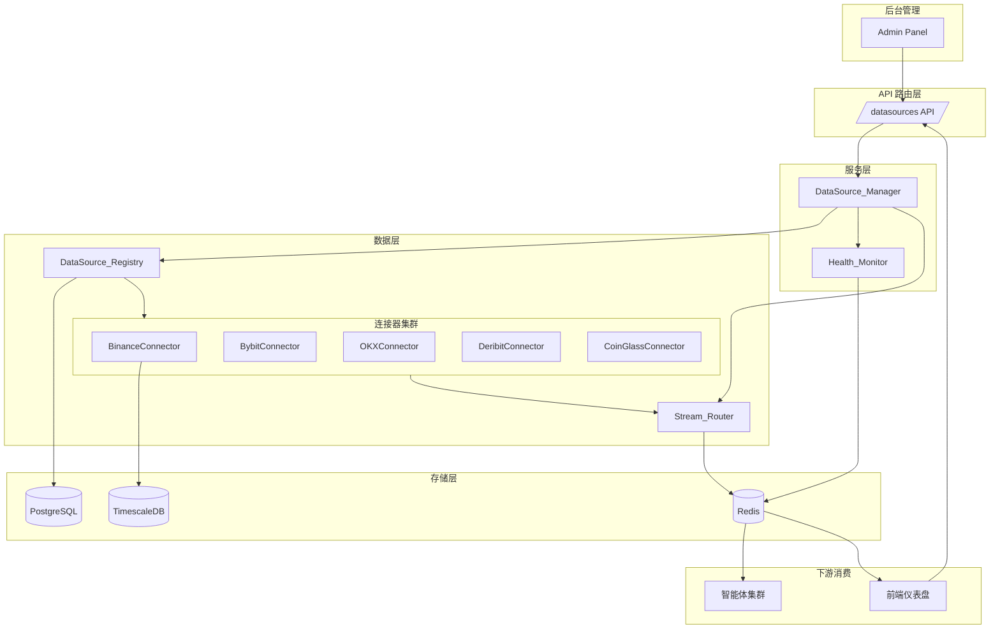
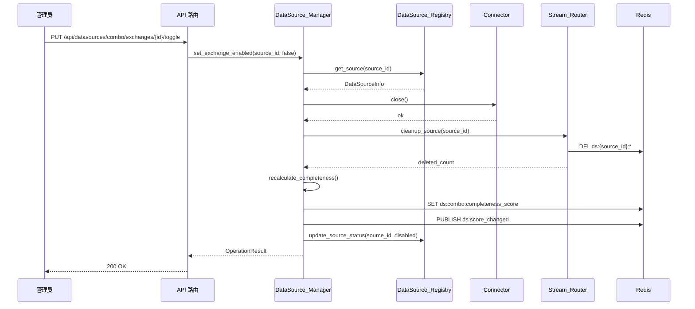
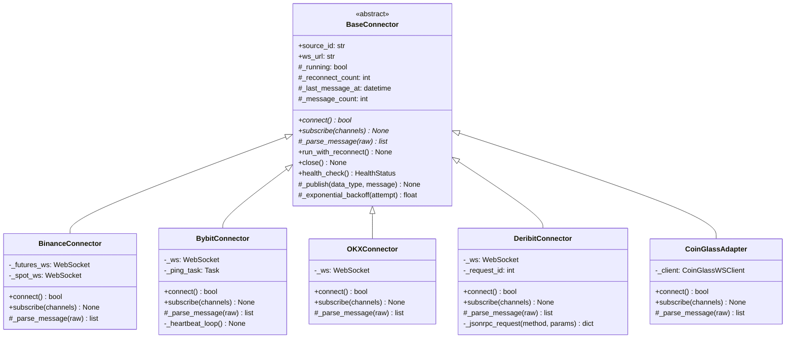
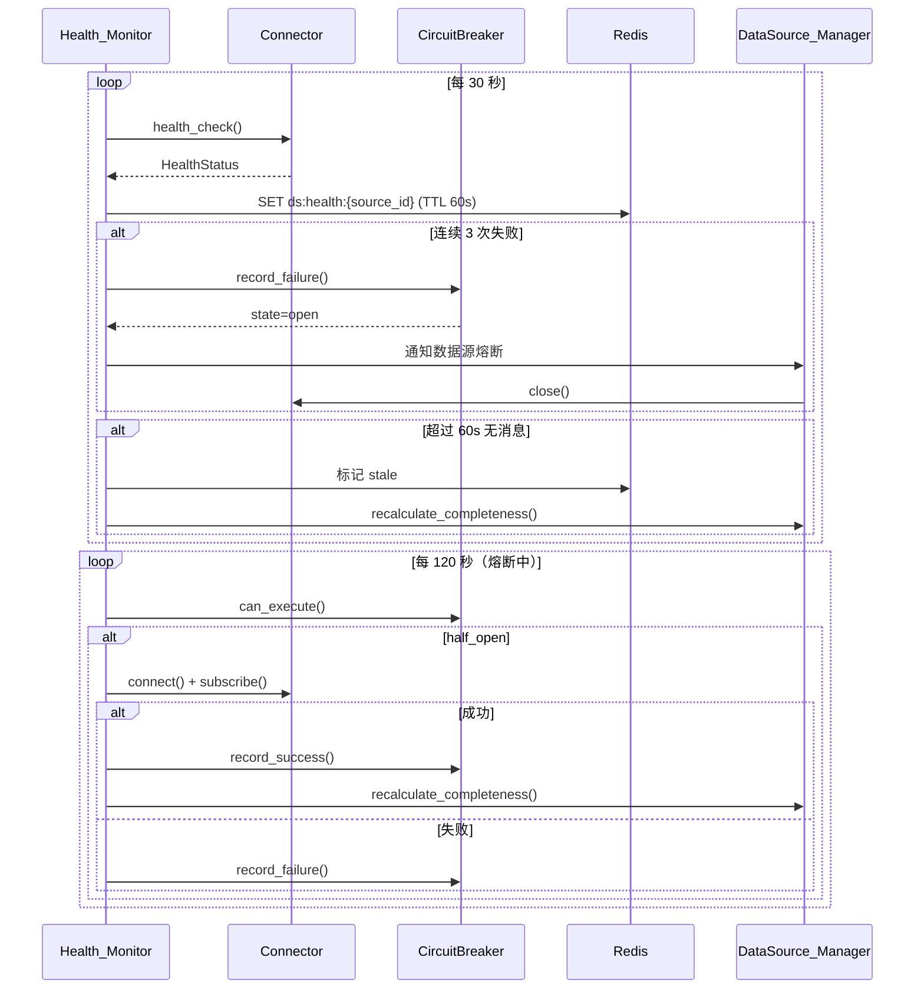

# 设计文档：多数据源管理框架

## 文档状态

- **当前定位**：本文件保留为运行时数据源管理设计与历史组合抽象说明。
- **不再承担**：当前产品级主数据源总纲。
- **当前主真相源**：请以 `four-primary-datasources` spec 为准。
- **仍然有效的部分**：开关、健康监控、缓存清理、状态快照等运行时设计。

## 概述

本文件描述的是历史形成的多数据源运行时管理设计，重点关注 CoinGlass_Source 与 Exchange_Direct_Combo 的开关、健康和状态管理。该设计仍可作为运行时管理层参考，但不再代表当前产品级主数据源架构；当前主数据源收敛方案请参见 `four-primary-datasources`。

核心设计目标：
- **统一管理**：通过 DataSource_Registry 集中注册和管理所有数据源的元信息与状态
- **双层开关**：组合级 + 交易所级两层开关，灵活控制数据采集范围
- **数据隔离**：每个数据源独立 Redis Stream，互不干扰
- **信号完整度**：加权评分机制量化数据覆盖程度，驱动下游智能体置信度降级
- **健康监控**：30 秒心跳检测 + 熔断保护，复用已有 CircuitBreaker
- **向后兼容**：无缝纳入现有 CoinGlassWSClient 和 BinanceWebSocket

### 与现有系统的关系

| 现有模块 | 集成方式 |
|---------|---------|
| `CoinGlassWSClient` (coinglass_ws.py) | 包装为 CoinGlass_Source 数据源组，保留 TierManager 逻辑 |
| `BinanceWebSocket` (binance.py) | 包装为 Exchange_Direct_Combo 的 Binance 子数据源，保留 TimescaleDB 写入 |
| `ConfigService` (config_service.py) | 复用其 Redis 缓存 + DB 持久化机制存储数据源开关状态 |
| `CircuitBreaker` (circuit_breaker.py) | 复用其 Redis-backed 熔断器，为每个数据源创建独立实例 |
| `publish_stream` (redis.py) | 复用其 Redis Stream 发布能力，扩展命名规范 |

## 架构

### 整体架构图



### 分层职责

```
API 路由层 (app/api/datasources.py)
  → 参数校验、响应格式化、权限控制
  → 公开端点（状态查询）+ 管理员端点（开关操作）

Service 层 (app/services/datasource_manager.py)
  → 双层开关业务逻辑
  → 信号完整度评分计算
  → 健康监控协调
  → 缓存清理编排

Data 层 (app/data/connectors/)
  → WebSocket 连接管理
  → 原始数据解析为标准模型
  → 发布到 Redis Stream
```

## 组件与接口

### 1. DataSource_Registry（数据源注册中心）

位置：`backend/app/data/datasource_registry.py`

职责：管理所有数据源组和子数据源的元信息、状态和配置。系统启动时从 ConfigService 加载配置。

```python
class DataSourceRegistry:
    """数据源注册中心 — 管理所有数据源组和子数据源的元信息。"""

    async def load_from_config(self) -> None:
        """系统启动时从 ConfigService 加载所有数据源配置。"""

    async def get_all_groups(self) -> list[DataSourceGroup]:
        """返回所有数据源组的元信息和实时状态。"""

    async def get_group(self, group_id: str) -> DataSourceGroup | None:
        """返回指定数据源组的详情。"""

    async def get_source(self, source_id: str) -> DataSourceInfo | None:
        """返回指定子数据源的元信息。"""

    async def update_source_status(
        self, source_id: str, status: DataSourceStatus
    ) -> None:
        """更新子数据源状态并同步到 Redis 缓存。"""
```

### 2. DataSource_Manager（数据源管理服务）

位置：`backend/app/services/datasource_manager.py`

职责：协调所有连接器的生命周期，实现双层开关逻辑和信号完整度评分。

```python
class DataSourceManager:
    """数据源管理服务 — 双层开关、信号完整度、生命周期管理。"""

    async def initialize(self) -> None:
        """初始化：加载配置，启动已启用的数据源。"""

    async def set_combo_enabled(self, enabled: bool) -> OperationResult:
        """组合级开关：启用/关闭整个 Exchange_Direct_Combo。"""

    async def set_exchange_enabled(
        self, source_id: str, enabled: bool
    ) -> OperationResult:
        """交易所级开关：启用/关闭单个交易所。"""

    async def set_coinglass_enabled(self, enabled: bool) -> OperationResult:
        """CoinGlass 独立开关控制。"""

    async def get_completeness_score(self) -> float:
        """获取当前信号完整度评分。"""

    async def recalculate_completeness(self) -> float:
        """重新计算信号完整度评分并更新 Redis 缓存。"""

    async def get_status_snapshot(self) -> DataSourceStatusSnapshot:
        """获取所有数据源的状态快照（供前端 API 使用）。"""

    async def cleanup_redis_cache(self, source_id: str) -> int:
        """清理指定数据源的 Redis 缓存，返回删除的 key 数量。"""
```

### 3. BaseConnector（连接器基类）

位置：`backend/app/data/connectors/base.py`

职责：定义所有 WebSocket 连接器的公共接口和重连逻辑。

```python
class BaseConnector(ABC):
    """WebSocket 连接器基类 — 统一重连、心跳、数据发布。"""

    source_id: str
    ws_url: str
    _running: bool
    _reconnect_count: int

    @abstractmethod
    async def connect(self) -> bool:
        """建立 WebSocket 连接。"""

    @abstractmethod
    async def subscribe(self, channels: list[str]) -> None:
        """订阅指定频道。"""

    @abstractmethod
    async def _parse_message(self, raw: dict) -> list[StandardMessage]:
        """将交易所原始消息解析为标准模型列表。"""

    async def run_with_reconnect(self) -> None:
        """带指数退避重连的主循环（5s 初始，60s 上限，10 次最大）。"""

    async def close(self) -> None:
        """关闭连接。"""

    async def _publish(self, data_type: str, message: StandardMessage) -> None:
        """通过 Stream_Router 发布标准化消息到 Redis Stream。"""

    async def health_check(self) -> HealthStatus:
        """返回当前连接健康状态。"""
```

### 4. 交易所连接器实现

| 连接器 | 位置 | WebSocket 端点 | 协议特点 |
|--------|------|---------------|---------|
| BinanceConnector | `connectors/binance.py` | `wss://fstream.binance.com/ws` + `wss://stream.binance.com:9443/ws` | Combined Stream，单连接多频道 |
| BybitConnector | `connectors/bybit.py` | `wss://stream.bybit.com/v5/public/linear` | V5 API，20s 心跳 ping |
| OKXConnector | `connectors/okx.py` | `wss://ws.okx.com:8443/ws/v5/public` | JSON subscribe 操作 |
| DeribitConnector | `connectors/deribit.py` | `wss://www.deribit.com/ws/api/v2` | JSON-RPC 2.0 |
| CoinGlassAdapter | `connectors/coinglass_adapter.py` | 包装现有 CoinGlassWSClient | 保留 TierManager |

### 5. Stream_Router（数据流路由器）

位置：`backend/app/data/stream_router.py`

职责：将标准化消息按来源标记后发布到对应的 Redis Stream。

```python
class StreamRouter:
    """数据流路由器 — 按数据源和数据类型路由到独立 Redis Stream。"""

    async def publish(
        self, source_id: str, data_type: str, message: dict
    ) -> str:
        """发布消息到 ds:{source_id}:{data_type}，附加 source_id 和 received_at。"""

    async def cleanup_source(self, source_id: str) -> int:
        """清理指定数据源的所有 Redis Stream key（模式匹配 ds:{source_id}:*）。"""
```

### 6. Health_Monitor（健康监控模块）

位置：`backend/app/services/health_monitor.py`

职责：定期检查各数据源连接状态，触发熔断保护。

```python
class HealthMonitor:
    """健康监控 — 30s 心跳检测 + 熔断触发。"""

    async def start(self) -> None:
        """启动定期健康检查循环。"""

    async def check_all(self) -> dict[str, HealthStatus]:
        """检查所有数据源健康状态。"""

    async def get_health_summary(self) -> HealthSummary:
        """返回所有数据源的实时健康指标汇总。"""
```

### 组件交互：开关操作流程




## 数据模型

### 1. 数据源配置模型（Pydantic）

```python
from enum import Enum
from pydantic import BaseModel, Field
from datetime import datetime


class DataSourceStatus(str, Enum):
    """数据源状态枚举。"""
    ENABLED = "enabled"
    DISABLED = "disabled"
    ERROR = "error"
    STALE = "stale"


class DataSourceType(str, Enum):
    """数据源类型。"""
    WEBSOCKET = "websocket"
    REST = "rest"


class GroupType(str, Enum):
    """数据源组类型。"""
    PAID = "paid"
    FREE = "free"


class DataSourceInfo(BaseModel):
    """子数据源元信息。"""
    source_id: str = Field(description="唯一标识符，如 binance_futures")
    name: str = Field(description="显示名称，如 Binance Futures")
    source_type: DataSourceType
    base_url: str
    channels: list[str] = Field(default_factory=list, description="可订阅频道列表")
    auth_method: str = Field(default="none", description="认证方式: none/api_key/json_rpc")
    status: DataSourceStatus = DataSourceStatus.DISABLED
    weight: float = Field(default=0.0, description="信号完整度权重（仅 Combo 内交易所）")
    enabled: bool = Field(default=False, description="交易所级开关")


class DataSourceGroup(BaseModel):
    """数据源组。"""
    group_id: str = Field(description="组标识符: coinglass_source / exchange_direct_combo")
    name: str
    group_type: GroupType
    enabled: bool = Field(default=True, description="组合级开关")
    sources: list[DataSourceInfo] = Field(default_factory=list)


class OperationResult(BaseModel):
    """开关操作结果。"""
    success: bool
    message: str
    source_id: str | None = None
    completeness_score: float | None = None
    errors: list[str] = Field(default_factory=list)
```

### 2. 标准化数据模型（Pydantic）

所有交易所的原始数据统一解析为以下标准模型，下游智能体无差别消费。

```python
class StandardTrade(BaseModel):
    """标准化成交模型。"""
    source_id: str
    symbol: str
    price: float
    quantity: float
    side: str  # "buy" | "sell"
    timestamp: datetime
    trade_id: str | None = None
    received_at: datetime = Field(default_factory=datetime.utcnow)


class StandardLiquidation(BaseModel):
    """标准化强平模型。"""
    source_id: str
    symbol: str
    side: str  # "long" | "short"
    price: float
    quantity: float
    usd_value: float
    timestamp: datetime
    received_at: datetime = Field(default_factory=datetime.utcnow)


class StandardTicker(BaseModel):
    """标准化行情模型。"""
    source_id: str
    symbol: str
    last_price: float
    mark_price: float | None = None
    index_price: float | None = None
    volume_24h: float
    open_interest: float | None = None
    funding_rate: float | None = None
    timestamp: datetime
    received_at: datetime = Field(default_factory=datetime.utcnow)


class StandardOrderBook(BaseModel):
    """标准化订单簿模型。"""
    source_id: str
    symbol: str
    bids: list[tuple[float, float]]  # [(price, qty), ...]
    asks: list[tuple[float, float]]
    timestamp: datetime
    received_at: datetime = Field(default_factory=datetime.utcnow)


class StandardFundingRate(BaseModel):
    """标准化资金费率模型。"""
    source_id: str
    symbol: str
    funding_rate: float
    predicted_rate: float | None = None
    next_funding_time: datetime | None = None
    timestamp: datetime
    received_at: datetime = Field(default_factory=datetime.utcnow)


class StandardOptionTicker(BaseModel):
    """标准化期权行情模型（Deribit 专用扩展）。"""
    source_id: str
    symbol: str
    underlying: str
    strike: float
    option_type: str  # "call" | "put"
    expiry: datetime
    mark_price: float
    delta: float | None = None
    gamma: float | None = None
    vega: float | None = None
    theta: float | None = None
    open_interest: float | None = None
    volume_24h: float | None = None
    timestamp: datetime
    received_at: datetime = Field(default_factory=datetime.utcnow)
```

### 3. 健康监控模型

```python
class HealthStatus(BaseModel):
    """单个数据源的健康状态。"""
    source_id: str
    connected: bool
    status: DataSourceStatus
    last_message_at: datetime | None = None
    message_rate: float = 0.0  # 条/秒
    reconnect_count: int = 0
    error_count: int = 0
    circuit_breaker_state: str = "closed"  # closed/open/half_open
    checked_at: datetime = Field(default_factory=datetime.utcnow)


class HealthSummary(BaseModel):
    """所有数据源的健康汇总。"""
    sources: dict[str, HealthStatus]
    overall_healthy: bool
    completeness_score: float
    checked_at: datetime = Field(default_factory=datetime.utcnow)
```

### 4. API 响应模型

```python
class DataSourceStatusSnapshot(BaseModel):
    """前端状态查询 API 响应模型。"""
    combo_enabled: bool
    exchanges: list[ExchangeStatusItem]
    completeness_score: float
    coinglass_enabled: bool
    coinglass_tier: str


class ExchangeStatusItem(BaseModel):
    """单个交易所状态。"""
    source_id: str
    name: str
    enabled: bool
    status: DataSourceStatus
    weight: float


class DataSourceDetailResponse(BaseModel):
    """数据源详情响应（管理员）。"""
    source_id: str
    name: str
    source_type: DataSourceType
    base_url: str
    channels: list[str]
    subscribed_channels: list[str]
    auth_method: str
    status: DataSourceStatus
    health: HealthStatus | None = None
```

### 5. 数据源配置持久化

数据源开关状态通过已有的 `ConfigService` 持久化，使用以下 config_key 规范：

| config_key | 值类型 | 说明 |
|-----------|--------|------|
| `ds:combo:enabled` | `"true"/"false"` | Exchange_Direct_Combo 组合级开关 |
| `ds:exchange:binance_futures:enabled` | `"true"/"false"` | Binance 交易所级开关 |
| `ds:exchange:bybit_linear:enabled` | `"true"/"false"` | Bybit 交易所级开关 |
| `ds:exchange:okx_swap:enabled` | `"true"/"false"` | OKX 交易所级开关 |
| `ds:exchange:deribit:enabled` | `"true"/"false"` | Deribit 交易所级开关 |
| `ds:coinglass:enabled` | `"true"/"false"` | CoinGlass 独立开关 |

### Redis Key 命名规范

| Key 模式 | TTL | 说明 |
|---------|-----|------|
| `ds:{source_id}:{data_type}` | Stream maxlen=50000 | 数据流（Redis Stream） |
| `ds:combo:completeness_score` | 300s | 信号完整度评分缓存 |
| `ds:health:{source_id}` | 60s | 单个数据源健康状态 |
| `ds:status_snapshot` | 30s | 前端 API 状态快照缓存 |
| `cb:ds_{source_id}:state` | 1200s | 数据源熔断器状态（复用 CircuitBreaker） |
| `ds:cache_cleared:{source_id}` | Pub/Sub | 缓存清理事件通知 |
| `ds:score_changed` | Pub/Sub | 信号完整度变更事件 |


## 信号完整度评分算法

### 权重分配

| 交易所 | source_id | 权重 | 分析价值 |
|--------|-----------|------|---------|
| Binance | binance_futures | 30% | 最大交易量，散户情绪风向标 |
| Deribit | deribit | 30% | 期权市场独占，GEX/Max Pain 关键数据 |
| Bybit | bybit_linear | 20% | 第二大合约交易所，爆仓数据补充 |
| OKX | okx_swap | 20% | 主力吃单数据，资金费率交叉验证 |

### 计算公式

```
Signal_Completeness_Score = Σ(weight_i × is_enabled_i) × 100%

其中:
  weight_i = 交易所 i 的分析价值权重
  is_enabled_i = 1 (enabled 且 connected) 或 0 (disabled/error/stale)
```

### 计算触发时机

1. 交易所级开关变更时
2. 组合级开关变更时（关闭 → 0%，开启 → 重新计算）
3. 健康监控检测到状态变化时（connected → error/stale）

### 评分缓存与通知

```python
async def recalculate_completeness(self) -> float:
    """重新计算信号完整度评分。"""
    if not self._combo_enabled:
        score = 0.0
    else:
        score = sum(
            src.weight for src in self._exchange_sources
            if src.enabled and src.status == DataSourceStatus.ENABLED
        )

    # 缓存到 Redis（TTL 300s）
    await set_with_ttl("ds:combo:completeness_score", {"score": score}, ttl_seconds=300)

    # 通过 Pub/Sub 通知下游
    redis = get_redis_pool()
    await redis.publish("ds:score_changed", json.dumps({"score": score}))

    return score
```

### 下游智能体置信度降级

当 `data_completeness < 1.0` 时，智能体在分析输出中：

1. 附加 `data_completeness` 字段（值为 Signal_Completeness_Score / 100）
2. 降低置信度：`adjusted_confidence = original_confidence × data_completeness`
3. 注明缺失的交易所列表
4. 当 `data_completeness < 0.5` 时，附加 `⚠️ 数据严重不足` 警告标记

```python
# 智能体分析输出中的降级字段
class AnalysisContext(BaseModel):
    """传递给智能体的数据上下文。"""
    data_completeness: float = Field(default=1.0, ge=0.0, le=1.0)
    missing_sources: list[str] = Field(default_factory=list)
    completeness_warning: str | None = None
```

## WebSocket 连接器架构

### 基类设计



### 重连策略（统一）

- 初始等待：5 秒
- 退避公式：`min(5 × 2^(attempt-1), 60)` 秒
- 最大重试：10 次
- 重试耗尽后标记为 error，等待 Health_Monitor 探测恢复

### 各交易所协议差异

| 交易所 | 订阅方式 | 心跳 | 特殊处理 |
|--------|---------|------|---------|
| Binance | Combined Stream URL 拼接 | websockets 库内置 ping | 合约+现货双连接 |
| Bybit | JSON `{"op":"subscribe","args":[...]}` | 主动发送 `{"op":"ping"}` 每 20s | V5 API 格式 |
| OKX | JSON `{"op":"subscribe","args":[...]}` | websockets 库内置 ping | instId 格式 |
| Deribit | JSON-RPC 2.0 `{"method":"public/subscribe","params":{"channels":[...]}}` | `public/test` 心跳 | request_id 递增 |

### 与现有 BinanceWebSocket 共存

新的 `BinanceConnector` 与现有 `BinanceWebSocket`（K线采集器）通过 `source_id` 区分：

- 现有 K线采集器：`source_id = "binance_kline"`，写入 `kline_updates` Stream + TimescaleDB
- 新连接器：`source_id = "binance_futures"`，写入 `ds:binance_futures:{data_type}` Stream

两者独立运行，互不干扰。BinanceConnector 不重复采集 K线数据。

## API 端点设计

### 公开端点（无需管理员权限）

```
GET /api/datasources/status
```

响应：`DataSourceStatusSnapshot`，从 Redis 缓存读取，响应时间 < 100ms。

### 管理员端点

```
GET    /api/admin/datasources
  → 返回所有数据源组列表（含健康指标）

GET    /api/admin/datasources/{source_id}
  → 返回单个数据源详情（含频道列表、连接参数、健康指标）

PUT    /api/admin/datasources/combo/toggle
  Body: {"enabled": true/false}
  → 组合级开关

PUT    /api/admin/datasources/combo/exchanges/{source_id}/toggle
  Body: {"enabled": true/false}
  → 交易所级开关

PUT    /api/admin/datasources/coinglass/toggle
  Body: {"enabled": true/false}
  → CoinGlass 独立开关

GET    /api/admin/datasources/health
  → 返回所有数据源健康指标汇总

GET    /api/admin/datasources/{source_id}/metrics
  → 返回指定数据源最近 1 小时消息速率趋势
```

## 健康监控设计

### 检查流程



### 健康指标

每个数据源维护以下指标（缓存在 Redis，TTL 60s）：

| 指标 | 类型 | 说明 |
|------|------|------|
| connected | bool | 当前连接状态 |
| last_message_at | datetime | 最后收到消息的时间 |
| message_rate | float | 消息速率（条/秒，滑动窗口 60s） |
| reconnect_count | int | 累计重连次数 |
| error_count | int | 累计错误次数 |
| circuit_breaker_state | str | 熔断器状态 |

### 熔断参数

复用已有 `CircuitBreaker`，每个数据源创建独立实例：

```python
CircuitBreaker(
    name=f"ds_{source_id}",
    failure_threshold=3,      # 连续 3 次失败触发熔断
    recovery_timeout=120.0,   # 120 秒后尝试探测恢复
    success_threshold=1,      # 1 次成功即恢复
)
```

## 前端组件设计

### 1. 降级警告横幅（DataSourceBanner）

位置：`frontend/components/cards/DataSourceBanner.tsx`

- 轮询 `GET /api/datasources/status`（间隔 30s）
- `completeness_score == 100%`：隐藏
- `50% <= completeness_score < 100%`：黄色警告横幅，显示离线交易所列表
- `completeness_score < 50%`：红色危险横幅，提示数据严重不足

### 2. 后台数据源管理页面（AdminDataSources）

位置：`frontend/app/(main)/admin/datasources/page.tsx`

布局：
- CoinGlass_Source 卡片：独立开关 + 套餐等级显示
- Exchange_Direct_Combo 卡片：
  - 组合级总开关
  - 信号完整度评分进度条
  - 四个交易所子卡片，每个含独立开关 + 权重标识 + 状态颜色编码
- 状态颜色：绿色（connected）、灰色（disabled）、红色（error）、黄色（stale）
- 消息速率趋势图（最近 1 小时）

### 3. 后台管理参数对照说明

> 本节面向非技术背景管理员，解释每个配置项的含义、影响和操作建议。

#### 3.1 CoinGlass_Source（付费数据源）

| 参数 | 显示名称 | 说明 | 关掉会怎样 |
|------|---------|------|-----------|
| CoinGlass 开关 | 启用 CoinGlass 数据 | CoinGlass 是付费数据平台，提供全市场爆仓聚合、大额资金流向等独家数据。开启后系统将连接 CoinGlass 实时拉取数据。 | 关掉后，依赖 CoinGlass 的分析指标（如全市场爆仓热图、资金费率聚合）将停止更新，相关分析结果可能变为空或使用缓存旧数据 |
| 套餐等级（Tier） | 当前套餐 | 显示当前 CoinGlass API Key 对应的套餐级别（Free / Basic / Pro 等）。套餐等级决定可访问的数据频道范围，等级越高数据越全。 | 只读展示，不可在此修改。如需升级套餐，请前往 CoinGlass 官网充值后在系统配置中更新 API Key |

#### 3.2 Exchange_Direct_Combo（交易所直连组合）

这是由 Binance、Bybit、OKX、Deribit 四个交易所的免费公开数据组合而成的数据源组，无需付费。

| 参数 | 显示名称 | 说明 | 操作建议 |
|------|---------|------|---------|
| 组合总开关 | 启用交易所直连 | 控制整个交易所直连组合的开启/关闭。**关闭后组合内所有四个交易所的数据均停止采集。** | 正常情况下保持开启。仅在系统维护或网络故障时临时关闭 |
| 信号完整度评分 | 数据覆盖率 | 显示当前有效数据来源的覆盖百分比（0%~100%）。计算方式：Binance 占 30%、Deribit 占 30%、Bybit 占 20%、OKX 占 20%。所有交易所正常时为 100%，每关闭一个交易所评分相应下降。 | 评分低于 50% 时建议排查原因，此时分析结果可靠性明显下降 |

#### 3.3 各交易所独立开关说明

| 交易所 | 权重 | 数据价值 | 关掉的影响 |
|--------|------|---------|-----------|
| **Binance（币安）** | 30% | 全球最大合约交易所。提供：实时成交、强平爆仓、资金费率、深度订单簿。是散户情绪和短期价格走势的核心指标来源。 | 评分 -30%。短期价格预测准确率下降，散户情绪信号缺失。仪表盘显示"⚠️ 部分数据源离线" |
| **Deribit** | 30% | 全球最大 BTC/ETH 期权交易所。提供：期权链数据、希腊字母（Delta/Gamma/Vega/Theta）、GEX（Gamma Exposure）、Max Pain。是预测中长期价格目标位的核心依据。 | 评分 -30%。期权分析功能完全失效，GEX 和 Max Pain 指标无法计算。对中长期周期预测影响最大 |
| **Bybit（比特）** | 20% | 全球第二大合约交易所。提供：强平爆仓链数据、实时成交、订单簿深度。是 Binance 爆仓数据的重要补充。 | 评分 -20%。爆仓连锁反应识别能力下降，做空/做多挤压信号减弱 |
| **OKX** | 20% | 主流合约交易所。提供：主力成交（大单识别）、资金费率、持仓量变化。是识别庄家吃单方向的辅助数据源。 | 评分 -20%。主力资金意图判断减弱，资金费率交叉验证缺失 |

#### 3.4 状态颜色说明

每个数据源会用颜色实时标识当前连接状态：

| 颜色 | 状态 | 含义 | 建议操作 |
|------|------|------|---------|
| 🟢 绿色 | 正常连接（connected） | 数据源正在实时采集数据，一切正常 | 无需操作 |
| ⚫ 灰色 | 已关闭（disabled） | 管理员手动关闭了该数据源，未采集数据 | 如需恢复，手动开启开关 |
| 🔴 红色 | 连接错误（error） | 数据源连接失败（网络超时、API 拒绝等），系统正在尝试自动重连 | 等待自动恢复（最多重连 10 次）；若持续红色超过 10 分钟，检查网络或联系技术支持 |
| 🟡 黄色 | 数据陈旧（stale） | 连接存在但超过 60 秒没有收到新数据，可能是交易所推送延迟或网络抖动 | 通常会自动恢复；若持续黄色，尝试关闭再开启该交易所 |

#### 3.5 健康监控指标说明

在数据源详情页可以看到以下实时指标：

| 指标名称 | 说明 | 参考范围 |
|---------|------|---------|
| 最后消息时间（last_message_at） | 最近一条数据到达的时间。超过 60 秒未更新会变黄色（stale）。 | 正常情况下应在几秒内持续更新 |
| 消息速率（message_rate） | 每秒接收的数据条数（条/秒）。反映数据流是否活跃。 | Binance 活跃行情下通常 10~50 条/秒；冷清时可降至 1~5 条/秒 |
| 累计重连次数（reconnect_count） | 系统自动重连的累计次数。数字越大说明该连接历史上越不稳定。 | 正常运行数天内 < 10 次；若短时间内大量重连，说明网络有问题 |
| 熔断器状态（circuit_breaker） | 自动保护机制状态：closed（正常）、open（熔断中）、half_open（探测恢复中）。连续 3 次连接失败后自动熔断，每 120 秒自动尝试恢复。 | 正常应为 closed；open 状态下系统已暂停该数据源采集，等待自动恢复 |

#### 3.6 消息速率趋势图说明

详情页底部展示最近 1 小时的消息速率折线图。帮助管理员判断数据源是否在特定时段出现异常：

- **平稳曲线**：数据源工作正常
- **突然归零**：该时间点发生了断线或重连
- **持续为零**：数据源长时间无数据，需要排查
- **异常尖峰**：短时大量数据涌入（通常对应剧烈行情，属正常现象）

### 前端 API 封装

位置：`frontend/lib/api/datasources.ts`

```typescript
interface DataSourceStatus {
  combo_enabled: boolean
  exchanges: ExchangeStatusItem[]
  completeness_score: number
  coinglass_enabled: boolean
  coinglass_tier: string
}

interface ExchangeStatusItem {
  source_id: string
  name: string
  enabled: boolean
  status: 'enabled' | 'disabled' | 'error' | 'stale'
  weight: number
}

// 公开 API
export async function getDataSourceStatus(): Promise<DataSourceStatus>

// 管理员 API
export async function toggleCombo(enabled: boolean): Promise<OperationResult>
export async function toggleExchange(sourceId: string, enabled: boolean): Promise<OperationResult>
export async function toggleCoinGlass(enabled: boolean): Promise<OperationResult>
export async function getDataSourceHealth(): Promise<HealthSummary>
export async function getDataSourceDetail(sourceId: string): Promise<DataSourceDetail>
export async function getSourceMetrics(sourceId: string): Promise<MetricsData>
```

## 新增文件清单

```
backend/
├── app/
│   ├── api/
│   │   └── datasources.py          # API 路由（公开 + 管理员）
│   ├── services/
│   │   ├── datasource_manager.py   # 数据源管理服务
│   │   └── health_monitor.py       # 健康监控服务
│   ├── data/
│   │   ├── datasource_registry.py  # 数据源注册中心
│   │   ├── stream_router.py        # 数据流路由器
│   │   └── connectors/
│   │       ├── __init__.py
│   │       ├── base.py             # 连接器基类
│   │       ├── binance.py          # Binance 连接器
│   │       ├── bybit.py            # Bybit 连接器
│   │       ├── okx.py              # OKX 连接器
│   │       ├── deribit.py          # Deribit 连接器
│   │       └── coinglass_adapter.py # CoinGlass 适配器
│   └── models/
│       └── datasource.py           # 数据源相关 pydantic 模型

frontend/
├── app/(main)/admin/
│   └── datasources/
│       └── page.tsx                # 后台数据源管理页面
├── components/cards/
│   └── DataSourceBanner.tsx        # 降级警告横幅
└── lib/api/
    └── datasources.ts              # 数据源 API 封装
```


## 正确性属性（Correctness Properties）

*正确性属性是系统在所有有效执行中都应保持为真的特征或行为——本质上是关于系统应该做什么的形式化陈述。属性是人类可读规范与机器可验证正确性保证之间的桥梁。*

### Property 1: 数据源配置完整性校验

*For any* 数据源配置字典，通过 pydantic 模型校验后，所有必填字段（source_id、name、source_type、base_url、channels、auth_method、status）必须存在且类型正确；无效配置必须被拒绝并抛出 ValidationError。

**Validates: Requirements 1.2, 1.3, 1.5**

### Property 2: source_id 唯一性与格式

*For any* 已注册的数据源集合，所有 source_id 必须互不相同，且每个 source_id 仅由小写字母和下划线组成。

**Validates: Requirements 1.7**

### Property 3: 信号完整度评分计算正确性

*For any* Exchange_Direct_Combo 内交易所的启用/禁用组合，Signal_Completeness_Score 必须等于所有已启用且状态为 connected 的交易所权重之和（Binance 0.3、Deribit 0.3、Bybit 0.2、OKX 0.2）；当组合级开关为 disabled 时，Score 必须为 0。

**Validates: Requirements 3.2, 3.3, 3.4, 3.6**

### Property 4: 组合级开关关闭时所有交易所停止

*For any* Exchange_Direct_Combo 内交易所的启用状态组合，当组合级开关从 enabled 切换为 disabled 时，所有交易所的运行状态必须变为 stopped，且 Signal_Completeness_Score 变为 0。

**Validates: Requirements 2.2**

### Property 5: 组合级开关开启时仅启动已启用交易所

*For any* Exchange_Direct_Combo 内交易所级开关状态组合，当组合级开关从 disabled 切换为 enabled 时，仅交易所级开关为 enabled 的交易所被启动，disabled 的交易所保持停止。

**Validates: Requirements 2.3**

### Property 6: 组合级 disabled 时交易所级开关变更无效

*For any* 交易所级开关变更操作，当 Exchange_Direct_Combo 组合级开关处于 disabled 状态时，该操作应被拒绝或无实际效果，系统状态不变。

**Validates: Requirements 2.5**

### Property 7: 开关状态持久化往返一致性

*For any* 开关状态变更操作（组合级或交易所级），变更后的状态写入 ConfigService，重新从 ConfigService 读取后应与写入值一致。

**Validates: Requirements 2.6**

### Property 8: 单交易所启用失败不影响其他交易所

*For any* 交易所启用操作，如果该交易所连接失败，其状态应标记为 error，但组合内其他已启用交易所的状态和连接不受影响。

**Validates: Requirements 2.7**

### Property 9: 指数退避重连计算

*For any* 重连尝试次数 n（1 ≤ n ≤ 10），退避等待时间必须等于 min(5 × 2^(n-1), 60) 秒。

**Validates: Requirements 5.6, 6.5, 7.5, 8.5**

### Property 10: Binance 消息解析正确性

*For any* 有效的 Binance aggTrade 或 forceOrder 原始消息，解析后必须产生有效的 StandardTrade 或 StandardLiquidation 模型，且 source_id 为 "binance_futures"，所有必填字段非空。

**Validates: Requirements 5.3, 5.4**

### Property 11: Bybit 消息解析正确性

*For any* 有效的 Bybit trade 或 liquidation 原始消息，解析后必须产生有效的 StandardTrade 或 StandardLiquidation 模型，且 source_id 为 "bybit_linear"，所有必填字段非空。

**Validates: Requirements 6.3, 6.4**

### Property 12: OKX 消息解析正确性

*For any* 有效的 OKX trades 或 funding-rate 原始消息，解析后必须产生有效的 StandardTrade 或 StandardFundingRate 模型，且 source_id 为 "okx_swap"，所有必填字段非空。

**Validates: Requirements 7.3, 7.4**

### Property 13: Deribit 期权 Greeks 解析正确性

*For any* 有效的 Deribit 期权 ticker 原始消息，解析后必须产生有效的 StandardOptionTicker 模型，包含 delta、gamma、vega、theta 字段，且 source_id 为 "deribit"。

**Validates: Requirements 8.3**

### Property 14: Stream 路由命名与元数据附加

*For any* 通过 StreamRouter 发布的消息，Redis Stream 名称必须符合 `ds:{source_id}:{data_type}` 格式，且消息体中必须包含 `source_id` 和 `received_at` 字段。

**Validates: Requirements 9.1, 9.2**

### Property 15: 多数据源数据隔离

*For any* 在多个数据源中出现的同一交易对，各数据源的数据必须存储在各自独立的 Redis Stream 中，互不合并。

**Validates: Requirements 9.4**

### Property 16: 关闭数据源时 Redis 缓存清理

*For any* 数据源关闭操作（交易所级或组合级），该数据源对应的所有 Redis key（匹配 `ds:{source_id}:*`）必须被删除，且清理完成后发布 `ds:cache_cleared:{source_id}` 事件。

**Validates: Requirements 10.1, 10.2, 10.5**

### Property 17: 缓存清理失败不阻塞关闭流程

*For any* Redis 缓存清理操作失败的情况，数据源关闭流程必须继续完成（连接器关闭、状态更新），不因缓存清理失败而中断。

**Validates: Requirements 10.4**

### Property 18: 连续失败触发熔断

*For any* 数据源，当健康检查连续失败达到 3 次时，对应的 CircuitBreaker 必须进入 open 状态。

**Validates: Requirements 11.2**

### Property 19: 健康指标完整性

*For any* 健康检查结果，必须包含所有必填指标字段：connected、last_message_at、message_rate、reconnect_count、error_count、circuit_breaker_state。

**Validates: Requirements 11.4, 11.5**

### Property 20: 超时无消息标记为 stale

*For any* 数据源，如果 last_message_at 距当前时间超过 60 秒，健康监控必须将其状态标记为 stale。

**Validates: Requirements 11.6**

### Property 21: 状态 API 响应完整性

*For any* 系统状态，公开 API 返回的 DataSourceStatusSnapshot 必须包含：combo_enabled、exchanges 列表（每项含 source_id、name、enabled、status、weight）、completeness_score、coinglass_enabled、coinglass_tier。

**Validates: Requirements 12.2, 12.3**

### Property 22: 状态变更时缓存同步

*For any* 数据源状态变更（开关切换、健康状态变化），Redis 中的状态快照缓存必须被更新，使后续 API 查询返回最新状态。

**Validates: Requirements 12.5**

### Property 23: 降级提示逻辑正确性

*For any* Signal_Completeness_Score 值：当 score = 100% 时隐藏横幅；当 50% ≤ score < 100% 时显示黄色警告横幅（含离线交易所列表和 score）；当 score < 50% 时显示红色危险横幅。

**Validates: Requirements 13.1, 13.2, 13.3, 13.4**

### Property 24: 智能体置信度降级

*For any* 原始置信度 c 和 data_completeness d（0 ≤ d ≤ 1），调整后的置信度必须等于 c × d，且当 d < 0.5 时输出必须包含警告标记，同时列出所有缺失的交易所。

**Validates: Requirements 4.1, 4.2, 4.3, 4.4, 4.5**

### Property 25: 状态颜色编码映射

*For any* DataSourceStatus 值，颜色映射必须是确定性的：enabled → 绿色、disabled → 灰色、error → 红色、stale → 黄色。

**Validates: Requirements 14.6**

### Property 26: 框架初始化失败回退

*For any* DataSourceManager 初始化失败场景，系统必须回退到直接使用现有的 CoinGlassWSClient 和 BinanceWebSocket 采集器，确保数据采集不中断。

**Validates: Requirements 15.5**


## 错误处理

### 连接器层错误处理

| 错误场景 | 处理策略 |
|---------|---------|
| WebSocket 连接失败 | 指数退避重连（5s~60s，最多 10 次），超限后标记 error |
| WebSocket 连接断开 | 自动触发重连流程 |
| 消息解析失败（JSON 无效） | 记录 warning 日志，跳过该消息，继续消费 |
| 消息解析失败（字段缺失） | 记录 warning 日志，跳过该消息，不发布到 Stream |
| Redis Stream 发布失败 | 记录 error 日志，不重试（避免消息积压） |
| 心跳超时 | 关闭连接，触发重连 |

### 服务层错误处理

| 错误场景 | 处理策略 |
|---------|---------|
| 单交易所启用失败 | 标记该交易所为 error，返回错误信息，不影响其他交易所 |
| ConfigService 读取失败 | 使用默认配置（所有开关 disabled），记录 error 日志 |
| ConfigService 写入失败 | 返回操作失败，不更新内存状态，保持一致性 |
| Redis 缓存清理失败 | 记录 error 日志，继续执行关闭流程，不阻塞 |
| 信号完整度计算异常 | 返回上次缓存值，记录 error 日志 |
| 框架初始化失败 | 回退到直接使用现有采集器，记录 error 日志并触发告警 |

### 健康监控错误处理

| 错误场景 | 处理策略 |
|---------|---------|
| 健康检查超时 | 视为失败，递增失败计数 |
| 连续 3 次失败 | 触发 CircuitBreaker 熔断，停止数据采集 |
| 熔断探测恢复失败 | CircuitBreaker 重新进入 open 状态，等待下次探测 |
| Redis 不可用 | fail-open，允许继续运行，记录 warning |

### 前端错误处理

| 错误场景 | 处理策略 |
|---------|---------|
| 状态 API 请求失败 | 保持上次状态，30s 后重试 |
| 开关操作超时（>3s） | 显示操作超时提示，允许重试 |
| WebSocket 断开 | 自动重连，显示连接状态指示器 |

## 测试策略

### 测试框架选择

- **单元测试**：pytest + pytest-asyncio（异步测试支持）
- **属性测试**：hypothesis（Python 属性测试库）
- **前端测试**：Jest + React Testing Library

### 属性测试（Property-Based Testing）

每个正确性属性对应一个属性测试，使用 hypothesis 库，最少 100 次迭代。

#### 后端属性测试

```python
# 测试文件：backend/tests/test_datasource_properties.py

# Feature: multi-datasource-management, Property 3: 信号完整度评分计算正确性
@given(
    binance_enabled=st.booleans(),
    deribit_enabled=st.booleans(),
    bybit_enabled=st.booleans(),
    okx_enabled=st.booleans(),
    combo_enabled=st.booleans(),
)
@settings(max_examples=200)
def test_completeness_score_calculation(binance_enabled, deribit_enabled, bybit_enabled, okx_enabled, combo_enabled):
    """Property 3: 信号完整度评分 = 已启用交易所权重之和，组合 disabled 时为 0。"""
    ...

# Feature: multi-datasource-management, Property 9: 指数退避重连计算
@given(attempt=st.integers(min_value=1, max_value=10))
@settings(max_examples=100)
def test_exponential_backoff(attempt):
    """Property 9: backoff = min(5 * 2^(n-1), 60)。"""
    ...

# Feature: multi-datasource-management, Property 1: 数据源配置完整性校验
@given(config=datasource_config_strategy())
@settings(max_examples=200)
def test_datasource_config_validation(config):
    """Property 1: pydantic 校验确保所有必填字段存在且类型正确。"""
    ...

# Feature: multi-datasource-management, Property 14: Stream 路由命名与元数据附加
@given(
    source_id=st.from_regex(r"[a-z][a-z_]{2,20}", fullmatch=True),
    data_type=st.sampled_from(["trade", "liquidation", "ticker", "orderbook", "funding_rate"]),
)
@settings(max_examples=200)
def test_stream_routing_naming(source_id, data_type):
    """Property 14: Stream 名称符合 ds:{source_id}:{data_type} 格式。"""
    ...
```

#### 消息解析属性测试

```python
# Feature: multi-datasource-management, Property 10: Binance 消息解析正确性
@given(raw_msg=binance_aggtrade_strategy())
@settings(max_examples=200)
def test_binance_parse_aggtrade(raw_msg):
    """Property 10: 有效 aggTrade 消息解析为 StandardTrade。"""
    ...

# Feature: multi-datasource-management, Property 11: Bybit 消息解析正确性
@given(raw_msg=bybit_trade_strategy())
@settings(max_examples=200)
def test_bybit_parse_trade(raw_msg):
    """Property 11: 有效 trade 消息解析为 StandardTrade。"""
    ...

# Feature: multi-datasource-management, Property 24: 智能体置信度降级
@given(
    original_confidence=st.floats(min_value=0.0, max_value=1.0),
    data_completeness=st.floats(min_value=0.0, max_value=1.0),
)
@settings(max_examples=200)
def test_confidence_degradation(original_confidence, data_completeness):
    """Property 24: adjusted = original × data_completeness。"""
    ...
```

### 单元测试

单元测试聚焦具体示例、边界条件和集成点：

| 测试文件 | 覆盖范围 |
|---------|---------|
| `test_datasource_registry.py` | 注册中心初始化、配置加载、状态更新 |
| `test_datasource_manager.py` | 双层开关逻辑、组合级/交易所级交互 |
| `test_stream_router.py` | Stream 发布、缓存清理、maxlen 限制 |
| `test_health_monitor.py` | 健康检查、熔断触发、stale 检测 |
| `test_connectors.py` | 各交易所连接器的消息解析（具体示例） |
| `test_datasource_api.py` | API 端点响应格式、权限控制 |

#### 关键边界条件测试

- 所有交易所都关闭时 Score = 0%
- 所有交易所都开启时 Score = 100%
- 组合级开关关闭后再开启，恢复到之前的交易所级状态
- 同时关闭多个交易所的并发安全性
- ConfigService 不可用时的降级行为
- Redis 不可用时的 fail-open 行为
- 空消息、畸形 JSON、字段缺失的解析容错

### 前端测试

| 测试文件 | 覆盖范围 |
|---------|---------|
| `DataSourceBanner.test.tsx` | 横幅显示/隐藏逻辑、颜色切换、内容正确性 |
| `AdminDataSources.test.tsx` | 开关操作、状态颜色编码、Score 显示 |
| `datasources.test.ts` | API 封装函数的请求/响应格式 |

