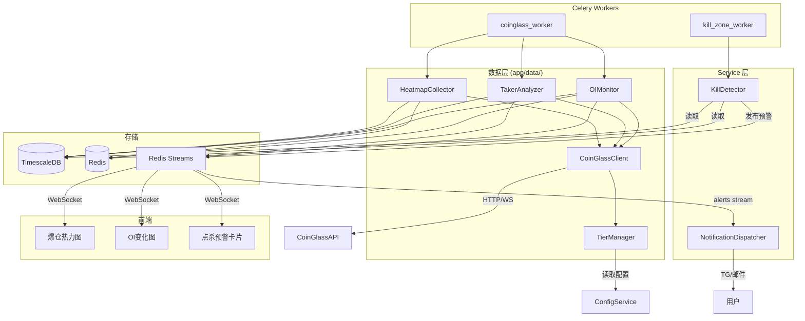

# 设计文档：庄家建仓/点杀预警系统

## 文档状态

- **当前定位**：本文件是 `CoinGlass` 衍生品增强与点杀预警的子域设计文档。
- **不再承担**：系统级主数据源总纲说明。
- **关系说明**：本设计应被视为 `four-primary-datasources` 中 `CoinGlass` 域的下钻文档。

## 概述

本设计为庄家视角多智能体分析系统新增 CoinGlass API V4 数据采集层和点杀预警引擎。核心架构思路：

1. **统一客户端** — `CoinGlassClient` 封装所有 CoinGlass API V4 请求，内置限频控制、重试、超时和套餐感知
2. **套餐管理** — `TierManager` 根据 `Config_Service` 中的 `coinglass_tier` 配置，控制限频上限、端点可用性、采集频率和功能矩阵
3. **数据采集模块** — `OIMonitor`、`TakerAnalyzer`、`HeatmapCollector` 各自负责单一数据域的采集、解析和存储
4. **点杀预警引擎** — `KillDetector` 综合多维信号，按套餐等级执行基础版(Startup)/增强版(Standard)/完整版(Professional)三级点杀检测，生成风险评分并发布预警
5. **推送集成** — 复用现有 `Notification_Dispatcher`（TG/邮件），按会员等级和风险评分分级推送
6. **前端展示** — 新增爆仓热力图、OI 变化图、点杀预警卡片，按 CoinGlass 套餐和用户会员等级做功能降级

设计遵循项目分层架构约束：API 路由层 → Service 层 → Agent/数据层，禁止跨层调用。

## 架构



### 关键设计决策

| 决策 | 选择 | 理由 |
|------|------|------|
| HTTP 客户端 | `httpx.AsyncClient` | 需求 1.1 明确要求；与项目异步架构一致 |
| 限频实现 | 滑动窗口计数器（Redis INCR + EXPIRE） | 精确控制每分钟请求数，跨进程共享 |
| 点杀检测频率 | 固定 60 秒 Celery Beat | 需求 6.1 明确要求；与现有 worker 模式一致 |
| 去重机制 | Redis key `kill_alert_dedup:{symbol}` TTL=600s | 需求 6.8 要求 10 分钟内去重 |
| WebSocket 实时流 | Standard+ 套餐建立 CoinGlass WS 连接 | 需求 11 分级要求；Standard=部分接口，Professional=全接口 |
| 前端降级 | 后端 API 返回能力矩阵，前端据此渲染 | 避免前端硬编码套餐逻辑 |
| 点杀检测分级 | 3 级：basic(Startup)/enhanced(Standard)/full(Professional) | 与 CoinGlass 4 级套餐权限精确对应 |


## 组件与接口

### 1. TierManager — 套餐管理模块

**文件**: `backend/app/data/coinglass_tier.py`

负责根据 `Config_Service` 中的 `coinglass_tier` 配置控制限频、端点可用性、采集频率和功能矩阵。纯数据层，不含业务逻辑。

```python
class CoinGlassTier(str, Enum):
    HOBBYIST = "hobbyist"
    STARTUP = "startup"
    STANDARD = "standard"
    PROFESSIONAL = "professional"

class TierCapabilities(BaseModel):
    tier: CoinGlassTier
    rate_limit_per_minute: int          # 30/80/300/1200
    collect_interval_seconds: int       # 300/120/60/30
    max_symbols: int                    # 50/100/300/7000
    history_depth_days: int             # 90/180/730/1095
    features: dict[str, bool]           # 功能能力矩阵
    websocket_enabled: bool             # Standard+ 可用

class TierManager:
    async def get_current_tier(self) -> CoinGlassTier
    async def get_capabilities(self) -> TierCapabilities
    def is_endpoint_available(self, tier: CoinGlassTier, endpoint: str) -> bool
    def is_feature_enabled(self, tier: CoinGlassTier, feature: str) -> bool
    async def check_rate_limit(self) -> bool          # True=有余量
    async def increment_request_count(self) -> None
    async def get_collect_interval(self) -> int        # 秒
```

限频实现：Redis 滑动窗口计数器，key `cg_rate:{minute_ts}`，TTL=60s。

### 2. CoinGlassClient — API V4 统一客户端

**文件**: `backend/app/data/coinglass_client.py`

封装所有 CoinGlass API V4 HTTP 请求。依赖 `TierManager` 做限频和端点检查。

```python
class CoinGlassClient:
    BASE_URL = "https://open-api-v4.coinglass.com"

    def __init__(self, session: AsyncSession) -> None: ...

    async def get(self, endpoint: str, params: dict[str, str | int] | None = None) -> dict | list | None:
        """统一 GET 请求，内置：
        - 从 ConfigService 读取 API Key
        - TierManager 限频检查 + 端点可用性检查
        - 30s 超时
        - 429 重试（最多 2 次，按 Retry-After 等待）
        - 非 2xx 记录错误日志返回 None
        - API Key 未配置时记录警告返回 None
        """
```

### 3. OIMonitor — 持仓量监控模块

**文件**: `backend/app/data/coinglass_oi.py`

```python
class OIMonitor:
    def __init__(self, client: CoinGlassClient, session: AsyncSession) -> None: ...

    async def collect_oi_ohlc(self, symbol: str) -> list[OISnapshot] | None:
        """调用 /api/futures/openInterest/ohlc-history"""

    async def collect_oi_aggregated(self, symbol: str) -> list[OISnapshot] | None:
        """调用 /api/futures/openInterest/aggregated-history"""

    async def collect_oi_exchange_list(self, symbol: str) -> list[OIExchangeData] | None:
        """调用 /api/futures/openInterest/exchange-list"""

    async def collect_net_position(self, symbol: str) -> list[NetPositionSnapshot] | None:
        """调用 /api/futures/openInterest/net-position（Startup+ 套餐）— 主力方向核心指标"""

    async def collect_net_position_v2(self, symbol: str) -> list[NetPositionSnapshot] | None:
        """调用 /api/futures/openInterest/net-position-v2（Startup+ 套餐）"""

    async def collect_oi_stablecoin_margin(self, symbol: str) -> list[OISnapshot] | None:
        """调用 /api/futures/openInterest/oi-ohlc-aggregated-stablecoin-margin-history（Standard+ 套餐）"""

    async def collect_oi_coin_margin(self, symbol: str) -> list[OISnapshot] | None:
        """调用 /api/futures/openInterest/oi-ohlc-aggregated-coin-margin-history（Standard+ 套餐）"""

    async def detect_oi_surge(self, symbol: str, threshold_pct: float = 5.0) -> OISurgeEvent | None:
        """5 分钟窗口 OI 增幅检测，超阈值发布 oi_surge 事件到 Redis Streams"""

    async def write_snapshots(self, snapshots: list[OISnapshot]) -> None:
        """写入 TimescaleDB oi_snapshots 表"""

    async def cache_latest(self, symbol: str, snapshot: OISnapshot) -> None:
        """缓存到 Redis oi_snapshot:{symbol}，TTL=300s"""
```

### 4. TakerAnalyzer — 主动买卖量分析模块

**文件**: `backend/app/data/coinglass_taker.py`

```python
class TakerAnalyzer:
    def __init__(self, client: CoinGlassClient, session: AsyncSession) -> None: ...

    async def collect_taker_volume(self, symbol: str) -> list[TakerVolumeSnapshot] | None:
        """调用 /api/futures/taker-buy-sell-volume/history（Standard+ 套餐）"""

    async def collect_aggregated_taker_volume(self, symbol: str) -> list[TakerVolumeSnapshot] | None:
        """调用 /api/futures/aggregated-taker-buysell-volume-history（Standard+ 套餐）"""

    async def detect_imbalance(self, symbol: str, threshold: float = 0.3) -> TakerImbalanceEvent | None:
        """检测 Buy/Sell Ratio 偏离 1.0 超阈值，发布 taker_imbalance 事件"""

    async def write_snapshots(self, snapshots: list[TakerVolumeSnapshot]) -> None:
        """写入 TimescaleDB taker_volume_snapshots 表"""
```

### 5. HeatmapCollector — 爆仓热力图采集模块

**文件**: `backend/app/data/coinglass_heatmap.py`

```python
class HeatmapCollector:
    def __init__(self, client: CoinGlassClient, session: AsyncSession) -> None: ...

    async def collect_heatmap_model1(self, symbol: str) -> list[LiquidationZone] | None:
        """调用 /api/futures/liquidation/heatmap (model1)（Startup+ 套餐）"""

    async def collect_heatmap_model2(self, symbol: str) -> list[LiquidationZone] | None:
        """调用 /api/futures/liquidation/heatmap/model2（Standard+ 套餐）"""

    async def collect_heatmap_model3(self, symbol: str) -> list[LiquidationZone] | None:
        """调用 /api/futures/liquidation/heatmap/model3（Standard+ 套餐）"""

    async def collect_liquidation_history(self, symbol: str) -> list[LiquidationRecord] | None:
        """调用 /api/futures/liquidation/history"""

    async def collect_liquidation_order(self, symbol: str) -> list[LiquidationRecord] | None:
        """调用 /api/futures/liquidation/order（Standard+ 套餐）— 爆仓订单明细"""

    async def collect_liquidation_max_pain(self, symbol: str) -> dict | None:
        """调用 /api/futures/liquidation/max-pain（Standard+ 套餐）— 清算最大痛点"""

    async def collect_basic_liquidation(self, symbol: str) -> BasicLiquidationData | None:
        """Hobbyist 套餐：采集爆仓总量(24h)、分多空、分交易所基础数据"""

    async def write_heatmap(self, zones: list[LiquidationZone]) -> None:
        """写入 TimescaleDB liquidation_heatmap 表"""

    async def cache_latest(self, symbol: str, zones: list[LiquidationZone]) -> None:
        """缓存到 Redis liq_heatmap:{symbol}，TTL=600s"""
```

### 6. KillDetector — 点杀预警引擎

**文件**: `backend/app/services/kill_detector.py`

位于 Service 层，综合读取各数据模块的缓存/DB 数据，执行点杀条件检测。

```python
class KillZoneAlert(BaseModel):
    alert_type: Literal["kill_zone_warning"]
    symbol: str
    risk_score: int                     # 0-100
    detection_version: Literal["basic", "enhanced", "full"]
    oi_change_percent: float
    taker_ratio: float | None           # 增强版/完整版
    ls_ratio: float | None              # 基础版（大户多空比）
    net_position_change: float | None   # 基础版+（净持仓变化）
    nearest_liq_zone: tuple[float, float]  # (price_low, price_high)
    estimated_liq_usd: float
    direction: Literal["long_kill", "short_kill"]
    timestamp: datetime

class KillDetector:
    def __init__(self, session: AsyncSession) -> None: ...

    async def evaluate(self, symbol: str) -> KillZoneAlert | None:
        """对单个交易对执行点杀检测：
        1. 读取 TierManager 判断使用基础版/增强版/完整版
        2. 从 Redis 缓存读取 OI 快照、爆仓热力图
        3. Hobbyist：跳过检测（缺少 OI 变化率、净持仓、热力图）
        4. 基础版(Startup)：OI变化率 + 大户多空比 + 净持仓 + 热力图model1 + 加权资金费率
        5. 增强版(Standard)：基础版 + Taker方向 + 热力图model2/3 + 爆仓订单明细 + 清算最大痛点 + 资金费率套利
        6. 完整版(Professional)：增强版全部能力 + 最高频率 + 全币种覆盖
        7. 计算风险评分
        8. 去重检查（Redis key kill_alert_dedup:{symbol}）
        9. 写入 TimescaleDB + 发布到 Redis Streams alerts
        """

    async def evaluate_all(self, symbols: list[str]) -> list[KillZoneAlert]:
        """批量检测所有监控交易对"""

    def compute_basic_score(self, oi_change_pct: float, top_ls_ratio_deviation: float, net_position_change: float, price_proximity_pct: float, weighted_fr_deviation: float) -> int:
        """基础版评分：OI(30%) + 大户多空比(20%) + 净持仓方向(20%) + 价格接近度(20%) + 加权资金费率(10%)"""

    def compute_enhanced_score(self, oi_change_pct: float, taker_deviation: float, price_proximity_pct: float, top_ls_ratio_deviation: float, liq_order_severity: float, max_pain_proximity: float, fr_arbitrage_anomaly: float) -> int:
        """增强版评分：OI(20%) + Taker(20%) + 价格接近度(15%) + 大户多空比(15%) + 爆仓订单(10%) + 清算最大痛点(10%) + 资金费率套利(10%)"""

    def compute_full_score(self, oi_change_pct: float, taker_deviation: float, price_proximity_pct: float, top_ls_ratio_deviation: float, liq_order_severity: float, max_pain_proximity: float, fr_arbitrage_anomaly: float) -> int:
        """完整版评分：与增强版相同公式，但数据覆盖更广（7000+ 币种）且检测频率更高"""
```

### 7. CoinGlass WebSocket 客户端

**文件**: `backend/app/data/coinglass_ws.py`

```python
class CoinGlassWSClient:
    WS_URL = "wss://open-api-v4.coinglass.com/ws"

    async def connect(self) -> None:
        """建立 WebSocket 连接（Standard=部分接口，Professional=全接口），指数退避重连（5s 起步，上限 60s，最多 10 次）
        Hobbyist/Startup 套餐不建立连接"""

    async def subscribe(self, channels: list[str]) -> None:
        """订阅指定频道（按套餐等级过滤可用频道：Standard 仅基础实时流，Professional 全接口）"""

    async def consume(self) -> AsyncIterator[dict]:
        """持续消费消息，解析后 yield"""

    async def publish_to_stream(self, event: dict) -> None:
        """将实时爆仓事件发布到 Redis Streams realtime_liquidations"""
```

### 8. Celery Workers

**文件**: `backend/workers/coinglass_worker.py`

```python
@celery_app.task(name="workers.coinglass_worker.collect_coinglass_data")
def collect_coinglass_data_task() -> dict[str, int]:
    """定时采集任务，频率由 TierManager 决定。
    采集顺序：OI → Taker Volume → 热力图 → 多空比 → 资金费率
    限频不足时按优先级跳过低优先级端点。"""

@celery_app.task(name="workers.coinglass_worker.evaluate_kill_zone")
def evaluate_kill_zone_task() -> dict[str, int]:
    """每 60 秒执行，调用 KillDetector.evaluate_all()"""
```

### 9. API 路由

**文件**: `backend/app/api/coinglass.py`

```python
GET /api/coinglass/tier-capabilities     → TierCapabilities（当前套餐能力矩阵）
GET /api/coinglass/oi/{symbol}           → OI 快照数据
GET /api/coinglass/net-position/{symbol} → 净持仓数据（Startup+）
GET /api/coinglass/taker/{symbol}        → Taker Volume 数据（Standard+）
GET /api/coinglass/heatmap/{symbol}      → 爆仓热力图数据（Startup+ model1, Standard+ model2/3）
GET /api/coinglass/kill-alerts/{symbol}  → 点杀预警历史
GET /api/coinglass/kill-alerts/latest    → 最新点杀预警
```

### 10. 前端组件

| 组件 | 文件 | 说明 |
|------|------|------|
| `LiquidationHeatmap` | `frontend/components/charts/LiquidationHeatmap.tsx` | 爆仓热力图，价格Y轴/时间X轴/颜色深浅 |
| `OIChangeChart` | `frontend/components/charts/OIChangeChart.tsx` | OI 变化折线图 + 价格叠加，支持 1h/4h/1d 切换 |
| `KillZoneCard` | `frontend/components/cards/KillZoneCard.tsx` | 点杀预警卡片：风险仪表盘、方向、各指标 |
| `TierGate` | `frontend/components/ui/TierGate.tsx` | 功能降级包装组件，按套餐等级显示/隐藏+升级提示 |

前端 API 封装：`frontend/lib/api/coinglass.ts`
WebSocket 实时爆仓流：通过现有 `lib/ws/` 管理，新增 `realtime_liquidations` 频道


## 数据模型

### Pydantic 模型（业务数据传递）

```python
# --- OI 相关 ---
class OISnapshot(BaseModel):
    time: datetime
    symbol: str
    exchange: str | None = None
    open_interest: float
    oi_change_percent: float | None = None

class OISurgeEvent(BaseModel):
    symbol: str
    oi_change_percent: float
    window_minutes: int = 5
    timestamp: datetime

class OIExchangeData(BaseModel):
    exchange: str
    open_interest: float
    oi_change_percent: float | None = None

# --- Taker Volume 相关 ---
class TakerVolumeSnapshot(BaseModel):
    time: datetime
    symbol: str
    buy_volume: float
    sell_volume: float
    buy_sell_ratio: float       # 精度 4 位小数

class TakerImbalanceEvent(BaseModel):
    symbol: str
    buy_sell_ratio: float
    direction: Literal["buy_dominant", "sell_dominant"]
    timestamp: datetime

# --- 爆仓热力图相关 ---
class LiquidationZone(BaseModel):
    time: datetime
    symbol: str
    price_low: float
    price_high: float
    estimated_liq_usd: float
    direction: Literal["long", "short"]
    model_version: Literal["model1", "model2", "model3"] = "model1"

class BasicLiquidationData(BaseModel):
    symbol: str
    total_liq_24h_usd: float
    long_liq_usd: float
    short_liq_usd: float
    by_exchange: dict[str, float]

class LiquidationRecord(BaseModel):
    time: datetime
    symbol: str
    side: str
    quantity: float
    price: float
    usd_value: float

# --- 净持仓相关 ---
class NetPositionSnapshot(BaseModel):
    time: datetime
    symbol: str
    net_position: float                 # 正=净多，负=净空
    long_position: float
    short_position: float

# --- 大户多空比相关 ---
class TopLongShortRatio(BaseModel):
    time: datetime
    symbol: str
    ratio_type: Literal["account", "position"]
    long_ratio: float
    short_ratio: float
    long_short_ratio: float

# --- 加权资金费率相关 ---
class WeightedFundingRate(BaseModel):
    time: datetime
    symbol: str
    weight_type: Literal["oi_weight", "vol_weight"]
    open: float
    high: float
    low: float
    close: float

# --- 点杀预警 ---
class KillZoneAlert(BaseModel):
    alert_type: Literal["kill_zone_warning"] = "kill_zone_warning"
    symbol: str
    risk_score: int                                     # 0-100
    detection_version: Literal["basic", "enhanced", "full"]
    oi_change_percent: float
    taker_ratio: float | None = None                    # 增强版/完整版
    ls_ratio: float | None = None                       # 基础版（大户多空比）
    net_position_change: float | None = None            # 基础版+（净持仓变化）
    nearest_liq_zone_low: float
    nearest_liq_zone_high: float
    estimated_liq_usd: float
    direction: Literal["long_kill", "short_kill"]
    timestamp: datetime

# --- 套餐能力 ---
class TierCapabilities(BaseModel):
    tier: str
    rate_limit_per_minute: int
    collect_interval_seconds: int
    max_symbols: int
    history_depth_days: int
    features: dict[str, bool]
    websocket_enabled: bool
```

### TimescaleDB 新增时序表

```sql
-- OI 快照
CREATE TABLE IF NOT EXISTS oi_snapshots (
    time              TIMESTAMPTZ NOT NULL,
    symbol            VARCHAR(20) NOT NULL,
    exchange          VARCHAR(30),
    open_interest     NUMERIC(30,4) NOT NULL,
    oi_change_percent NUMERIC(10,4)
);
SELECT create_hypertable('oi_snapshots', 'time', if_not_exists => TRUE);
CREATE INDEX IF NOT EXISTS idx_oi_symbol ON oi_snapshots (symbol, time DESC);

-- Taker Volume 快照
CREATE TABLE IF NOT EXISTS taker_volume_snapshots (
    time            TIMESTAMPTZ NOT NULL,
    symbol          VARCHAR(20) NOT NULL,
    buy_volume      NUMERIC(30,4) NOT NULL,
    sell_volume     NUMERIC(30,4) NOT NULL,
    buy_sell_ratio  NUMERIC(10,4) NOT NULL
);
SELECT create_hypertable('taker_volume_snapshots', 'time', if_not_exists => TRUE);
CREATE INDEX IF NOT EXISTS idx_taker_symbol ON taker_volume_snapshots (symbol, time DESC);

-- 爆仓热力图
CREATE TABLE IF NOT EXISTS liquidation_heatmap (
    time              TIMESTAMPTZ NOT NULL,
    symbol            VARCHAR(20) NOT NULL,
    price_low         NUMERIC(20,4) NOT NULL,
    price_high        NUMERIC(20,4) NOT NULL,
    estimated_liq_usd NUMERIC(30,2) NOT NULL,
    direction         VARCHAR(10) NOT NULL,
    model_version     VARCHAR(10) NOT NULL DEFAULT 'model1'
);
SELECT create_hypertable('liquidation_heatmap', 'time', if_not_exists => TRUE);
CREATE INDEX IF NOT EXISTS idx_liq_heatmap_symbol ON liquidation_heatmap (symbol, time DESC);

-- 点杀预警记录
CREATE TABLE IF NOT EXISTS kill_zone_alerts (
    time               TIMESTAMPTZ NOT NULL,
    symbol             VARCHAR(20) NOT NULL,
    risk_score         INTEGER NOT NULL,
    detection_version  VARCHAR(10) NOT NULL,
    oi_change_percent  NUMERIC(10,4) NOT NULL,
    taker_ratio        NUMERIC(10,4),
    ls_ratio           NUMERIC(10,4),
    net_position_change NUMERIC(20,4),
    nearest_liq_low    NUMERIC(20,4),
    nearest_liq_high   NUMERIC(20,4),
    estimated_liq_usd  NUMERIC(30,2),
    direction          VARCHAR(15) NOT NULL,
    snapshot_data      JSONB
);
SELECT create_hypertable('kill_zone_alerts', 'time', if_not_exists => TRUE);
CREATE INDEX IF NOT EXISTS idx_kill_alerts_symbol ON kill_zone_alerts (symbol, time DESC);
CREATE INDEX IF NOT EXISTS idx_kill_alerts_score ON kill_zone_alerts (risk_score DESC, time DESC);
```

### derivatives_snapshots 表扩展

在现有 `derivatives_snapshots` 表中新增 `source` 字段以区分 Binance 和 CoinGlass 数据来源：

```sql
ALTER TABLE derivatives_snapshots ADD COLUMN IF NOT EXISTS source VARCHAR(20) DEFAULT 'binance';
CREATE INDEX IF NOT EXISTS idx_deriv_source ON derivatives_snapshots (source, symbol, time DESC);
```

### Redis 缓存键设计

| 键 | 值 | TTL | 说明 |
|----|-----|-----|------|
| `oi_snapshot:{symbol}` | JSON(OISnapshot) | 300s | 最新 OI 快照 |
| `liq_heatmap:{symbol}` | JSON(list[LiquidationZone]) | 600s | 最新爆仓密集区 |
| `cg_rate:{minute_ts}` | int（请求计数） | 60s | 限频滑动窗口 |
| `kill_alert_dedup:{symbol}` | JSON(KillZoneAlert) | 600s | 点杀预警去重 |
| `cg_tier_capabilities` | JSON(TierCapabilities) | 300s | 套餐能力缓存 |


## 正确性属性

*属性是一种在系统所有有效执行中都应成立的特征或行为——本质上是对系统应做什么的形式化陈述。属性是人类可读规格说明与机器可验证正确性保证之间的桥梁。*

### Property 1: 非 2xx 状态码返回 None

*For any* CoinGlass API 端点和任意非 2xx、非 429 的 HTTP 状态码（如 400、401、403、500、502、503），CoinGlassClient.get() 应返回 None 且不抛出异常。

**Validates: Requirements 1.5**

### Property 2: OI 数据持久化往返

*For any* 有效的 OISnapshot（包含合法 symbol、正数 open_interest），写入 TimescaleDB `oi_snapshots` 表后再读取，应得到等价的数据；同时缓存到 Redis `oi_snapshot:{symbol}` 后读取，应得到等价的数据。

**Validates: Requirements 2.3, 2.4**

### Property 3: OI 突增检测阈值正确性

*For any* OI 变化百分比和任意正数阈值，当套餐为 Startup 或更高时，`detect_oi_surge` 应在 OI 变化百分比 > 阈值时返回 OISurgeEvent，否则返回 None。当套餐为 Hobbyist 时，无论 OI 变化多大都不应生成 surge 事件。

**Validates: Requirements 2.5, 2.6**

### Property 4: Taker Buy/Sell Ratio 计算精度

*For any* 正数 buy_volume 和正数 sell_volume，计算得到的 buy_sell_ratio 应等于 round(buy_volume / sell_volume, 4)。

**Validates: Requirements 3.2**

### Property 5: Taker 失衡检测与套餐门控

*For any* buy_sell_ratio 和正数阈值，当套餐为 Standard 或 Professional 时：若 |ratio - 1.0| > threshold，应发布 taker_imbalance 事件，方向为 buy_dominant（ratio > 1.0 + threshold）或 sell_dominant（ratio < 1.0 - threshold）；若 |ratio - 1.0| <= threshold，不应发布事件。当套餐低于 Standard 时，应跳过 Taker Volume 采集并返回 None。

**Validates: Requirements 3.5, 3.6**

### Property 6: 爆仓热力图数据持久化往返

*For any* 有效的 LiquidationZone 列表，写入 TimescaleDB `liquidation_heatmap` 表后再读取，应得到等价的数据；同时缓存到 Redis `liq_heatmap:{symbol}` 后读取，应得到等价的数据。

**Validates: Requirements 4.3, 4.4**

### Property 7: 爆仓密集区解析不变量

*For any* 有效的 CoinGlass 热力图 API 响应，解析后的每个 LiquidationZone 应满足 price_low < price_high 且 estimated_liq_usd >= 0。

**Validates: Requirements 4.2**

### Property 8: 多空比数据来源区分

*For any* 写入 `derivatives_snapshots` 表的记录，若 source="coinglass" 则读取时 source 字段应为 "coinglass"，若 source="binance" 则读取时 source 字段应为 "binance"。两种来源的数据在同一表中共存且互不干扰。

**Validates: Requirements 5.3**

### Property 9: 多空比偏差检测

*For any* CoinGlass 全网多空比值 cg_ratio 和 Binance 多空比值 bn_ratio，当 |cg_ratio - bn_ratio| > 0.2 时应记录 ls_ratio_divergence 日志，否则不应记录。

**Validates: Requirements 5.4**

### Property 10: 基础版点杀检测（含方向判断）

*For any* OI 变化百分比、大户多空账户比、净持仓变化、当前价格与爆仓密集区距离百分比、加权资金费率偏离，以及各自的阈值，当套餐为 Startup 时：若多个条件综合满足（OI 增幅 > OI 阈值 AND |大户LS ratio - 1.0| > LS 阈值 AND 净持仓出现显著方向性变化 AND 价格距离 < 距离阈值），应生成 detection_version="basic" 的 KillZoneAlert。方向判断：大户 LS ratio > 1.0（多头多）→ long_kill，大户 LS ratio < 1.0（空头多）→ short_kill。

**Validates: Requirements 6.2, 6.10**

### Property 11: 增强版点杀检测（含方向判断）

*For any* OI 变化百分比、Taker Buy/Sell Ratio、当前价格与爆仓密集区距离百分比、大户多空比、爆仓订单明细严重度、清算最大痛点接近度、资金费率套利异常度，以及各自的阈值，当套餐为 Standard 时：综合多个条件判断是否生成 detection_version="enhanced" 的 KillZoneAlert。方向判断：Taker Buy 主导（ratio > 1.0）→ long_kill（多头密集可能被空头点杀），Taker Sell 主导（ratio < 1.0）→ short_kill。

**Validates: Requirements 6.3, 6.9**

### Property 11b: 完整版点杀检测

*For any* 与增强版相同的输入指标，当套餐为 Professional 时：使用与增强版相同的检测逻辑和评分公式，但数据覆盖范围为 7000+ 币种且检测频率为最高（1200次/分钟），应生成 detection_version="full" 的 KillZoneAlert。

**Validates: Requirements 6.4**

### Property 12: 风险评分计算与边界

*For any* 有效的输入指标值，基础版评分 = OI 增幅权重(30%) + 大户多空比异常权重(20%) + 净持仓方向权重(20%) + 价格接近度权重(20%) + 加权资金费率偏离权重(10%)，增强版评分 = OI 增幅权重(20%) + Taker 失衡(20%) + 价格接近度(15%) + 大户多空比(15%) + 爆仓订单明细(10%) + 清算最大痛点(10%) + 资金费率套利(10%)，完整版评分公式与增强版相同。评分结果应始终在 [0, 100] 范围内。

**Validates: Requirements 6.5**

### Property 13: 点杀预警去重

*For any* 同一交易对的连续点杀预警序列，若两条预警间隔不超过 10 分钟，第二条应被跳过，除非新评分比旧评分高出超过 20 分。

**Validates: Requirements 6.7**

### Property 14: 套餐能力矩阵完整性

*For any* 有效的 CoinGlassTier 枚举值（hobbyist/startup/standard/professional），`get_capabilities()` 返回的 TierCapabilities 应包含正确的 rate_limit_per_minute（30/80/300/1200）、collect_interval_seconds（300/120/60/30）、max_symbols（50/100/300/7000）、history_depth_days（90/180/730/1095）和完整的 features 字典，且所有值与需求 7 中定义的四级映射一致。

**Validates: Requirements 7.2, 7.6, 7.8, 7.9, 7.10, 7.11**

### Property 15: 客户端限频与端点可用性执行

*For any* 请求，当当前分钟内请求次数已达套餐限频上限时，CoinGlassClient 应等待而非立即发起请求。*For any* 在当前套餐不可用的端点，CoinGlassClient 应返回 None 而非发起请求。

**Validates: Requirements 7.4, 7.5**

### Property 16: 点杀预警推送路由

*For any* KillZoneAlert，若 risk_score >= 70，应向订阅了该交易对的专业版和旗舰版用户推送通知；若 50 <= risk_score < 70，应仅向旗舰版用户推送；若 risk_score < 50，不应推送通知。

**Validates: Requirements 8.1, 8.2**

### Property 17: 预警推送消息完整性

*For any* KillZoneAlert，格式化后的推送消息应包含以下所有字段：交易对(symbol)、点杀方向(direction)、风险评分(risk_score)、OI 变化幅度(oi_change_percent)、Taker 失衡方向或多空比(taker_ratio/ls_ratio)、最近爆仓密集区价格范围(nearest_liq_zone)、预估爆仓量(estimated_liq_usd)。

**Validates: Requirements 8.3**

### Property 18: WebSocket 重连指数退避

*For any* 重连尝试序列（最多 10 次），第 n 次重连的等待时间应为 min(5 * 2^(n-1), 60) 秒。超过 10 次后应停止重连。

**Validates: Requirements 11.4**

### Property 19: 采集任务容错

*For any* 采集端点序列（OI → Taker → 热力图 → 多空比 → 资金费率），若其中任意一个端点采集失败，剩余端点应继续被采集。

**Validates: Requirements 12.3**

### Property 20: 限频不足时优先级采集

*For any* 限频余量 N（N < 总端点数），`collect_coinglass_data` 应按优先级顺序（OI > Taker Volume > 热力图 > 多空比 > 资金费率）采集前 N 个端点，跳过剩余低优先级端点。

**Validates: Requirements 12.5**


## 错误处理

### CoinGlassClient 错误处理

| 错误场景 | 处理方式 |
|----------|----------|
| API Key 未配置 | 记录 WARNING 日志，返回 None，跳过所有采集 |
| HTTP 429（限频） | 读取 Retry-After 头，等待指定秒数后重试，最多 2 次 |
| HTTP 4xx（非 429） | 记录 ERROR 日志（端点、状态码、响应体），返回 None |
| HTTP 5xx | 记录 ERROR 日志，返回 None |
| 网络超时（30s） | 记录 ERROR 日志，返回 None |
| 连接错误 | 记录 ERROR 日志，返回 None |
| JSON 解析失败 | 记录 ERROR 日志，返回 None |

### TierManager 错误处理

| 错误场景 | 处理方式 |
|----------|----------|
| `coinglass_tier` 配置不存在 | 降级为 hobbyist |
| `coinglass_tier` 值无效 | 降级为 hobbyist，记录 WARNING |
| Redis 不可用（限频计数） | 记录 WARNING，允许请求通过（宁可超限也不阻塞采集） |
| Config_Service 读取失败 | 降级为 hobbyist，记录 ERROR |

### KillDetector 错误处理

| 错误场景 | 处理方式 |
|----------|----------|
| OI 缓存缺失 | 尝试从 DB 读取最近 5 分钟数据，仍无则跳过该交易对 |
| 爆仓热力图缓存缺失 | 尝试从 DB 读取，仍无则跳过该交易对 |
| 风险评分计算异常 | 记录 ERROR，跳过该交易对 |
| Redis Streams 发布失败 | 记录 ERROR，仍写入 DB（确保预警不丢失） |
| DB 写入失败 | 记录 ERROR，仍发布到 Redis Streams（尽力保证至少一个通道成功） |

### WebSocket 错误处理

| 错误场景 | 处理方式 |
|----------|----------|
| 连接失败 | 5 秒后重连，指数退避，上限 60 秒，最多 10 次 |
| 连接断开 | 同上 |
| 消息解析失败 | 记录 WARNING，跳过该消息，继续消费 |
| 超过最大重连次数 | 记录 CRITICAL，停止 WS 客户端，等待下次 Celery 调度重启 |

### 采集 Worker 错误处理

| 错误场景 | 处理方式 |
|----------|----------|
| 单个端点采集失败 | 记录 ERROR，继续采集剩余端点 |
| 全部端点采集失败 | 记录 CRITICAL，Celery 自动重试（max_retries=2，countdown=30s） |
| 限频余量不足 | 按优先级采集，跳过低优先级端点，记录 INFO |

### 推送错误处理

| 错误场景 | 处理方式 |
|----------|----------|
| TG 推送失败 | 记录 ERROR，5 分钟后重试一次 |
| 邮件推送失败 | 记录 ERROR，5 分钟后重试一次 |
| 重试仍失败 | 记录 ERROR，不再重试，预警记录已在 DB 中保存 |

## 测试策略

### 测试框架

- **单元测试**: pytest + pytest-asyncio
- **属性测试**: hypothesis（Python 属性测试库）
- **Mock**: unittest.mock + aioresponses（HTTP mock）
- **前端测试**: Jest + React Testing Library

### 属性测试（Property-Based Testing）

每个属性测试至少运行 100 次迭代。每个测试用注释标注对应的设计属性。

```python
# Feature: whale-position-detection, Property 1: 非 2xx 状态码返回 None
@given(status_code=st.sampled_from([400, 401, 403, 500, 502, 503, 504]))
@settings(max_examples=100)
async def test_non_2xx_returns_none(status_code: int): ...

# Feature: whale-position-detection, Property 4: Taker Buy/Sell Ratio 计算精度
@given(
    buy_volume=st.floats(min_value=0.01, max_value=1e12),
    sell_volume=st.floats(min_value=0.01, max_value=1e12),
)
@settings(max_examples=100)
async def test_taker_ratio_precision(buy_volume: float, sell_volume: float): ...

# Feature: whale-position-detection, Property 5: Taker 失衡检测与套餐门控（Standard+）
@given(
    ratio=st.floats(min_value=0.01, max_value=10.0),
    threshold=st.floats(min_value=0.01, max_value=2.0),
    tier=st.sampled_from(list(CoinGlassTier)),
)
@settings(max_examples=100)
async def test_taker_imbalance_tier_gate(ratio, threshold, tier): ...

# Feature: whale-position-detection, Property 12: 风险评分计算与边界（三版本）
@given(
    oi_change=st.floats(min_value=0, max_value=100),
    top_ls_deviation=st.floats(min_value=0, max_value=5),
    net_position_change=st.floats(min_value=-1e6, max_value=1e6),
    proximity=st.floats(min_value=0, max_value=100),
    weighted_fr=st.floats(min_value=0, max_value=10),
)
@settings(max_examples=100)
async def test_basic_score_bounds(oi_change, top_ls_deviation, net_position_change, proximity, weighted_fr): ...

@given(
    oi_change=st.floats(min_value=0, max_value=100),
    taker_deviation=st.floats(min_value=0, max_value=5),
    proximity=st.floats(min_value=0, max_value=100),
    top_ls_deviation=st.floats(min_value=0, max_value=5),
    liq_order_severity=st.floats(min_value=0, max_value=100),
    max_pain_proximity=st.floats(min_value=0, max_value=100),
    fr_arbitrage=st.floats(min_value=0, max_value=10),
)
@settings(max_examples=100)
async def test_enhanced_score_bounds(oi_change, taker_deviation, proximity, top_ls_deviation, liq_order_severity, max_pain_proximity, fr_arbitrage): ...

# Feature: whale-position-detection, Property 13: 点杀预警去重
@given(
    score1=st.integers(min_value=0, max_value=100),
    score2=st.integers(min_value=0, max_value=100),
    interval_seconds=st.integers(min_value=0, max_value=1200),
)
@settings(max_examples=100)
async def test_dedup_logic(score1, score2, interval_seconds): ...

# Feature: whale-position-detection, Property 14: 套餐能力矩阵完整性（4 级）
@given(tier=st.sampled_from(list(CoinGlassTier)))
@settings(max_examples=100)
def test_tier_capabilities_completeness(tier): ...

# Feature: whale-position-detection, Property 18: WebSocket 重连指数退避
@given(attempt=st.integers(min_value=1, max_value=15))
@settings(max_examples=100)
def test_ws_reconnect_backoff(attempt): ...

# Feature: whale-position-detection, Property 20: 限频不足时优先级采集
@given(remaining_quota=st.integers(min_value=0, max_value=10))
@settings(max_examples=100)
async def test_priority_collection(remaining_quota): ...
```

### 单元测试

| 测试文件 | 覆盖范围 |
|----------|----------|
| `test_coinglass_client.py` | CoinGlassClient: API Key 读取、请求头设置、429 重试、超时、错误处理 |
| `test_coinglass_tier.py` | TierManager: 四级套餐映射、限频计数、端点可用性、降级逻辑 |
| `test_coinglass_oi.py` | OIMonitor: OI 采集、净持仓采集(Startup+)、稳定币/币本位保证金(Standard+)、DB 写入、缓存、surge 检测 |
| `test_coinglass_taker.py` | TakerAnalyzer: Taker 采集(Standard+)、聚合主动买卖、ratio 计算、imbalance 检测、套餐门控 |
| `test_coinglass_heatmap.py` | HeatmapCollector: 热力图 model1(Startup+)/model2/model3(Standard+)、爆仓订单明细、清算最大痛点、解析、DB 写入、缓存 |
| `test_kill_detector.py` | KillDetector: 基础版(Startup)/增强版(Standard)/完整版(Professional)检测、评分计算、去重、方向判断 |
| `test_kill_notification.py` | 推送路由: 按评分和会员等级分级推送、消息格式 |
| `test_coinglass_worker.py` | Worker: 采集顺序、容错、优先级跳过 |

### 集成测试

- CoinGlass API mock 服务器 → 完整采集流程 → DB 验证
- 点杀检测端到端：注入 OI/净持仓/大户多空比/Taker/Heatmap 数据 → KillDetector（三版本） → Redis Streams → 推送验证
- WebSocket 重连：模拟断连 → 验证指数退避 → 验证消息不丢失

### 测试原则

- 所有外部 API 调用（CoinGlass、Telegram、SendGrid）必须 mock
- 属性测试覆盖所有 20 个正确性属性
- 单元测试覆盖边界情况和错误路径
- 属性测试和单元测试互补：属性测试验证通用规则，单元测试验证具体场景和集成点
